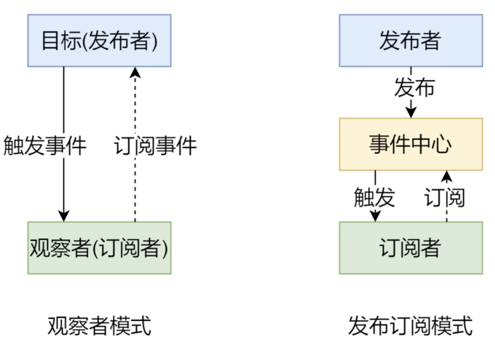

# VUE

-  快速回顾 Vue.js 基础语法
- Vue Router 原理分析与实现
- 虚拟 DOM 库 Snabbdom 源码解析
- 响应式原理分析与实现
- Vue.js 源码分析

## 回顾

### 基础结构

```vue
<div id="app">
    <p>公司名称：{{ company.name }}</p>
    <p>公司地址：{{ company.address }}</p>
</div>
<script src="https://cdn.jsdelivr.net/npm/vue/dist/vue.js"></script>
<script>
    new Vue({
        el: '#app',
        data: { // vue 会将 data 填充到模板中，并把模板渲染到浏览器
            company: {
                name: '拉勾',
                address: '中关村创业大街籍海楼4层'
            }
        }
    })
</script>
```

下面的代码和上面的代码执行效果是一样的，不过下面的使用了 render 和 $mount 方法

```vue
<div id="app">
</div>
<script src="https://cdn.jsdelivr.net/npm/vue/dist/vue.js"></script>

<script>
    new Vue({
        data: {
            company: {
                name: '拉勾',
                address: '中关村创业大街籍海楼4层'
            }
        },
        render(h) {
            return h('div', [
                h('p', '公司名称：' + this.company.name),
                h('p', '公司地址：' + this.company.address)
            ])
        }
    }).$mount('#app')
</script>
```

### 生命周期

- new Vue
  - 初始化时间 & 生命周期
- beforeCreate 钩子
  - 初始化注入 & 校验
- created 钩子
- 将模板编译成 render 函数
  - 如果没有 el 选项，就调用 \$mount 方法，\$mount 会把 el 转换成 template
  - 如果指定了 template，将模板编译成 render 函数，render 函数用来生成虚拟 dom
  - 如果没有指定 template，将 el 外部的 HTML 作为 template 编译
- beforeMount 钩子
  - 无法获取新元素的内容
- 创建 vm.$el 并用其替换 el
- mounted 钩子
  - 可以访问到新的 dom 元素
- 挂载完成后，当 data 被修改时，会触发 beforeUpdate 钩子
  - 新旧虚拟 DOM 对比，将差异重新渲染到浏览器中
- updated 钩子
  - updated 中访问的最新的结果
- 当调用 vm.$destroy() 函数时，触发 beforeDestroy 钩子
  - 执行解除绑定、销毁子组件以及事件监听器等清理工作
- Destroyed 钩子

如果使用构造生成文件（例如构造单文件组件），模板编译将提前执行，编译将在打包构建的时候去完成，不在运行时处理模板编译的工作，官方也推荐提前编译，这样的性能会更好

### 语法和概念

- 插值表达式
- 指令
- 计算属性和监听器
  - 计算会缓存
- Class 和 Style 绑定
- 条件渲染 / 列表渲染
- 表单输入绑定
- 组件
- 插槽
- 插件
  - VueRouter Vuex
- 混入 mixin
- 深入响应式原理
- 不同构建版本的 Vue

# Vue Router 实现原理

- Vue Router 基本回顾
- Hash 模式和 History 模式
- 模拟实现自己的 Vue Router

## 基本使用

router/index.js

```js
import Vue from 'vue'
import VueRouter from 'vue-router'
import Index from '../views/Index.vue'
// 1. 注册路由插件
// Vue.use 用来注册插件，会调用传入对象的 install 方法
Vue.use(VueRouter)

// 路由规则
const routes = [
  {
    path: '/',
    name: 'Index',
    component: Index
  },
  {
    path: '/blog',
    name: 'Blog',
    // route level code-splitting
    // this generates a separate chunk (about.[hash].js) for this route
    // which is lazy-loaded when the route is visited.
    component: () => import(/* webpackChunkName: "blog" */ '../views/Blog.vue')
  },
  {
    path: '/photo',
    name: 'Photo',
    // route level code-splitting
    // this generates a separate chunk (about.[hash].js) for this route
    // which is lazy-loaded when the route is visited.
    component: () => import(/* webpackChunkName: "photo" */ '../views/Photo.vue')
  }
]
// 2. 创建 router 对象
const router = new VueRouter({
  routes
})

export default router

```

main.js

```js
import Vue from 'vue'
import App from './App.vue'
import router from './router'

Vue.config.productionTip = false

new Vue({
  // 3. 注册 router 对象
  router, // 注入 $route 和 $router
  render: h => h(App)
}).$mount('#app')
```

App.vue

```vue
<template>
  <div id="app">
    <div>
      
    </div>
    <div id="nav">
      <!-- 5. 创建链接 -->
      <router-link to="/">Index</router-link> |
      <router-link to="/blog">Blog</router-link> |
      <router-link to="/photo">Photo</router-link>
    </div>
    <!-- 4. 创建路由组建的占位 -->
    <router-view/>
  </div>
</template>

```

`$route` 存储的是路由规则，和当前的路径

`$router` 就是 VueRouter 的实例，提供路由相关的方法

## 动态路由传参

有两种方式

- 直接通过 `$route.params.xx` 来获取

- 在路由配置里讲 props 设置成 true，然后在组件里接受 props

推荐第二种

## 嵌套路由

多个组件里有相同的内容就可以提取出来到一个公共组件中，一般是 Layout

## 编程式导航

一般指 `this.$router.push` 方法，如果路由有指定 name 那跳转的的时候指定 `{ name }` 也可以跳转

prams 对象指定传递的路由参数

`this.$router.replace` 是替换当前路由，没有添加新的路由页面，历史记录里是不会有新的记录的

go 方法传入数字，正数代表前进，负数代表后退

## Hash 和 History 模式区别

都是客户端的路由方式，当路径发生变化的时候不必向服务端发送请求，使用 JS 监视路径的变化，然后根据不同的地址渲染不同的内容，如果需要服务端的内容就发 ajax 请求

表现形式

- Hash 模式
  - https://music.163.com/#/playlist?id=3102961863
  - 有点丑
- History 模式
  - https://music.163.com/playlist?id=3102961863
  - 需要服务端配合

原理

- Hash 模式是基于锚点，以及 onhashchange 事件
- History 模式是基于 HTML5 中的 History API
  - 以下两个方法是不想服务器发送请求的
  - history.pushState() IE10 以后才支持
  - history.replaceState()

### History 模式

- History 需要服务端的支持
- 单页面应用中，服务端不存在 http://www.testurl.com/login 这样的地址会返回找不到该页面
- 在服务端应该出了静态资源外都返回单页应用的 index.html

在 new 一个 VueRouter 的时候除了传入 routes，还要传入 `mode: 'history'`

#### node

```js
const path = require('path')
// 导入处理 history 模式的模块
const history = require('connect-history-api-fallback')
// 导入 express
const express = require('express')

const app = express()
// 注册处理 history 模式的中间件
app.use(history())
// 处理静态资源的中间件，网站根目录 ../web
app.use(express.static(path.join(__dirname, '../web')))

// 开启服务器，端口是 3000
app.listen(3000, () => {
  console.log('服务器开启，端口：3000')
})
```

nginx

- 从官网下载 nginx 的压缩包
- 把压缩包解压到 c 盘根目录，c:\nginx-1.18.0 文件夹（路径里不要有中文）
- 打开命令行，切换到目录 c:\nginx-1.18.0

配置 `nginx.conf`

```nginx
#其他配置...
http {

#其他配置...
	server {
		listen 80;
		server_name localhost;
		
		location / {
			root html;
			index index.html index.htm;
			try_files $uri $uri/ /index.html; 
		}
	}
}
```

## 实现原理

Hash 模式

- URL 中 # 后面的内容作为路径地址
- 监听 hashchange 事件
- 根据当前路由地址找到对应组件重新渲染

History 模式

- 通过 history.pushState() 方法改变地址栏，并记录到历史记录
- 监听 popstate 事件
- 根据当前路由地址找到对应的组件重新渲染

VueRouter 也是 vue 的一个插件

有属性

- options
- data
- routeMap

方法

- Constructor(Options): VueRouter
- _install(Vue): void
- init(): void
- initEvent(): void
- createRouteMap(): void
- initComponents(Vue): void

模拟代码

```js
console.dir(Vue)
let _Vue = null
class VueRouter {

    // 1
    static install(Vue) {
        //1 判断当前插件是否被安装
        if (VueRouter.install.installed) {
            return;
        }
        VueRouter.install.installed = true
        //2 把Vue的构造函数记录在全局
        _Vue = Vue
        //3 把创建Vue的实例传入的router对象注入到Vue实例
        // _Vue.prototype.$router = this.$options.router // 不能直接这样写是因为 this 指向不对，这里的静态方法调用者一般是这个类，所以 this 一般指向 VueRouter
        _Vue.mixin({
            beforeCreate() {
                if (this.$options.router) { // 有 Vue.$options，Vue 的实例上是没有 $options 属性的
                    _Vue.prototype.$router = this.$options.router
                }
            }
        })
    }
    // 2 构造需要的属性和 init 操作
    constructor(options) {
        this.options = options
        this.routeMap = {} // 解析之后 options 中会传入的 routes，key 就是路由地址，value 就是路由组件，这样就能找到路由对应的组件渲染到视图中了
        // observable
        this.data = _Vue.observable({ // 响应式
            current: "/"
        })
        this.init()

    }
    init() {
        this.createRouteMap()
        this.initComponent(_Vue)
        this.initEvent()
    }

    // 3 也是 init
    createRouteMap() {
        //遍历所有的路由规则 吧路由规则解析成键值对的形式存储到routeMap中
        this.options.routes.forEach(route => {
            this.routeMap[route.path] = route.component
        });
    }
    initComponent(Vue) {

        Vue.component("router-link", {
            props: {
                to: String
            },

            // 这里如果不是 render 函数而是 template 属性的话，需要 vue 去编译 template 成 render 函数，运行时版本 Vue 不包含编译器，不支持 template 模板，需要打包的时候提前编译，官方也推荐提前编译
            // 完整版：包含运行时和编译器，体积比运行时版本大 10k 左右，程序运行的时候把模板转换成 render 函数
            // 如果要使用完整版的话，在项目根目录下的 vue.config.js 中导出的对象中要有 runtimeCompiler 属性为 true，这样 vue-cli 就知道使用完整版的 vue 了，请参考 https://cli.vuejs.org/config/#runtimecompiler
            // 那还有一个问题就是，为什么使用运行时版本的时候，*.vue 文件也是用的模板却可以编译呢，那是因为开发工程中这个 cli 在打包的时候也是提前编译（预编译）了
            render(h) {
                return h("a", { // 这里也只是 h 函数的一种用法
                    attrs: {
                        href: this.to
                    },
                    on: {
                        click: this.clickhander
                    }
                }, [this.$slots.default])
            },
            methods: {
                clickhander(e) {
                    history.pushState({}, "", this.to)
                    this.$router.data.current = this.to
                    e.preventDefault()
                }
            }
            // template:"<a :href='to'><slot></slot><>"
        })
        const self = this
        Vue.component("router-view", { // router-view 就是一个占位符
            render(h) {
                // self.data.current
                const cm = self.routeMap[self.data.current]
                return h(cm)
            }
        })

    }
    initEvent() {
        // 处理点击前进后退按钮后，地址栏变化了但页面没有变化的问题，this.data 是响应式的
        window.addEventListener("popstate", () => {
            this.data.current = window.location.pathname
        })
    }
}
```


# Vue 响应式原理

- 模拟一个最小版本的 vue
- 响应式原理在面试中的常见问题
- 学习别人优秀的经验，转换成自己的经验
- 实际项目中出文昌塔的原理层面的解决
  - 给 Vue 实例新增一个成员是否是响应式的？
  - 非属性重新赋值成对象，是否是响应式的？
- 为学习 Vue 源码做铺垫

## 数据驱动


- 数据响应式、双向绑定、数据驱动
- 数据响应式
  - 数据模型仅仅是普通的 JavaScript 对象，而当我们修改数据时，视图会进行更新，避免了繁琐的 DOM 操作，提高开发效率
- 双向绑定
  - 数据改变，视图改变;视图改变，数据也随之改变
  - 我们可以使用 v-model 在表单元素上创建双向数据绑定
- 数据驱动是 Vue 最独特的特性之一
  - 开发过程中仅需要关注数据本身，不需要关心数据是如何渲染到视图

## 数据响应式的核心原理

### Vue 2.x

- [vue 2.x 深入响应式原理](https://cn.vuejs.org/v2/guide/reactivity.html)
- [MDN - Object.defineProperty](https://developer.mozilla.org/zh-CN/docs/Web/JavaScript/Reference/Global_Objects/Object/defineProperty)
- 是 ES5 新增的无法 shim 的特性，所以浏览器兼容 IE8 以上(不兼容 IE8)

```vue
<div id="app">
  hello
</div>
<script>
  // 模拟 Vue 中的 data 选项
  let data = {
    msg: 'hello',
    count: 10
  }

  // 模拟 Vue 的实例
  let vm = {}

  proxyData(data)

  function proxyData(data) {
    // 遍历 data 对象的所有属性
    Object.keys(data).forEach(key => {
      // 把 data 中的属性，转换成 vm 的 setter/setter
      Object.defineProperty(vm, key, {
        enumerable: true,
        configurable: true,
        get () {
          console.log('get: ', key, data[key])
          return data[key]
        },
        set (newValue) {
          console.log('set: ', key, newValue)
          if (newValue === data[key]) {
            return
          }
          data[key] = newValue
          // 数据更改，更新 DOM 的值
          document.querySelector('#app').textContent = data[key]
        }
      })
    })
  }

  // 测试
  vm.msg = 'Hello World'
  console.log(vm.msg)
```

### Vue 3.x

- [MDN - Proxy](https://developer.mozilla.org/zh-CN/docs/Web/JavaScript/Reference/Global_Objects/Proxy)

- 直接监听对象，而非属性。

- ES 6 中新增，IE 不支持，性能由浏览器优化

```vue
<div id="app">
  hello
</div>
<script>
  // 模拟 Vue 中的 data 选项
  let data = {
    msg: 'hello',
    count: 0
  }

  // 模拟 Vue 实例
  let vm = new Proxy(data, {
    // 执行代理行为的函数
    // 当访问 vm 的成员会执行
    get (target, key) {
      console.log('get, key: ', key, target[key])
      return target[key]
    },
    // 当设置 vm 的成员会执行
    set (target, key, newValue) {
      console.log('set, key: ', key, newValue)
      if (target[key] === newValue) {
        return
      }
      target[key] = newValue
      document.querySelector('#app').textContent = target[key]
    }
  })

  // 测试
  vm.msg = 'Hello World'
  console.log(vm.msg)
```

## 发布订阅模式和观察者模式

这两种模式本质是相同的，但是是有区别的，所有经常被混为一谈

### 发布/订阅模式

- 订阅者
- 发布者
- 信号中心

```js
  // Vue 自定义事件
  let vm = new Vue()
  // { 'click': [fn1, fn2], 'change': [fn] }

  // 注册事件(订阅消息)
  vm.$on('dataChange', () => {
    console.log('dataChange')
  })

  vm.$on('dataChange', () => {
    console.log('dataChange1')
  })
  // 触发事件(发布消息)
  vm.$emit('dataChange')
```

实现原理

```js
// 事件触发器
class EventEmitter {
  constructor () {
    // { 'click': [fn1, fn2], 'change': [fn] }
    this.subs = Object.create(null)
  }

  // 注册事件
  $on (eventType, handler) {
    this.subs[eventType] = this.subs[eventType] || []
    this.subs[eventType].push(handler)
  }

  // 触发事件
  $emit (eventType) {
    if (this.subs[eventType]) {
      this.subs[eventType].forEach(handler => {
        handler()
      })
    }
  }
}

// 测试
let em = new EventEmitter()
em.$on('click', () => {
  console.log('click1')
})
em.$on('click', () => {
  console.log('click2')
})

em.$emit('click')
```

### 观察者模式

- 观察者(订阅者) -- Watcher 

  - update(): 当事件发生时，具体要做的事情

- 目标(发布者) -- Dep

  - subs 数组:存储所有的观察者
  - addSub(): 添加观察者
  - notify():当事件发生，调用所有观察者的 update() 方法

- 没有事件中心

```js
// 发布者-目标
class Dep {
  constructor () {
    // 记录所有的订阅者
    this.subs = []
  }
  // 添加订阅者
  addSub (sub) {
    if (sub && sub.update) {
      this.subs.push(sub)
    }
  }
  // 发布通知
  notify () {
    this.subs.forEach(sub => {
      sub.update()
    })
  }
}
// 订阅者-观察者
class Watcher {
  update () {
    console.log('update')
  }
}

// 测试
let dep = new Dep()
let watcher = new Watcher()

dep.addSub(watcher)

dep.notify()
```

总结

- **观察者模式**是由具体目标调度，比如当事件触发，Dep 就会去调用观察者的方法，所以观察者模
- 式的订阅者与发布者之间是存在依赖的。 **发布/订阅模式**由统一调度中心调用，因此发布者和订阅者不需要知道对方的存在。



## 模拟 Vue 响应式原理

- Vue
  - 把 data 中的成员注入到 Vue 实例，并且把 data 中的成员转成 getter/setter 
- Observer
  - 能够对数据对象的所有属性进行监听，如有变动可拿到最新值并通知 Dep 
- Compiler
  - 解析每个元素中的指令/插值表达式，并替换成相应的数据 
- Dep
  - 添加观察者(watcher)，当数据变化通知所有观察者 
- Watcher
  - 数据变化更新视图

### Vue

- 功能
  - 负责接收初始化的参数(选项
  - 负责把 data 中的属性注入到 Vue 实例，转换成 getter/setter 
  - 负责调用 observer 监听 data 中所有属性的变化
  - 负责调用 compiler 解析指令/插值表达式
- 结构
  - 属性
    - $options
    - $el
    - $data
  - 方法
    - _proxyData()

```js
class Vue {
  constructor (options) {
    // 1. 通过属性保存选项的数据
    this.$options = options || {}
    this.$data = options.data || {}
    this.$el = typeof options.el === 'string' ? document.querySelector(options.el) : options.el
    // 2. 把data中的成员转换成getter和setter，注入到vue实例中
    this._proxyData(this.$data)
    // 3. 调用observer对象，监听数据的变化
    new Observer(this.$data)
    // 4. 调用compiler对象，解析指令和差值表达式
    new Compiler(this)
  }
  _proxyData (data) {
    // 遍历data中的所有属性
    Object.keys(data).forEach(key => {
      // 把data的属性注入到vue实例中
      Object.defineProperty(this, key, {
        enumerable: true,
        configurable: true,
        get () {
          return data[key]
        },
        set (newValue) {
          if (newValue === data[key]) {
            return
          }
          data[key] = newValue
        }
      })
    })
  }
}
```

### Observer

- 功能
  - 负责把 data 选项中的属性转换成响应式数据
  - data 中的某个属性也是对象（包含本来不是对象，后来变成了对象的情况），把该属性转换成响应式数据 
  - 数据变化发送通知
- 结构
  - 方法
    - walk(data)
    - defineReactive(data, key, value)

```js
class Observer {
  constructor (data) {
    this.walk(data)
  }
  walk (data) {
    // 1. 判断data是否是对象
    if (!data || typeof data !== 'object') {
      return
    }
    // 2. 遍历data对象的所有属性
    Object.keys(data).forEach(key => {
      this.defineReactive(data, key, data[key])
    })
  }
  defineReactive (obj, key, val) { // 必须传 val，不然使用 obj[key] 就会递归调用 get 方法然后报错。这里的 val 传进来，外部对这个 get 方法有引用，get 方法又对 val 有引用，所以就会变成形成一个闭包
    
    // 解决 Object.defineProperty 中 set 方法中 this 指向问题
    let that = this
    // 负责收集依赖，并发送通知
    let dep = new Dep()
    // 如果val是对象，把val内部的属性转换成响应式数据
    this.walk(val)
    Object.defineProperty(obj, key, {
      enumerable: true,
      configurable: true,
      get () {
        // 收集依赖
        Dep.target && dep.addSub(Dep.target)
        return val
      },
      set (newValue) {
        if (newValue === val) {
          return
        }
        val = newValue
        that.walk(newValue)
        // 发送通知
        dep.notify()
      }
    })
  }
}
```

### Compiler

- 功能（本质上是就操作 DOM）
  - 负责编译模板，解析指令/插值表达式
  - 负责页面的首次渲染
  - 当数据变化后重新渲染视图
- 结构
  - 属性
    - el
    - vm
  - 方法（写在一起太乱，所以分开）
    - compile(el)
    - compileElement(node)
    - compileText(node)
    - isDirective(attrName)
    - isTextNode(node)
    - isElementNode(node)

```js
class Compiler {
  constructor (vm) {
    this.el = vm.$el
    this.vm = vm
    this.compile(this.el)
  }
  // 编译模板，处理文本节点和元素节点
  compile (el) {
    let childNodes = el.childNodes
    Array.from(childNodes).forEach(node => {
      // 处理文本节点
      if (this.isTextNode(node)) {
        this.compileText(node)
      } else if (this.isElementNode(node)) {
        // 处理元素节点
        this.compileElement(node)
      }

      // 判断node节点，是否有子节点，如果有子节点，要递归调用compile
      if (node.childNodes && node.childNodes.length) {
        this.compile(node)
      }
    })
  }
  // 编译元素节点，处理指令
  compileElement (node) {
    // console.log(node.attributes)
    // 遍历所有的属性节点
    Array.from(node.attributes).forEach(attr => {
      // 判断是否是指令
      let attrName = attr.name
      if (this.isDirective(attrName)) {
        // v-text --> text
        attrName = attrName.substr(2)
        let key = attr.value
        this.update(node, key, attrName)
      }
    })
  }

  update (node, key, attrName) {
    let updateFn = this[attrName + 'Updater']
    updateFn && updateFn.call(this, node, this.vm[key], key)
  }

  // 处理 v-text 指令
  textUpdater (node, value, key) {
    node.textContent = value
    new Watcher(this.vm, key, (newValue) => {
      node.textContent = newValue
    })
  }
  // v-model
  modelUpdater (node, value, key) {
    node.value = value
    new Watcher(this.vm, key, (newValue) => {
      node.value = newValue
    })
    // 双向绑定
    node.addEventListener('input', () => {
      this.vm[key] = node.value
    })
  }

  // 编译文本节点，处理差值表达式
  compileText (node) {
    // console.dir(node)
    // {{  msg }}
    let reg = /\{\{(.+?)\}\}/
    let value = node.textContent
    if (reg.test(value)) {
      let key = RegExp.$1.trim()
      node.textContent = value.replace(reg, this.vm[key])

      // 创建watcher对象，当数据改变更新视图
      new Watcher(this.vm, key, (newValue) => {
        node.textContent = newValue
      })
    }
  }
  // 判断元素属性是否是指令
  isDirective (attrName) {
    return attrName.startsWith('v-')
  }
  // 判断节点是否是文本节点
  isTextNode (node) {
    return node.nodeType === 3
  }
  // 判断节点是否是元素节点
  isElementNode (node) {
    return node.nodeType === 1
  }
}
```

### Dep

- 功能
  - 收集依赖，添加观察者(watcher)
  - 通知所有观察者
- 结构
  - 属性
    - subs
  - 方法
    - addSub(sub)
    - notify()

```js
class Dep {
  constructor () {
    // 存储所有的观察者
    this.subs = []
  }
  // 添加观察者
  addSub (sub) {
    if (sub && sub.update) {
      this.subs.push(sub)
    }
  }
  // 发送通知
  notify () {
    this.subs.forEach(sub => {
      sub.update()
    })
  }
}
```

### Watcher

- 功能
  - 自身实例化的时候往 dep 对象中添加自己 
  - 当数据变化触发依赖， dep 通知所有的 Watcher 实例更新视图
- 结构
  - 属性
    - vm
    - key
    - cb
    - oldValue
  - 方法
    - update()

```js
class Watcher {
  constructor (vm, key, cb) {
    this.vm = vm
    // data中的属性名称
    this.key = key
    // 回调函数负责更新视图
    this.cb = cb

    // 把watcher对象记录到Dep类的静态属性target
    Dep.target = this
    // 触发get方法，在get方法中会调用addSub
    this.oldValue = vm[key]
    Dep.target = null
  }
  // 当数据发生变化的时候更新视图
  update () {
    let newValue = this.vm[this.key]
    if (this.oldValue === newValue) {
      return
    }
    this.cb(newValue)
  }
}
```

# 虚拟 DOM

- 了解什么是虚拟 DOM，以及虚拟 DOM 的作用
- Snabbdom 的基本使用
- Snabbdom 的源码解析

## 什么是 Virtual DOM

Virtual DOM(虚拟 DOM) 是由普通的 JS 对象来描述 DOM 对象，因为不是真实的 DOM 对象，所以叫 Virtual DOM，Virtual DOM 的开销比真实 DOM 的开销小很多

## 为什么使用 Virtual DOM

- 手动操作 DOM 比较麻烦，还需要考虑浏览器兼容性问题，虽然有 jQuery 等库简化 DOM 操作，但是随着项目的复杂 DOM 操作复杂提升
- 为了简化 DOM 的复杂操作于是出现了各种 MVVM 框架，MVVM 框架解决了视图和状态的同步问题
- 为了简化视图的操作我们可以使用模板引擎，但是模板引擎没有解决跟踪状态变化的问题，于是Virtual DOM 出现了
- Virtual DOM 的好处是当状态改变时不需要立即更新 DOM，只需要创建一个虚拟树来描述 DOM， Virtual DOM 内部将弄清楚如何有效(diff)的更新 DOM 
- 参考 github 上 virtual-dom 的描述
  - 虚拟 DOM 可以维护程序的状态，跟踪上一次的状态
  - 通过比较前后两次状态的差异更新真实 DOM

## 虚拟 DOM 的作用

- 维护视图和状态的关系
- 复杂视图情况下提升渲染性能
- 除了渲染 DOM 以外，还可以实现 SSR(Nuxt.js/Next.js)、原生应用(Weex/React Native)、小程序 (mpvue/uni-app) 等

首次渲染的时候性能下降，但是界面复杂的情况下更新视图性能一般就会提升

## Virtual DOM 库 

- Snabbdom
  - Vue 2.x 内部使用的 Virtual DOM 就是改造的 Snabbdom 
  - 大约 200 SLOC(single line of code)
  - 通过模块可扩展
  - 源码使用 TypeScript 开发
  - 最快的 Virtual DOM 之一 
- virtual-dom

## Snabbdom 基本使用创建项目

### 创建项目

- 打包工具为了方便使用 parcel 
- 创建项目并安装 parcel

```shell
# 创建项目目录
md snabbdom-demo
# 进入项目目录
cd snabbdom-demo
# 创建 package.json 
yarn init -y
# 本地安装 parcel
yarn add parcel-bundler
```

- 配置 package.json 的 scripts

```json
"scripts": {
  "dev": "parcel index.html --open",
  "build": "parcel build index.html"
}
```

- 创建目录结构

```
│ index.html
│ package.json
└─src
   └─01-basicusage.js
```

### 导入 Snabbdom

- Snabbdom 的官网 demo 中导入使用的是 commonjs 模块化语法，我们使用更流行的 ES6 模块化的语法 import 

- 关于模块化的语法请参考阮一峰老师的 [Module 的语法](http://es6.ruanyifeng.com/#docs/module)

```js
import { init, h, thunk } from 'snabbdom'
```

- Snabbdom 的核心仅提供最基本的功能，只导出了三个函数 init()、h()、thunk() 
  
   - init() 是一个高阶函数，返回 patch()
   - h() 返回虚拟节点 VNode，这个函数我们在使用 Vue.js 的时候见过
   
```js
new Vue({
  router,
  store,
  render: h => h(App)
}).$mount('#app')
```

	- thunk() 是一种优化策略，可以在处理不可变数据时使用

- 注意：导入 snabbdom 时不能使用 import snabbdom from 'snabbdom'
  - 原因:node_modules/src/snabbdom.ts 末尾导出使用的语法是 export 导出 API，没有使用 export default 导出默认输出

### 基本使用

```js
// div中放置子元素 h1,p
import { h, init } from 'snabbdom'

let patch = init([])

let vnode = h('div#container', [
  h('h1', 'Hello Snabbdom'),
  h('p', '这是一个p标签')
])

let app = document.querySelector('#app')

let oldVnode = patch(app, vnode)

setTimeout(() => {
  vnode = h('div#container', [
    h('h1', 'Hello World'),
    h('p', 'Hello P')
  ])
  // 把老的视图更新到新的状态
  patch(oldVnode, vnode)

  // 卸载 DOM，文档中 patch(oldVnode, null) 有误 
  // h('!') 是创建注释
  patch(oldVnode, h('!'))
}, 2000);
```

### 模块

Snabbdom 的核心库并不能处理元素的属性/样式/事件等，如果需要处理的话，可以使用模块 **常用模块**

- 官方提供了 6 个模块 
  - attributes
    - 设置 DOM 元素的属性，使用 setAttribute ()
    - 处理布尔类型的属性
  - props
    - 和 attributes 模块相似，设置 DOM 元素的属性 element[attr] = value
    - 不处理布尔类型的属性
  - class
    - 切换类样式
    - 注意:给元素设置类样式是通过 sel 选择器 
  - dataset
    - 设置 data-* 的自定义属性 
  - eventlisteners
    - 注册和移除事件
  - style
    - 设置行内样式，支持动画
    - delayed/remove/destroy

#### 模块使用

模块使用步骤:

- 导入需要的模块
- init() 中注册模块
- 使用 h() 函数创建 VNode 的时候，可以把第二个参数设置为对象，其他参数往后移

**代码演示**

```js
import { init, h } from 'snabbdom'
// 1. 导入模块
import style from 'snabbdom/modules/style'
import eventlisteners from 'snabbdom/modules/eventlisteners'
// 2. 注册模块
let patch = init([
  style,
  eventlisteners
])
// 3. 使用 h() 函数的第二个参数传入模块需要的数据（对象）
let vnode = h('div', {
  style: { // 这里使用刚刚注册的 modules
    backgroundColor: 'red'
  },
  on: {
    click: eventHandler
  }
}, [
  h('h1', 'Hello Snabbdom'),
  h('p', '这是p标签')
])

function eventHandler () {
  console.log('点击我了')
}

let app = document.querySelector('#app')

let oldVnode = patch(app, vnode)


vnode = h('div', 'hello')
patch(oldVnode, vnode)
```

## Snabbdom 源码解析

### 如何学习源码

- 先宏观了解
- 带着目标看源码
- 看源码的过程要不求甚解
- 调试
- 参考资料

### Snabbdom 核心

- 使用 h() 函数创建 JavaScript 对象(VNode)描述真实 DOM 
- init() 设置模块，创建 patch()

- patch() 比较新旧两个 VNode

- 把变化的内容更新到真实 DOM 树上

### Snabbdom 源码

源码地址: https://github.com/snabbdom/snabbdom

src 目录结构

```
.
├── LICENSE
├── README.md
├── examples
│   ├── carousel-svg
│   ├── hero
│   ├── reorder-animation
│   └── svg
├── helpers
│   ├── attachto.d.ts
│   ├── attachto.js 				定义了 vnode.ts 中 AttachData 的数据结构
│   └── attachto.js.map
├── src
│   ├── h.ts								h() 函数，用来创建 VNode 
│   ├── helpers
│   ├── hooks.ts 						所有钩子函数的定义
│   ├── htmldomapi.ts 			对 DOM API 的包装
│   ├── is.ts 							判断数组和原始值的函数
│   ├── modules 						所有模块定义
│   │   ├── attributes.ts
│   │   ├── class.ts
│   │   ├── dataset.ts
│   │   ├── eventlisteners.ts
│   │   ├── hero.ts 				example 中使用到的自定义钩子
│   │   ├── module.ts 			定义了模块中用到的钩子函数
│   │   ├── props.ts
│   │   └── style.ts
│   ├── snabbdom.bundle.ts 	入口，已经注册了模块
│   ├── snabbdom.ts 				初始化，返回 init/h/thunk
│   ├── thunk.ts 						优化处理，对复杂视图不可变值得优化
│   ├── tovnode.ts 					DOM 转换成 VNode
│   └── vnode.ts 						虚拟节点定义
├── thunk.d.ts
├── thunk.js
├── thunk.js.map
├── tovnode.d.ts
├── tovnode.js
├── tovnode.js.map
├── tsconfig.json
├── vnode.d.ts
├── vnode.js
└── vnode.js.map

```

### h 函数

h() 函数介绍

- 在使用 Vue 的时候见过 h() 函数

```js
new Vue({
  router,
store,
  render: h => h(App)
}).$mount('#app')
```
- h() 函数最早见于 [hyperscript](https://github.com/hyperhype/hyperscript)，使用 JavaScript 创建超文本
- Snabbdom 中的 h() 函数不是用来创建超文本，而是创建 VNode 

函数重载概念

- **参数个数**或**类型**不同的函数
- JavaScript 中没有重载的概念
- TypeScript 中有重载，不过重载的实现还是通过代码调整参数

重载的示意
```js
function add (a, b) {
  console.log(a + b)
}
function add (a, b, c) {
  console.log(a + b + c)
}
add(1, 2)
add(1, 2, 3)
```

### **VNode**

一个 VNode 就是一个虚拟节点用来描述一个 DOM 元素，如果这个 VNode 有 children 就是 Virtual DOM

### **snabbdom**

- patch(oldVnode, newVnode)
- 打补丁，把新节点中变化的内容渲染到真实 DOM，最后返回新节点作为下一次处理的旧节点 
- 对比新旧 VNode 是否相同节点(节点的 key 和 sel 相同) 
- 如果不是相同节点，删除之前的内容，重新渲染
- 如果是相同节点，再判断新的 VNode 是否有 text，如果有并且和 oldVnode 的 text 不同，直接更新文本内容
- 如果新的 VNode 有 children，判断子节点是否有变化，判断子节点的过程使用的就是 diff 算法 
- diff 过程只进行同层级比较

### Diff

Diff 是虚拟 DOM 的核心

- patch(oldVnode, newVnode)
- 打补丁，把新节点中变化的内容渲染到真实 DOM，最后返回新节点作为下一次处理的旧节点
- 对比新旧 VNode 是否相同节点(节点的 key 和 sel 相同)
- 如果不是相同节点，删除之前的内容，重新渲染
- 如果是相同节点，再判断新的 VNode 是否有 text，如果有并且和 oldVnode 的 text 不同，直接更新文本内容
- 如果新的 VNode 有 children，判断子节点是否有变化
- diff 过程只进行同层级比较，时间复杂度 O(n)

#### patch

- **功能：**

  - 传入新旧 VNode，对比差异，把差异渲染到 DOM
  - 返回新的 VNode，作为下一次 patch() 的 oldVnode

- **执行过程：**

  - 首先执行**模块**中的**钩子**函数 `pre`
  - 如果 oldVnode 和 vnode 相同（key 和 sel 相同）
    - 调用 patchVnode()，找节点的差异并更新 DOM
  - 如果 oldVnode 是 DOM 元素
    - 把 DOM 元素转换成 oldVnode
    - 调用 createElm() 把 vnode 转换为真实 DOM，记录到 vnode.elm
    - 把刚创建的 DOM 元素插入到 parent 中
    - 移除老节点
    - 触发**用户**设置的 `create ` **钩子**函数

- 源码位置：src/snabbdom.ts

  ```js
  export function init(modules: Array<Partial<Module>>, domApi?: DOMAPI) {
    return patch (oldVNode, vnode) {
      ……
      return vnode
    }
  }
  ```

  

  ```typescript
  return function patch(oldVnode: VNode | Element, vnode: VNode): VNode {
    let i: number, elm: Node, parent: Node;
    // 保存新插入节点的队列，为了触发钩子函数
    const insertedVnodeQueue: VNodeQueue = [];
    // 执行模块的 pre 钩子函数
    for (i = 0; i < cbs.pre.length; ++i) cbs.pre[i]();
  
    // 如果 oldVnode 不是 VNode，创建 VNode 并设置 elm 
    if (!isVnode(oldVnode)) {
      // 把 DOM 元素转换成空的 VNode
      oldVnode = emptyNodeAt(oldVnode);
    }
    // 如果新旧节点是相同节点(key 和 sel 相同)
    if (sameVnode(oldVnode, vnode)) {
      // 找节点的差异并更新 DOM
      patchVnode(oldVnode, vnode, insertedVnodeQueue);
    } else {
      // 如果新旧节点不同，vnode 创建对应的 DOM
      // 获取当前的 DOM 元素
      elm = oldVnode.elm!;
      parent = api.parentNode(elm);
      // 触发 init/create 钩子函数,创建 DOM
      createElm(vnode, insertedVnodeQueue);
  
      if (parent !== null) {
        // 如果父节点不为空，把 vnode 对应的 DOM 插入到文档中
        api.insertBefore(parent, vnode.elm!, api.nextSibling(elm));
        // 移除老节点
        removeVnodes(parent, [oldVnode], 0, 0);
      }
    }
    // 执行用户设置的 insert 钩子函数
    for (i = 0; i < insertedVnodeQueue.length; ++i) {
      insertedVnodeQueue[i].data!.hook!.insert!(insertedVnodeQueue[i]);
    }
    // 执行模块的 post 钩子函数
    for (i = 0; i < cbs.post.length; ++i) cbs.post[i]();
    // 返回 vnode
    return vnode;
  };
  ```

  #### patchVnode

  - **功能：**

    - patchVnode(oldVnode, vnode, insertedVnodeQueue)
    - 对比 oldVnode 和 vnode 的差异，把差异渲染到 DOM 

  - **执行过程：**

    - 首先执行**用户**设置的 **prepatch** **钩子**函数
    - 执行 create 钩子函数
      - 首先执行**模块**的 **create** **钩子**函数
      - 然后执行**用户**设置的 **create** **钩子**函数
    - 如果 **vnode.text** 未定义
      - 如果 `oldVnode.children` 和 `vnode.children` 都有值
        - 调用 `updateChildren()`
        - 使用 diff 算法对比子节点，更新子节点
      - 如果 `vnode.children` 有值，`oldVnode.children` 无值
        - 清空 DOM 元素
        - 调用 `addVnodes()`，批量添加子节点
      - 如果 `oldVnode.children` 有值，`vnode.children` 无值
        - 调用 `removeVnodes()`，批量移除子节点
      - 如果 **oldVnode.text** 有值
        - 清空 DOM 元素的内容
    - 如果设置了 `vnode.text` 并且和和 `oldVnode.text` 不等
      - 如果老节点有子节点，全部移除
      - 设置 DOM 元素的 `textContent` 为 `vnode.text`
    - 最后执行用户**设置的** **postpatch** **钩子**函数

  - 源码位置：src/snabbdom.ts

    ```typescript
    function patchVnode(oldVnode: VNode, vnode: VNode, insertedVnodeQueue: VNodeQueue) {
      const hook = vnode.data?.hook;
      // 首先执行用户设置的 prepatch 钩子函数
      hook?.prepatch?.(oldVnode, vnode);
      const elm = vnode.elm = oldVnode.elm!;
      let oldCh = oldVnode.children as VNode[];
      let ch = vnode.children as VNode[];
      // 如果新老 vnode 相同返回
      if (oldVnode === vnode) return;
      if (vnode.data !== undefined) {
        // 执行模块的 update 钩子函数
        for (let i = 0; i < cbs.update.length; ++i) cbs.update[i](oldVnode, vnode);
        // 执行用户设置的 update 钩子函数
        vnode.data.hook?.update?.(oldVnode, vnode);
      }
      // 如果 vnode.text 未定义
      if (isUndef(vnode.text)) {
        // 如果新老节点都有 children
        if (isDef(oldCh) && isDef(ch)) {
          // 使用 diff 算法对比子节点，更新子节点
          if (oldCh !== ch) updateChildren(elm, oldCh, ch, insertedVnodeQueue);
        } else if (isDef(ch)) {
          // 如果新节点有 children，老节点没有 children
          // 如果老节点有text，清空dom 元素的内容
          if (isDef(oldVnode.text)) api.setTextContent(elm, '');
          // 批量添加子节点
          addVnodes(elm, null, ch, 0, ch.length - 1, insertedVnodeQueue);
        } else if (isDef(oldCh)) {
          // 如果老节点有children，新节点没有children
          // 批量移除子节点
          removeVnodes(elm, oldCh, 0, oldCh.length - 1);
        } else if (isDef(oldVnode.text)) {
          // 如果老节点有 text，清空 DOM 元素
          api.setTextContent(elm, '');
        }
      } else if (oldVnode.text !== vnode.text) {
        // 如果没有设置 vnode.text
        if (isDef(oldCh)) {
          // 如果老节点有 children，移除
          removeVnodes(elm, oldCh, 0, oldCh.length - 1);
        }
        // 设置 DOM 元素的 textContent 为 vnode.text
        api.setTextContent(elm, vnode.text!);
                           }
      // 最后执行用户设置的 postpatch 钩子函数
      hook?.postpatch?.(oldVnode, vnode);
    }
    ```

  

  ## patchVnode

  - **功能：**

    - patchVnode(oldVnode, vnode, insertedVnodeQueue)
    - 对比 oldVnode 和 vnode 的差异，把差异渲染到 DOM 

  - **执行过程：**

    - 首先执行**用户**设置的 **prepatch** **钩子**函数
    - 执行 create 钩子函数
      - 首先执行**模块**的 **create** **钩子**函数
      - 然后执行**用户**设置的 **create** **钩子**函数
    - 如果 **vnode.text** 未定义
      - 如果 `oldVnode.children` 和 `vnode.children` 都有值
        - 调用 `updateChildren()`
        - 使用 diff 算法对比子节点，更新子节点
      - 如果 `vnode.children` 有值，`oldVnode.children` 无值
        - 清空 DOM 元素
        - 调用 `addVnodes()`，批量添加子节点
      - 如果 `oldVnode.children` 有值，`vnode.children` 无值
        - 调用 `removeVnodes()`，批量移除子节点
      - 如果 **oldVnode.text** 有值
        - 清空 DOM 元素的内容
    - 如果设置了 `vnode.text` 并且和和 `oldVnode.text` 不等
      - 如果老节点有子节点，全部移除
      - 设置 DOM 元素的 `textContent` 为 `vnode.text`
    - 最后执行用户**设置的** **postpatch** **钩子**函数

  - 源码位置：src/snabbdom.ts

    ```typescript
    function patchVnode(oldVnode: VNode, vnode: VNode, insertedVnodeQueue: VNodeQueue) {
      const hook = vnode.data?.hook;
      // 首先执行用户设置的 prepatch 钩子函数
      hook?.prepatch?.(oldVnode, vnode);
      const elm = vnode.elm = oldVnode.elm!;
      let oldCh = oldVnode.children as VNode[];
      let ch = vnode.children as VNode[];
      // 如果新老 vnode 相同返回
      if (oldVnode === vnode) return;
      if (vnode.data !== undefined) {
        // 执行模块的 update 钩子函数
        for (let i = 0; i < cbs.update.length; ++i) cbs.update[i](oldVnode, vnode);
        // 执行用户设置的 update 钩子函数
        vnode.data.hook?.update?.(oldVnode, vnode);
      }
      // 如果 vnode.text 未定义
      if (isUndef(vnode.text)) {
        // 如果新老节点都有 children
        if (isDef(oldCh) && isDef(ch)) {
          // 使用 diff 算法对比子节点，更新子节点
          if (oldCh !== ch) updateChildren(elm, oldCh, ch, insertedVnodeQueue);
        } else if (isDef(ch)) {
          // 如果新节点有 children，老节点没有 children
          // 如果老节点有text，清空dom 元素的内容
          if (isDef(oldVnode.text)) api.setTextContent(elm, '');
          // 批量添加子节点
          addVnodes(elm, null, ch, 0, ch.length - 1, insertedVnodeQueue);
        } else if (isDef(oldCh)) {
          // 如果老节点有children，新节点没有children
          // 批量移除子节点
          removeVnodes(elm, oldCh, 0, oldCh.length - 1);
        } else if (isDef(oldVnode.text)) {
          // 如果老节点有 text，清空 DOM 元素
          api.setTextContent(elm, '');
        }
      } else if (oldVnode.text !== vnode.text) {
        // 如果没有设置 vnode.text
        if (isDef(oldCh)) {
          // 如果老节点有 children，移除
          removeVnodes(elm, oldCh, 0, oldCh.length - 1);
        }
        // 设置 DOM 元素的 textContent 为 vnode.text
        api.setTextContent(elm, vnode.text!);
                           }
      // 最后执行用户设置的 postpatch 钩子函数
      hook?.postpatch?.(oldVnode, vnode);
    }
    ```

  


#### updateChildren

- **功能：**

  - diff 算法的核心，对比新旧节点的 children，更新 DOM

- **执行过程：**

  - 要对比两棵树的差异，我们可以取第一棵树的每一个节点依次和第二课树的每一个节点比较，但是这样的时间复杂度为 O(n^3)
  - 在DOM 操作的时候我们很少很少会把一个父节点移动/更新到某一个子节点
  - 因此只需要找**同级别**的子**节点**依次**比较**，然后再找下一级别的节点比较，这样算法的时间复杂度为 O(n)

  

  - 在进行同级别节点比较的时候，首先会对新老节点数组的开始和结尾节点设置标记索引，遍历的过程中移动索引
  - 在对**开始和结束节点**比较的时候，总共有四种情况
    - oldStartVnode / newStartVnode (旧开始节点 / 新开始节点)
    - oldEndVnode / newEndVnode (旧结束节点 / 新结束节点)
    - oldStartVnode / oldEndVnode (旧开始节点 / 新结束节点)
    - oldEndVnode / newStartVnode (旧结束节点 / 新开始节点)

  

  - 开始节点和结束节点比较，这两种情况类似
    - oldStartVnode / newStartVnode (旧开始节点 / 新开始节点)
    - oldEndVnode / newEndVnode (旧结束节点 / 新结束节点)
  - 如果 oldStartVnode 和 newStartVnode 是 sameVnode (key 和 sel 相同)
    - 调用 patchVnode() 对比和更新节点
    - 把旧开始和新开始索引往后移动  oldStartIdx++ / oldEndIdx++

  

   - oldStartVnode / newEndVnode (旧开始节点 / 新结束节点) 相同
     - 调用 patchVnode() 对比和更新节点
     - 把 oldStartVnode 对应的 DOM 元素，移动到右边
       - 更新索引

  

  - oldEndVnode / newStartVnode (旧结束节点 / 新开始节点) 相同
    - 调用 patchVnode() 对比和更新节点
     - 把 oldEndVnode 对应的 DOM 元素，移动到左边
     - 更新索引

  

  - 如果不是以上四种情况
    - 遍历新节点，使用 newStartNode 的 key 在老节点数组中找相同节点
    - 如果没有找到，说明 newStartNode 是新节点
      - 创建新节点对应的 DOM 元素，插入到 DOM 树中
    - 如果找到了
      - 判断新节点和找到的老节点的 sel 选择器是否相同
      - 如果不相同，说明节点被修改了
        - 重新创建对应的 DOM 元素，插入到 DOM 树中
      - 如果相同，把 elmToMove 对应的 DOM 元素，移动到左边

  

  - 循环结束
    - 当老节点的所有子节点先遍历完 (oldStartIdx > oldEndIdx)，循环结束
    - 新节点的所有子节点先遍历完 (newStartIdx > newEndIdx)，循环结束
  - 如果老节点的数组先遍历完(oldStartIdx > oldEndIdx)，说明新节点有剩余，把剩余节点批量插入到右边

  

  ​	

    - 如果新节点的数组先遍历完(newStartIdx > newEndIdx)，说明老节点有剩余，把剩余节点批量删除

  

  

### Key

#### key 的作用

https://cn.vuejs.org/v2/api/#key

- 有相同父元素的子元素必须有**独特的 key**。重复的 key 会造成渲染错误。

```html
<ul>
  <li v-for="item in items" :key="item.id">...</li>
</ul>
```

- 它也可以用于强制替换元素/组件而不是重复使用它

```html
<transition>
  <span :key="text">{{ text }}</span>
</transition>
```

## Diff 过程

```html
<div id="app">
  <button @click="onClick">按钮</button>
<ul>
  <li v-for="item in arr" :key="item">{{ item }}</li>
</ul>
</div>

<script src="https://lib.baomitu.com/vue/2.6.11/vue.js"></script>
<script>
  let vm = new Vue({
    el: '#app',
    data: {
      arr: [1, 2, 3]
    },
    methods: {
      onClick () {
        // 不是响应式的
        // this.arr[0] = 0
        // this.arr.splice(0, 1, 0)
        
        this.arr.reverse()
      }
    }
  })
</script>
```

旧节点 ---> [vnode, vnode, vnode]

新节点 ---> [vnode, vnode, vnode]

- 四种情况演示：
  - 更改第一个元素的值，设置 key 和不设置 key
  - 翻转数组，设置 key 和不设置 key
- 更改第一个元素的值，不设置 key
  - 1 2 3
  - 0 2 3

```
updateChildren() 的时候比较新旧 VNode 数组中的第一个 VNode   (li)，此时是 sameVnode()
调用 patchVnode() 比较 VNode   (li)，都有子节点（文本节点）继续调用 updateChildren()
文本节点也都是 sameVnode() 调用 patchVnode()，此时有 text 属性，直接更新 li 的 text
继续比较第二个 vnode。。。最终都是更新文本的操作

只更了一次文本节点
```

---

- 更改第一个元素的值，设置 key
- 123
- 023

```
如果把数组中的当前项，设置为 li 的 key 的话，第一个新的 VNode，和 第一个 老的 VNode 不是 sameVnode
于是比较 最后一个老的就节点和最后一个老的新节点，是sameVnode，节点内容也一样什么都不做
倒数第一个节点也一样
回到比较第一个节点的过程，新的第一个节点，在老节点中找不到相同节点，
这时候创建一个新的 li，插入到第一个老的li之前。
最后再把老的第一个li节点，从界面上移除

只有一次插入的 DOM 操作，和一次移除的 DOM 操作
```

---

- 翻转数组，不设置 key
  - 1  2  3   
  - 3  2  1
  - 1234
  - 4321

```
不设置 key 的情况，对比 第一个旧的开始节点和新的开始节点，是 sameVnode
继续 updateChildren，更新文本节点的内容

继续往后都是相同的操作

二次更新文本的操作
```

---

- 翻转数组，设置 key

  - 1 2 3  

  - 3 2 1


```
翻转数组，第一个旧节点和第一个新节点不是 sameVnode
然后比较第一个旧节点和最后一个新节点，是 sameVnode，
这时候继续比较，因为这两个节点的内容也是一样的，所以不更新，但是要移动位置，把第一个旧节点移动到结束节点之后

继续比较第二个开始节点和倒数第二个结束节点，是 sameVnode
把旧开始节点移动到旧结束节点之后

然后再比较旧的开始节点（3）和新的开始节点（3），此时是 sameVnode 什么都不做。

两次移动的操作（n-1次操作）
```

- 123465
- 123456


