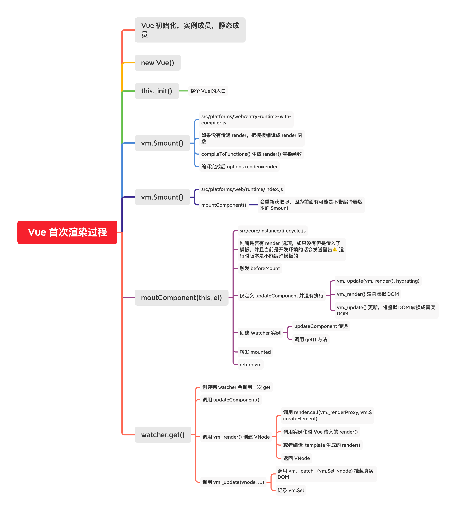
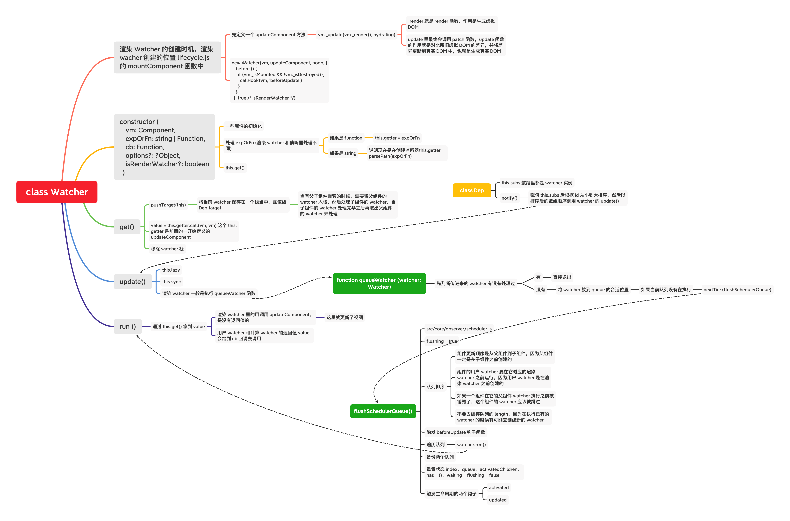
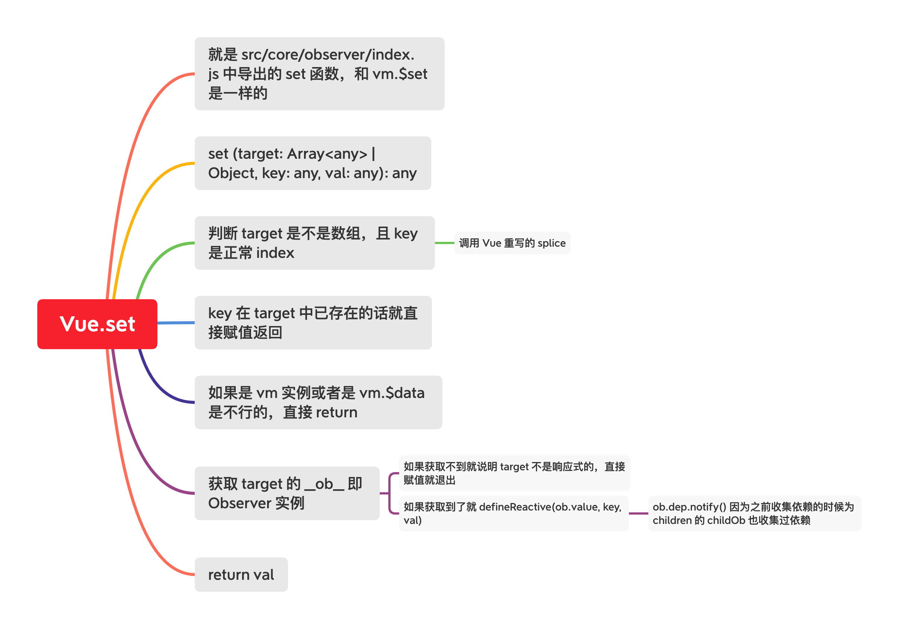
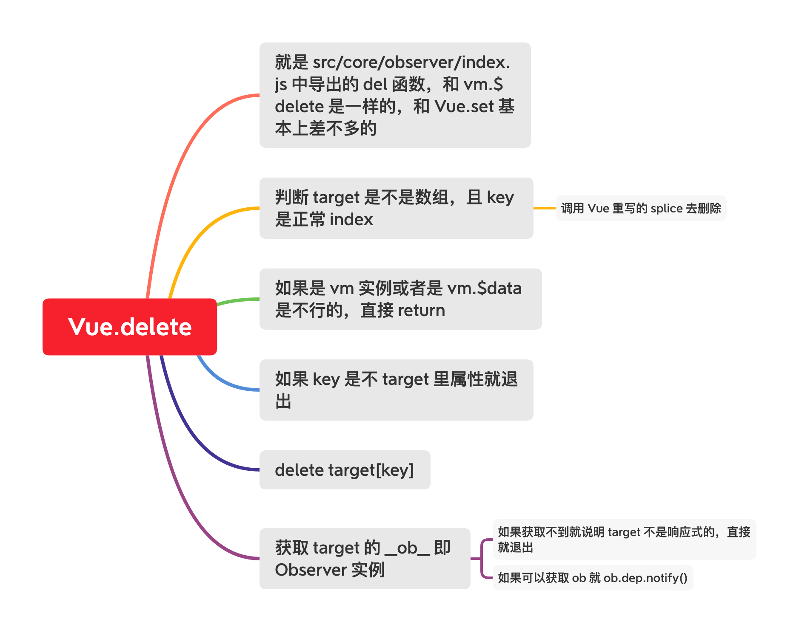
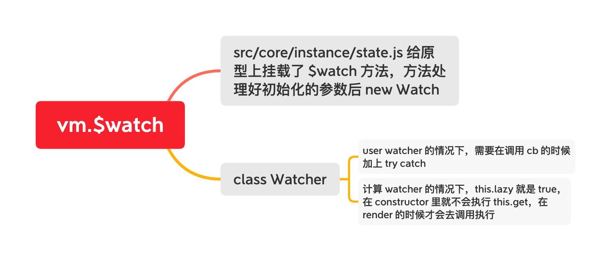
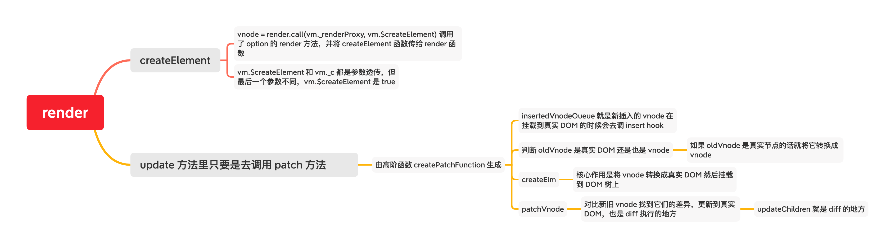
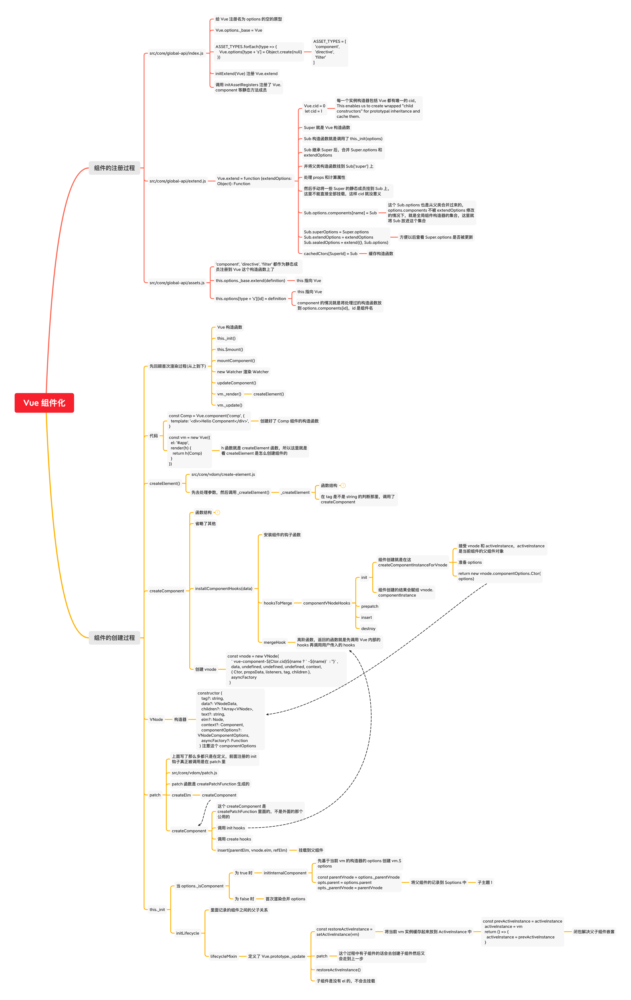

# **Vue** **源码解析** **-** **响应式原理** 

## **课程目标**

- Vue.js 的静态成员和实例成员初始化过程 
- 首次渲染的过程
- **数据响应式原理**

vue 3 虽然出了但是很多项目还没有那么快到 3，可能还有一段很长的过渡期

## 目录结构

```
.
├── BACKERS.md
├── LICENSE
├── README.md
├── benchmarks
├── dist
├── examples
├── flow
├── node_modules
├── package.json
├── packages
├── scripts
├── src								源码目录
    ├── compiler			编译相关
    ├── core					vue 核心库
    ├── platforms			平台相关代码
    ├── server				服务端渲染
    ├── sfc
    └── shared
├── test
├── types
└── yarn.lock
```


## Flow

- vue 2.x 选择的静态类型检查器
- Flow 的静态类型检查错误是通过静态类型推断实现的
  - 文件开头通过 // @flow 或者 /* @flow */ 声明

## 调试设置

### 打包

- 打包工具 Rollup
  - Vue.js 源码的打包工具使用的是 Rollup，比 Webpack 轻量
  - Webpack 把所有文件当做模块，Rollup 只处理 js 文件更适合在 Vue.js 这样的库中使用 
  - Rollup 打包不会生成冗余的代码
- 拉下 vue 仓库的源码后先安装依赖

```shell
npm i #或者 yarn
```

- 设置 sourcemap
  - package.json 文件中的 dev 脚本中添加参数 --sourcemap

```
 "dev": "rollup -w -c scripts/config.js --environment TARGET:web-full-dev", 
 改成下面的
 "dev": "rollup -w -c scripts/config.js --sourcemap --environment TARGET:web-full-dev",
 -w 是 watch 的意思，就是监视文件变化，文件一旦变化立即重新打包
 -c 是指定配置文件
 --sourcemap 就是启用 sourcemap
 --environment 指定环境变量
```

- 执行 dev
  - npm run dev 执行打包，用的是 rollup，-w 参数是监听文件的变化，文件变化自动重新打包

然后可以在根目录下的 examples 目录里找个例子，将里面引入 vue 的 script 改成自己刚打包出来的新 vue.js

然后打开 index.html 就能看到用刚刚打包出来的 vue.js 的运行情况

也浏览器中打开开发者工具，切换到 source 栏，可是看到我们页面的所引用的资源，其中的 `src` 目录就是开启了 `sourcemap` 后才会出现的，里面只会展示我们依赖了的那些源文件

一般 `vue` 的入口都是 `new Vue()` 的位置，将断点打在这个位置，刷新页面就能看到页面暂停了，然后我们走进这个 `new Vue` 里面，应该会跳到 `core/instance/index.js`，现在我们就可以好好调试我们的源码的 vue 了

## Vue 的各种构件版本

- `npm run build` 构件所有版本的 vue
- [官方对不同构建版本的解释](https://cn.vuejs.org/v2/guide/installation.html#%E5%AF%B9%E4%B8%8D%E5%90%8C%E6%9E%84%E5%BB%BA%E7%89%88%E6%9C%AC%E7%9A%84%E8%A7%A3%E9%87%8A)
- dist/README.md 也是很好的介绍文档

|                          | UMD                | CommonJS              | ES Module          |
| ------------------------ | ------------------ | --------------------- | ------------------ |
| Full                     | vue.js             | vue.common.js         | vue.esm.js         |
| Runtime-only             | vue.runtime.js     | vue.runtime.common.js | vue.runtime.esm.js |
| Full(production)         | vue.min.js         |                       |                    |
| Runtime-only(production) | vue.runtime.min.js |                       |                    |

### 区别

- **完整版**:同时包含**编译器**和**运行时**的版本。
- **编译器**:用来将模板字符串编译成为 JavaScript 渲染函数的代码，体积大、效率低。
- **运行时**:用来创建 Vue 实例、渲染并处理虚拟 DOM 等的代码，体积小、效率高。基本上就是除 去编译器的代码。
- [**UMD**](https://github.com/umdjs/umd): UMD 版本**通用的模块版本**，支持多种模块方式。 默认文件就是运行时 + 编译器的 UMD 版本
- [**CommonJS** **(cjs)**](http://wiki.commonjs.org/wiki/Modules/1.1):CommonJS 版本用来配合老的打包工具比如 [Browserify](http://browserify.org/) 或 [webpack 1](https://webpack.github.io/)。
- [**ES Module**](http://exploringjs.com/es6/ch_modules.html):从 2.6 开始 Vue 会提供两个 ES Modules (ESM) 构建文件，为现代打包工具提供的版本。
  - ESM 格式被设计为可以被静态分析，所以打包工具可以利用这一点来进行“tree-shaking”并 将用不到的代码排除出最终的包。
  - ES6 模块与 CommonJS 模块的差异

查看 `vue-cli` 创建的项目是用的哪个版本的 `vue`

全局安装 `vue` 的脚手架，然后 `vue inspect > output.js`，`vue inspect` 输出的并不是一个有效的配置文件，不能直接使用作为 `webpack` 的配置。在输出的文件里 `alias` 里可以看到默认使用的是运行时的 esm 版本的 vue

## 入口文件

根据前面 dev 的命令，`rollup` 只要配置了入口就会解析模块之间的引用，所以可以在那个配置文件就能找到 vue 的入口文件

看源码也不是上来就一行一行的看，那会疯掉的，看源码要有个目标，我们现在就是要找到入口文件

看 rollup 的配置文件，`yarn dev` 的命令会让我们打包 `web-full-dev` 那个包，对应的入口就是 `src/platforms/web/entry-runtime-with-compiler.js`

## 开始

找到了入口文件，我们就可以从入口文件看起了

`src/platforms/web/entry-runtime-with-compiler.js`

- 在 `Vue.prototype` 上挂载了 `$mount` 方法，主要就找到整个 vue 的根节点，然后挂载，先看有没有 render 方法，如果没有就去编译生成 render 方法
- 这个挂载的 `$mount` 方法什么时候调用就成了关键，可以回到我们之前那个调试方法，随便写个 vue 的例子，调用开启了 sourcemap 的 vue.js，我们就可以直接用源码来调试
- 这样我们就能找到 `entry-runtime-with-compiler.js` 并在 `$mount` 方法里打个断点，刷新页面，就会早我们刚刚调用的打了断点的位置停下，然后我们在 `Call Stack` 里可以看 `$mount` 的**调用堆栈**
- el 不能是 body 或者 html 标签

## 初始化

`entry-runtime-with-compiler.js` 比 `entry-runtime.js` 多的就是编译的部分，我们现在要看 vue 实例初始化的部分其实就可以去看 `entry-runtime.js`，它直接就是导出 `src/platforms/web/runtime/index.js` 的默认导出，`src/platforms/web/runtime/index.js` 里也给 vue.prototype 挂了一个 $mount 的方法，不过这里面就没有编译的过程了，这个文件里的 Vue 是来自 `src/core/index.js` 的

- `src/platforms/web/entry-runtime-with-compiler.js`
  - web 平台
  - 重写了平台相关的 $mount 方法
  - 注册了 Vue.compile() 方法，传递一个 HTML 字符串返回 render 函数
- `src/platforms/web/runtime/index.js`
  - web 平台
  - 注册和平台相关的全局指令：v-model、v-show
  - 注册和平台相关的全局组件：v-transition、v-transition-group
  - 全局方法：
    - `__patch__` ：把虚拟 DOM 转换成真实 DOM
    - $mount：挂载节点
- `src/core/index.js`
  - 与平台无关
  - 设置了 Vue 的静态方法，调用 initGlobalAPI(Vue)
- `src/core/instance/index.js`
  - 与平台无关
  - 定义了构造函数，调用了 this._init(options)
  - 给 Vue 中混入常用的实例成员

## 小问题

1. 如果用的是 vscode 看源码，打开这些 js 文件的时候，很容易就看到各种提示 `xxx 是 ts 的语法...`，毕竟 vscode 和 ts 都是微软的，flow 的那些语法也有点像 ts，vscode 理所当然的会认为报错，这是因为 vscode 开启了 JavaScript 的 validation，你可以到设置里搜 JavaScript validation，关闭就好了，多说一点，一般我们也不能一天天地就只看源码，我们可能都是工作之余来学习一下源码，所以这个关闭 JavaScript validation 只能是属于这个 vue 源码的 workspace，没必要全局都关闭，人还要工作混口饭吃不是。
2. 在一些泛型定义后面例如 `<T>(obj: T): T => {}` 后面，会导致后面的代码高亮没了，安装 Babel JavaScript 拓展就行了，不过可能就不能跳转到定义了，这个问题还暂时没有解决方法（尝试过 vscode 装 flow 的拓展，但是结果并不行，懒的折腾这些无关紧要的了）

## 入口相关

### src/core/index.js

```js
import Vue from './instance/index'
import { initGlobalAPI } from './global-api/index'
import { isServerRendering } from 'core/util/env'
import { FunctionalRenderContext } from 'core/vdom/create-functional-component'

// 注册 Vue 的静态方法
initGlobalAPI(Vue)


Object.defineProperty(Vue.prototype, '$isServer', {
  get: isServerRendering
})

Object.defineProperty(Vue.prototype, '$ssrContext', {
  get () {
    /* istanbul ignore next */
    return this.$vnode && this.$vnode.ssrContext
  }
})

// expose FunctionalRenderContext for ssr runtime helper installation
Object.defineProperty(Vue, 'FunctionalRenderContext', {
  value: FunctionalRenderContext
})

Vue.version = '__VERSION__'

export default Vue
```

### src/core/global-api/index.js

初始化 Vue 的静态方法

```js
/* @flow */

import config from '../config'
import { initUse } from './use'
import { initMixin } from './mixin'
import { initExtend } from './extend'
import { initAssetRegisters } from './assets'
import { set, del } from '../observer/index'
import { ASSET_TYPES } from 'shared/constants'
import builtInComponents from '../components/index'
import { observe } from 'core/observer/index'

import {
  warn,
  extend,
  nextTick,
  mergeOptions,
  defineReactive
} from '../util/index'

export function initGlobalAPI (Vue: GlobalAPI) {
  // config
  const configDef = {}
  configDef.get = () => config
  if (process.env.NODE_ENV !== 'production') {
    configDef.set = () => {
      warn(
        'Do not replace the Vue.config object, set individual fields instead.'
      )
    }
  }
  Object.defineProperty(Vue, 'config', configDef)

  // exposed util methods.
  // NOTE: these are not considered part of the public API - avoid relying on
  // them unless you are aware of the risk.
  // 文档里都不会提到这些方法，不推荐我们使用
  Vue.util = {
    warn,
    extend,
    mergeOptions,
    defineReactive
  }
  // 静态方法 set/delete/nextTick
  Vue.set = set
  Vue.delete = del
  Vue.nextTick = nextTick

  // 2.6 explicit observable API
  // 让一个对象可响应的方法
  Vue.observable = <T>(obj: T): T => {
    observe(obj)
    return obj
  }

  // 初始化 Vue.options 对象，并给其扩展
  Vue.options = Object.create(null)
  ASSET_TYPES.forEach(type => {
    Vue.options[type + 's'] = Object.create(null)
  })

  // this is used to identify the "base" constructor to extend all plain-object
  // components with in Weex's multi-instance scenarios.
  Vue.options._base = Vue

  // 设置 keep-alive 组件
  extend(Vue.options.components, builtInComponents)

  // 注册 Vue.use() 用来注册插件
  initUse(Vue)
  // 注册 Vue.mixin() 实现混入
  initMixin(Vue)
  // 注册 Vue.extend() 基于传入的options返回一个自定义组件的构造函数
  initExtend(Vue)
  // 注册 Vue.directive()、 Vue.component()、Vue.filter()
  initAssetRegisters(Vue)
}
```

### src/core/instance/index.js

- 定义 Vue 的构造函数 
- 初始化 Vue 的实例成员

```js
import { initMixin } from './init'
import { stateMixin } from './state'
import { renderMixin } from './render'
import { eventsMixin } from './events'
import { lifecycleMixin } from './lifecycle'
import { warn } from '../util/index'
// 此处不用 class 的原因是因为方便后续给 Vue 实例混入实例成员
function Vue (options) {
  if (process.env.NODE_ENV !== 'production' &&
    !(this instanceof Vue)
  ) {
    warn('Vue is a constructor and should be called with the `new` keyword')
  }
  // 调用 _init() 方法
  this._init(options)
}
// 注册 vm 的 _init() 方法，初始化 vm
initMixin(Vue)
// 注册 vm 的 $data/$props/$set/$delete/$watch
stateMixin(Vue)
// 初始化事件相关方法
// $on/$once/$off/$emit
eventsMixin(Vue)
// 初始化生命周期相关的混入方法
// _update/$forceUpdate/$destroy
lifecycleMixin(Vue)
// 混入 render
// $nextTick/_render
renderMixin(Vue)

export default Vue
```

### src/core/instance/init.js

初始化 _init() 方法

```js
import config from '../config'
import { initProxy } from './proxy'
import { initState } from './state'
import { initRender } from './render'
import { initEvents } from './events'
import { mark, measure } from '../util/perf'
import { initLifecycle, callHook } from './lifecycle'
import { initProvide, initInjections } from './inject'
import { extend, mergeOptions, formatComponentName } from '../util/index'

let uid = 0

export function initMixin (Vue: Class<Component>) {
  // 给 Vue 实例增加 _init() 方法
  // 合并 options / 初始化操作
  Vue.prototype._init = function (options?: Object) {
    const vm: Component = this
    // a uid
    vm._uid = uid++

    let startTag, endTag
    /* istanbul ignore if */
    if (process.env.NODE_ENV !== 'production' && config.performance && mark) {
      startTag = `vue-perf-start:${vm._uid}`
      endTag = `vue-perf-end:${vm._uid}`
      mark(startTag)
    }

    // a flag to avoid this being observed
    // 如果是 Vue 实例不需要被 observe
    vm._isVue = true
    // merge options
    // 合并 options
    if (options && options._isComponent) {
      // optimize internal component instantiation
      // since dynamic options merging is pretty slow, and none of the
      // internal component options needs special treatment.
      initInternalComponent(vm, options)
    } else {
      vm.$options = mergeOptions(
        resolveConstructorOptions(vm.constructor),
        options || {},
        vm
      )
    }
    /* istanbul ignore else */
    if (process.env.NODE_ENV !== 'production') {
      initProxy(vm)
    } else {
      vm._renderProxy = vm
    }
    // expose real self
    vm._self = vm
    // vm 的生命周期相关变量初始化
    // $children/$parent/$root/$refs
    initLifecycle(vm)
    // vm 的事件监听初始化, 父组件绑定在当前组件上的事件
    initEvents(vm)
    // vm 的编译render初始化
    // $slots/$scopedSlots/_c/$createElement/$attrs/$listeners
    initRender(vm)
    // beforeCreate 生命钩子的回调
    callHook(vm, 'beforeCreate')
    // 把 inject 的成员注入到 vm 上
    initInjections(vm) // resolve injections before data/props
    // 初始化 vm 的 _props/methods/_data/computed/watch
    initState(vm)
    // 初始化 provide
    initProvide(vm) // resolve provide after data/props
    // created 生命钩子的回调
    callHook(vm, 'created')

    /* istanbul ignore if */
    if (process.env.NODE_ENV !== 'production' && config.performance && mark) {
      vm._name = formatComponentName(vm, false)
      mark(endTag)
      measure(`vue ${vm._name} init`, startTag, endTag)
    }
    // 调用 $mount() 挂载
    if (vm.$options.el) {
      vm.$mount(vm.$options.el)
    }
  }
}
```

## 首次渲染结构



## 简述首次渲染的过程

Vue 初始化实例成员和静态方法，Vue 初始化结束后就调用构造函数，在构造函数中调用了 `_init()` 方法，然后调用了 `plateforms/web/entry-runtime-with-compiler.js` 里的 `$mount` 方法，如果有没有传递 `render` 方法，就会通过 `compileToFunctions()` 将模板编译成 `render` 函数并挂到 `options` 的 `render` 上

然后调用 runtime 的 `$mount` 方法，里面会重新获取 `$el` 去调用 mountComponent 方法

mountComponent 会触发 bdeforeMount 的生命周期，再定义 updateComponent 函数，在 updataComponent 函数中去调用了 `vm._update` 和 `vm._render`，`_render` 的作用是生成虚拟 DOM，`_update` 的作用是将虚拟 DOM 转换成真实 DOM 并挂到页面上。

mountComponent 里接着创建了 Watcher 实例对象，并传递了刚刚定义的 updateComponent 函数，这个 updateComponent 最终是在 watcher 实例中被调用的。在 watcher 中会调用 get 方法

mountComponent 里再继续触发 mounted 生命周期钩子，最后返回 vue 实例

上面讲的创建完 watcher 的时候会调用一次 get 方法，然后会调用 updateComponent 方法，然后会调用传入的 render 函数生成虚拟 DOM 返回

再调用 update，里面又调用了 patch 方法去挂载到真实 DOM 上并记录到 `vm.$el` 中

## 数据响应式原理

### 问题（目标）

- `vm.msg = { count: 0 }`，重新给属性赋值，是否是响应式的？
- `vm.arr[0] = 4`，给数组元素赋值，视图是否会更新？
- `vm.arr.length = 0`，修改数组的 length，视图是否会更新？
- `vm.arr.push(4)`，视图是否会更新？

## 简述 Vue 响应式原理

整个响应式的过程是从 init 方法开始的，在 init 里面调用了 initState 去初始化 vue 实例的状态，然后调用了 initData 将 data 属性注入到实例上，然后调用 observe 去将 data 对象变成响应式的对象

observe 接受一个对象，这个对象如果有 `__ob__` 属性就直接返回 `__ob__`，如果没有的话就创建 Observer 对象并返回

在 Observer 的构造函数中，给 value 对象定义一个不可枚举的 `__ob__` 属性，记录当前的 observer 对象，然后进行数组的响应化处理或者对象的响应化处理。

数组的响应化处理就是劫持会对数组进行修改的原型方法，对它们进行改造，在调用它们的时候去发送通知。

对象的响应化处理是调用 walk 方法，就是遍历对象的所有属性，对每一个属性调用 defineReactive 方法

defineReactive 方法会为每一个属性创建 Dep 对象，如果当前属性是对象的话，调用 observe。defineReactive 的主要作用是定义 getter 和 setter，在 getter 中去收集依赖并返回属性值，在 setter 中保存新值，如果新值是对象的话，调用 observe 将新值也转成响应式对象，再派发更新调用 dep.notify()

收集依赖的时候是在 watcher 对象的 get 方法中调用 pushTarget 记录 Dep.target 属性，访问 data 中的成员的时候会触发 defineReactive 定义的 getter 去收集依赖，会把属性对应的 watcher 对象添加到 dep 的 subs 数组中，如果属性的值也是对象，就要创建一个 childOb 为子对象收集依赖，目的是将来子对象发生变化的时候也能发送通知

当数据发生变化的时候，会调用 dep.notify 发送通知，会调用 Watcher 对象的 update 方法，然后调用 queueWatcher 函数，里面回去判断 wathcer 是否被处理，如没有就添加到 queue 队列中，并调用 flushSchedulerQueue，在 flushSchedulerQueue 函数中，会去触发 beforeUpdate 钩子函数，调用 watcher.run 方法，在 watcher.run 方法中会调用 get 从而触发 getter 从而调用 updateComponent，这样变化就更新到了视图上了，接下来就是一些清理的工作，清空上一次的依赖并重置 watcher 的一些状态，并触发 actived 钩子函数和 updated 钩子函数

## watcher

- Watcher 分为三种，Computed Watcher、用户 Watcher (侦听器)、**渲染** **Watcher**，创建顺序也是 Computed Watcher、用户 Watcher (侦听器)、**渲染** **Watcher**
- 下面是渲染 watcher



##  **vm.$set**

功能

向响应式对象中添加一个属性，并确保这个新属性同样是响应式的，且触发视图更新。它必须用于 向响应式对象上添加新属性，因为 Vue 无法探测普通的新增属性 (比如 `this.myObject.newProperty = 'hi'`)

> **注意:**对象不能是 Vue 实例，或者 Vue 实例的根数据对象。



## vm.$delete

功能

删除对象的属性。如果对象是响应式的，确保删除能触发更新视图。这个方法主要用于避开 Vue 不能检测到属性被删除的限制，但是你应该很少会使用它。

>  **注意:**目标对象不能是一个 Vue 实例或 Vue 实例的根数据对象。



## vm.$watch

`$watch` 只在实例上挂载了，因为 watch 依赖实例



## 异步更新队列 nextTick

- Vue 更新 DOM 是异步执行的，批量的
	- 在下次 DOM 更新循环结束之后执行延迟回调。在修改数据之后立即使用这个方法，获取更新后的 DOM。
- `vm.$nextTick(function () { /* 操作 DOM */ }) / Vue.nextTick(function () {})`

Vue 和 Vue 实例上都有 nextTick，是同一个方法

# Vue 虚拟 DOM

- 虚拟 DOM(Virtual DOM) 是使用 JavaScript 对象来描述真实 DOM
- Vue.js 中的虚拟 DOM 借鉴了 Snabbdom，并添加了一些 Vue.js 中的特性，例如:指令和组件机制。

## 使用虚拟 DOM 的原因

- 使用虚拟 DOM，可以避免用户直接操作 DOM，开发过程关注在业务代码的实现，不需要关注如 何操作 DOM，从而提高开发效率
- 作为一个中间层可以跨平台，除了 Web 平台外，还支持 SSR、Weex。 
- 关于性能方面
	- 在首次渲染的时候肯定不如直接操作 DOM，因为要维护一层额外的虚拟 DOM
	- 如果后续有频繁操作 DOM 的操作，这个时候可能会有性能的提升，虚拟 DOM 在更新真实 DOM 之前会通过 Diff 算法对比新旧两个虚拟 DOM 树的差异，最终把差异更新到真实 DOM

## createElement

常说的 h 函数就是 createElement 函数



## 简述虚拟 DOM 中 Key 的作用和好处

当没有 key 的时候，如果数据项的顺序被改变，Vue 将不会移动 DOM 元素来匹配数据项的顺序，而是就地更新每个元素，并且确保它们在每个索引位置正确渲染。如果都是同一标签类型的 children 仅仅是将最后一个项提到最前面的话，可能每个 child 都更新了一遍。如果有 key 的话，就移动一次就够了

设置 key 能更大限度的复用 DOM 从而减少 DOM 操作，提高性能

# 模板编译

模板编译的主要目的是将模板 template 转换成渲染函数 render

模板编译的作用

- Vue 2.x 使用 VNode 描述视图以及各种交互，用户自己编写 VNode 比较复杂 
- 用户只需要编写类似 HTML 的代码 - Vue 模板，通过编译器将模板转换为返回 VNode 的 render 函数
- .vue 文件会被 webpack 在构建的过程中转换成 render 函数

Vue 2 模板中间的空白会编译进渲染函数中，但是 vue 3 不会

## 为什么需要抽象语法树

- 模板字符串转换成 ast 后，可以通过 ast 对模板做优化处理
- 标记模板中的静态内容，在 patch 的时候直接推过静态内容
- 在 patch 的过程中静态内容不需要对比和重新渲染

## parser

vue 中主要借鉴了 *simplehtmlparser*，这里内容特别的多，只做大致流程的梳理

解析器将模板解析为抽象语树 AST，只有将模板解析成 AST 后，才能基于它做优化或者生成代码字符串

[astexplorer.net](https://astexplorer.net/#/gist/30f2bd28c9bbe0d37c2408e87cabdfcc/1cd0d49beed22d3fc8e2ade0177bb22bbe4b907c)

## 简述 Vue 中模板编译的过程

在入口函数 compileToFunctions 中首先加载缓存好的 render 函数，如果没有缓存就调用 `compile(template, options)` 开始编译

compile 函数先合并 options，然后调用 `baseCompile(template.trim(), finalOptions)` 编译模板，compile 的核心主要是合并 options

编译是在 baseCompile 里完成的，它里面完成了模板编译的核心三件事就是，先 parse 将模板变成了 AST 对象，然后对 AST 进行优化，标记 AST 中静态的 sub trees，静态的 sub trees 不需要重绘，patch 阶段会跳过静态子树，最后通过 generate 将 AST 转换成 js 的创建代码

最后会回到 compileToFunctions 里，通过 createFunction 继续把上一步生成的字符串形式 js 的代码转换成函数，render 和 staticRenderFns 初始化完毕后，就挂载到 Vue 实例的 options 对应的属性上

## 组件化

- 一个 Vue 组件就是一个拥有预定义选项的一个 Vue 实例
- 一个组件可以组成页面上一个功能完备的区域，组件可以包含脚本、样式、模板

### 组件注册方式

- 全局组件
- 局部组件

Vue.Component 

先创建父组件再创建子组件

先将子组件挂载到父组件上

