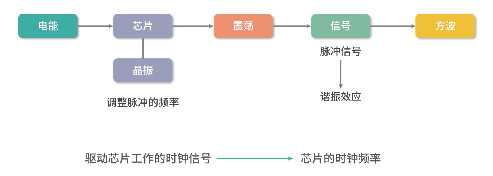
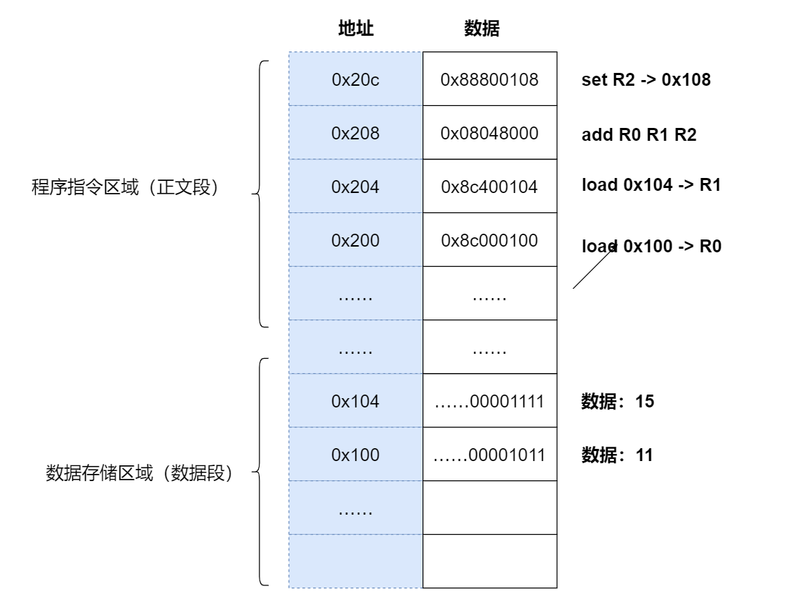

芯片



芯片内部的集成电路，所有的元件都是用同一块半导体材料制作而成

希尔伯特
建立一套完善的公理体系，由少数几个公理出发，推导出所有的定理和推论，将世界上的万事万物都统一到一个体系中

哥德尔不完备性定理：即便在完善的公理体系中，仍然可以找到不能被证明也不能被证伪的命题

计算机能力也是有**边界**的

摩尔定律原话已经失效，但还是告诉我们一个事实，我们的计算能力在飞速发展

阿兰图灵，图灵机，一种不断执行指令的抽象计算机（当时没有真的机器）

不能使用图灵机计算的问题，都是不可计算问题

“素数是不是有无穷多个”就是不可计算问题

无法实现：用一个通用程序去判断另一个程序是否会停止（停机问题）

世界上想解决的问题都成为问题

解决问题需要消耗芯片的计算能力--时间开销

解决问题需要消耗内存--空间开销

假如现在有一个O(n^1000)的问题，在遥远的将来我们能解决，这个问题被称为多项式时间问题（Polynomial time），也叫 P 问题

还有一种是指数形式的问题，O(n^2) ，问题如果不能在多项式时间内找到答案，就是 NP 问题

```javascript
// 假设存在程序isHalt可以判断程序f对输入input是否停机，当输入input时，f停机返回0；当输入input时，f不停机返回1
function isHalt(f, input){}// 设定test方法与isHalt结果返回相反
function test(f){ 
  if(isHalt(f, f) === 1){//当停机时，test方法终止 
    return; 
  }else{//当不停机时，test方法死循环 
    while(1){} 
  }
}
// isHalt(test, test)停机时，test(test)进入死循环，与定义的test方法相矛盾（看test代码会直接return）isHalt(test, test)不停机时，test(test)停机，与定义的test方法相矛盾（看test代码会进入死循环）
```

## 相比 32 位，64 位的优势是什么

面试官在这里给你挖了一个陷阱，因为他没有说清楚 32、64 位指的是操作系统、是软件、还是 CPU？

如果是软件，那么我们的数据库有 32 位和 64 位版本；

如果是操作系统，那么在阿里云上选择 Centos 和 Debian 版本的时候，也会有 32/64 版本；

如果是 CPU，那么有 32 位 CPU，也有 64 位 CPU。

图灵机说起了。它在计算机科学方面有两个巨大的贡献：

- 第一，它清楚地定义了计算机能力的边界，也就是可计算理论；

- 第二，它定义了计算机由哪些部分组成，程序又是如何执行的。

图灵通过数学证明了，一个问题如果可以拆解成图灵机的可执行步骤，那问题就是可计算的。另一方面，图灵机定义了计算机的组成以及工作原理，但是没有给出具体的实现。


具体的实现是 1945 年冯诺依曼和其他几位科学家在著名的 101 页报告中提出的。报告遵循了图灵机的设计，并提出用电子元件构造计算机，约定了用二进制进行计算和存储，并且将计算机结构分成以下 5 个部分：

1. 输入设备；

2. 输出设备；

3. 内存；

4. 中央处理器；

5. 总线。

这个模型也被称为冯诺依曼模型

### 内存

在冯诺依曼模型中，程序和数据被存储在一个被称作内存的线性排列存储区域。存储的数据单位是一个二进制位，英文是 bit。最小的存储单位叫作字节，也就是 8 位，英文是 byte，每一个字节都对应一个内存地址。内存地址由 0 开始编号，比如第 1 个地址是 0，第二个地址是 1， 然后自增排列，最后一个地址是内存中的字节数减 1。

我们通常说的内存都是随机存取器，也就是读取任何一个地址数据的速度是一样的，写入任何一个地址数据的速度也是一样的。

### CPU

冯诺依曼模型中 CPU 负责控制和计算。为了方便计算较大的数值，CPU 每次可以计算多个字节的数据。

如果 CPU 每次可以计算 4 个 byte，那么我们称作 32 位 CPU；

如果 CPU 每次可以计算 8 个 byte，那么我们称作 64 位 CPU。

这里的 32 和 64，称作 CPU 的位宽。

为什么 CPU 要这样设计呢？ 因为一个 byte 最大的表示范围就是 0~255。比如要计算 20000*50，就超出了byte 最大的表示范围了。因此，CPU 需要支持多个 byte 一起计算。当然，CPU 位数越大，可以计算的数值就越大。但是在现实生活中不一定需要计算这么大的数值。比如说 32 位 CPU 能计算的最大整数是 4294967295，这已经非常大了。

### 控制单元和逻辑运算单元

CPU 中有一个控制单元专门负责控制 CPU 工作；还有逻辑运算单元专门负责计算。具体的工作原理我们在指令部分给大家分析。

### 寄存器

CPU 要进行计算，比如最简单的加和两个数字时，因为 CPU 离内存太远，所以需要一种离自己近的存储来存储将要被计算的数字。这种存储就是寄存器。寄存器就在 CPU 里，控制单元和逻辑运算单元非常近，因此速度很快。

- 寄存器中有一部分是可供用户编程用的，比如用来存加和指令的两个参数，是**通用寄存器**。

- 还有一部分寄存器有特殊的用途，叫作**特殊寄存器**。比如程序指针，就是一个特殊寄存器。它存储了 CPU 要执行的下一条指令所在的内存地址。注意，程序指针不是存储了下一条要执行的指令，此时指令还在内存中，程序指针只是存储了下一条指令的地址。

- 下一条要执行的指令，会从内存读入到另一个特殊的寄存器中，这个寄存器叫作**指令寄存器**。指令被执行完成之前，指令都存储在这里。

### 总线

CPU 和内存以及其他设备之间，也需要通信，因此我们用一种特殊的设备进行控制，就是总线。总线分成 3 种：

- 一种是地址总线，专门用来指定 CPU 将要操作的内存地址。

- 还有一种是数据总线，用来读写内存中的数据。

当 CPU 需要读写内存的时候，先要通过地址总线来指定内存地址，再通过数据总线来传输数据。

- 最后一种总线叫作控制总线，用来发送和接收关键信号，比如后面我们会学到的中断信号，还有设备复位、就绪等信号，都是通过控制总线传输。同样的，CPU 需要对这些信号进行响应，这也需要控制总线。

### 程序的执行过程

当 CPU 执行程序的时候：

1. 首先，CPU 读取 PC 指针指向的指令，将它导入指令寄存器。具体来说，完成读取指令这件事情有 3 个步骤：

步骤 1：CPU 的控制单元操作地址总线指定需要访问的内存地址（简单理解，就是把 PC 指针中的值拷贝到地址总线中）。

步骤 2：CPU 通知内存设备准备数据（内存设备准备好了，就通过数据总线将数据传送给 CPU）。

步骤 3：CPU 收到内存传来的数据后，将这个数据存入指令寄存器。

完成以上 3 步，CPU 成功读取了 PC 指针指向指令，存入了指令寄存器。

2. 然后，CPU 分析指令寄存器中的指令，确定指令的类型和参数。
3. 如果是计算类型的指令，那么就交给逻辑运算单元计算；如果是存储类型的指令，那么由控制单元执行。
4. PC 指针自增，并准备获取下一条指令。

比如在 32 位的机器上，指令是 32 位 4 个字节，需要 4 个内存地址存储，因此 PC 指针会自增 4。

### 详解 a = 11 + 15 的执行过程

上面我们了解了基本的程序执行过程，接下来我们来看看如果用冯诺依曼模型执行a=11+15是一个怎样的过程。

我们再 Review 下这个问题：程序员写的程序a=11+15是字符串，CPU 不能执行字符串，只能执行指令。所以这里需要用到一种特殊的程序——编译器。编译器的核心能力是翻译，它把一种程序翻译成另一种程序语言。

这里，我们需要编译器将程序员写的程序翻译成 CPU 认识的指令（指令我们认为是一种低级语言，我们平时书写的是高级语言）。你可以先跟我完整地学完操作系统，再去深入了解编译原理的内容。

下面我们来详细阐述 a=11+15 的执行过程：

1.编译器通过分析，发现 11 和 15 是数据，因此编译好的程序启动时，会在内存中开辟出一个专门的区域存这样的常数，这个专门用来存储常数的区域，就是数据段，如下图所示：

11 被存储到了地址 0x100；

15 被存储到了地址 0x104；



2.编译器将a=11+15转换成了 4 条指令，程序启动后，这些指令被导入了一个专门用来存储指令的区域，也就是正文段。如上图所示，这 4 条指令被存储到了 0x200-0x20c 的区域中：

0x200 位置的 load 指令将地址 0x100 中的数据 11 导入寄存器 R0；

0x204 位置的 load 指令将地址 0x104 中的数据 15 导入寄存器 R1；

0x208 位置的 add 指令将寄存器 R0 和 R1 中的值相加，存入寄存器 R2；

0x20c 位置的 store 指令将寄存器 R2 中的值存回数据区域中的 0x1108 位置。

3.具体执行的时候，PC 指针先指向 0x200 位置，然后依次执行这 4 条指令。

### 指令

在上面的例子中，load 指令将内存中的数据导入寄存器，我们写成了 16 进制：0x8c000100，拆分成二进制就是：

```
指令编码 100011
寄存器R0 0000
内存地址0x100 0000000000000100000000
```

指令编码的 6 位，叫作操作码，英文是 OpCode，100011 代表 load 指令；


寄存器的 4 位 0000是寄存器的编号，这里代表寄存器 R0；


后面的 22 位代表要读取的地址，也就是 0x100。


所以我们是把操作码、寄存器的编号、要读取的地址合并到了一个 32 位的指令中。

一条求加法运算的 add 指令，16 进制表示是 0x08048000，换算成二进制就是：

```
指令编码 000010
寄存器R0 0000
寄存器R1 0001
寄存器R2 0010
未使用 00000000000000
```

开始 6 位是指令编码，代表指令 add；

紧接着的 4 位 0000 代表寄存器 R0；

然后再接着的 4 位 0001 代表寄存器 R1；

再接着的 4 位 0010 代表寄存器 R2；

最后剩下的 14 位没有被使用。

构造指令的过程，叫作指令的编码，通常由编译器完成；解析指令的过程，叫作指令的解码，由 CPU 完成。由此可见 CPU 内部有一个循环：

首先 CPU 通过 PC 指针读取对应内存地址的指令，我们将这个步骤叫作 Fetch，就是获取的意思。

CPU 对指令进行解码，我们将这个部分叫作 Decode。

CPU 执行指令，我们将这个部分叫作 Execution。

CPU 将结果存回寄存器或者将寄存器存入内存，我们将这个步骤叫作 Store。

上面 4 个步骤，我们叫作 CPU 的指令周期。CPU 的工作就是一个周期接着一个周期，周而复始。

### 指令的类型

通过上面的例子，会发现不同类型（不同 OpCode）的指令、参数个数、每个参数的位宽，都不一样。而参数可以是以下这三种类型：

1. 寄存器；
2. 内存地址；
3. 数值（一般是整数和浮点）。

当然，无论是寄存器、内存地址还是数值，它们都是数字。

指令从功能角度来划分，大概有以下 5 类：

1. I/O 类型的指令，比如处理和内存间数据交换的指令 store/load 等；再比如将一个内存地址的数据转移到另一个内存地址的 mov 指令。
2. 计算类型的指令，最多只能处理两个寄存器，比如加减乘除、位运算、比较大小等。
3. 跳转类型的指令，用处就是修改 PC 指针。比如编程中大家经常会遇到需要条件判断+跳转的逻辑，比如 if-else，swtich-case、函数调用等。
4. 信号类型的指令，比如发送中断的指令 trap。
5. 闲置 CPU 的指令 nop，一般 CPU 都有这样一条指令，执行后 CPU 会空转一个周期。

指令还有一个分法，就是寻址模式，比如同样是求和指令，可能会有 2 个版本：

1. 将两个寄存器的值相加的 add 指令。
2. 将一个寄存器和一个整数相加的 addi 指令。

另外，同样是加载内存中的数据到寄存器的 load 指令也有不同的寻址模式：

1. 比如直接加载一个内存地址中的数据到寄存器的指令la，叫作直接寻址。
2. 直接将一个数值导入寄存器的指令li，叫作寄存器寻址。
3. 将一个寄存器中的数值作为地址，然后再去加载这个地址中数据的指令lw，叫作间接寻址。

因此寻址模式是从指令如何获取数据的角度，对指令的一种分类，目的是给编写指令的人更多选择。

了解了指令的类型后，强调几个细节问题：

1. 关于寻址模式和所有的指令，只要你不是嵌入式开发人员，就不需要记忆，理解即可。
2. 不同 CPU 的指令和寄存器名称都不一样，因此这些名称也不需要记忆。
3. 有几个寄存器在所有 CPU 里名字都一样，比如 PC 指针、指令寄存器等。

### 指令的执行速度

CPU 是用石英晶体产生的脉冲转化为时钟信号驱动的，每一次时钟信号高低电平的转换就是一个周期，我们称为时钟周期。CPU 的主频，说的就是时钟信号的频率。比如一个 1GHz 的 CPU，说的是时钟信号的频率是 1G。

到这里可能会有疑问：是不是每个时钟周期都可以执行一条指令？其实，不是的，多数指令不能在一个时钟周期完成，通常需要 2 个、4 个、6 个时钟周期。

### 总结

回到开的问题，64 位和 32 位比较有哪些优势？

优势 1：64 位 CPU 可以执行更大数字的运算，这个优势在普通应用上不明显，但是对于数值计算较多的应用就非常明显。

优势 2：64 位 CPU 可以寻址更大的内存空间

如果 32 位/64 位说的是程序，那么说的是指令是 64 位还是 32 位的。32 位指令在 64 位机器上执行，困难不大，可以兼容。 如果是 64 位指令，在 32 位机器上执行就困难了。因为 32 位指令在 64 位机器执行的时候，需要的是一套兼容机制；但是 64 位指令在 32 位机器上执行，32 位的寄存器都存不下指令的参数。

操作系统也是一种程序，如果是 64 位操作系统，也就是操作系统中程序的指令都是 64 位指令，因此不能安装在 32 位机器上。

CPU 中有没有求对数的指令？如果没有那么程序如何去计算？

log x = a

底层方面CPU应当是没有计算对数的功能的。如果想要解决，可以考虑使用逼近法。计算机按照位数提前设计一个误差允许值，然后用e^x-a不断尝试不同x进行逼近。（写到这又感觉这样很效率很低。。。）泰勒展开求近似值

## 构造复杂的程序

不支持递归的程序语言如何实现递归程序？

```java
// 求 1 加到 100
var i = 1, s = 0;
for(; i <= 100; i++) {
  s+=i;
}
```

指令的设计者提供了一种 `jump` 类型的指令，让你可以在程序间跳跃

```
loop:
  jump loop
```

这就实现了一个无限循环，程序执行到 `jumploop` 的时候，就会跳回 `loop` 标签。用这种方法，我们可以将 `for` 循环用底层的指令实现：

```
# var i = 1, s = 0
# 对应 Java 代码，我们首先将 1 和 0 存储到两个地址
# 这两个地址我们用 $i 和 $s 表示
store #1 -> $i // 将数字 1 存入i的地址
store #0 -> $s // 将数字 0 存入 s 的地址
# 接下来循环要开始了，我们在这里预留一个 loop 标签
# loop 是一个自定义标签，它代表指令的相对位置
# 后续我们可以用 jump 指令跳转回这个位置实现循环
loop: # 循环标签

# for ... i <= 100
# 接下来我们开始实现循环控制
# 我们先首先 i <= 100的比较
# 我们先将变量 i 的地址，也就是 $i 导入寄存器 R0
load $i -> R0
# 然后我们用 cmp 比较指令 R0 和数字 100
cmp R0 #100 // 比较 R0 和数字 100
# 注意指令不会有返回值，它会进行计算，然后改变机器的状态（也就是寄存器）
# 比较后，有几个特殊的寄存器会保存比较结果
# 然后我们用 ja（jump above）, 如果比较结果 R0 比 100 大
# 那么我们就跳转到 end 标签，实现循环的跳出
ja end 
nop
# 如果 R0<=100，那么ja end 没有生效，这时我们处理 s+=i
# 首先我们把变 s 所在地址的数据导入寄存器 R1

load $s -> R1
# 然后我们把寄存器R0和R1加和，把结果存储寄存器 R2
add R0 R1 R2 
# 这时，我们把寄存器 R2 的值存入变量 s 所在的地址
store R2 -> $s
# 刚才我们完成了一次循环
# 我们还需要维护变量 i 的自增
# 现在 i 的值在 R0 中，我们首先将整数 1 叠加到 R0 上
add R0 #1 R0
# 再把 R0 的值存入i所在的内存地址
store R0 -> $i
# 这时我们的循环体已经全部执行完成，我们需要调转回上面 loop 标签所在的位置
# 继续循环
jump loop
nop
end:
```

