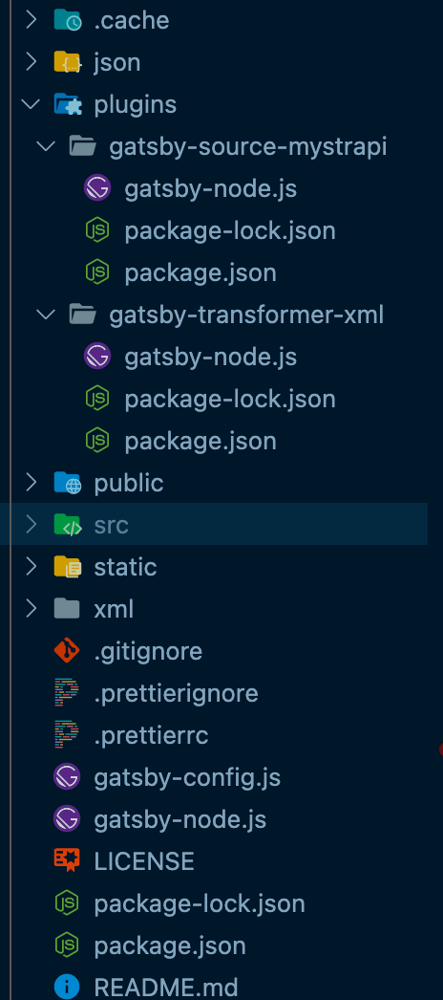

Gatsby 是一个静态站点生成器

官网： http://www.gatsbyjs.org/

把 React 应用变成静态站点的好处就是首屏加载更快，SEO 更友好，部署更简单

这个博客就是用 Gatsby 搭建的

## Gatsby 总览

1. 基于 React 和 GraphQL，结合了 webpack, babel, react-router 等前端领域中较先进的工具，开发人员体验好
2. 采用数据层和 UI 层分离而不失 SEO 的现代前端开发模式，对 SEO 非常友好
3. 数据预读取，在浏览器空闲的时候预先读取链接对应的页面内容，使静态页面拥有 SPA 应用的用户体验，用户体验好
4. 可以同时使用多个数据源，可以使用 markdown，yaml/json，也能用 CMS 来管理内容
5. 功能插件化，Gatsby 中提供了丰富且功能强大的各种类型的插件，用什么装什么

## 创建 Gatsby 项目

创建项目的内容官网一直都会更新，去官网看就行了，下面这个链接甚至过段时间就不一样了，所以自己去搜是最好的

https://www.gatsbyjs.com/docs/tutorial/part-1/

## 基于文件的路由系统

Gatsby 框架内置基于文件的路由系统，页面组件被放置在 src/pages 文件夹中

## 以编程的方式创建页面

基于一个模板创建多个 HTML 页面，有多少数据就创建多少页面

比如商品详情页面，有多少商品就区工程多少商品详情展示页面，还比如我们这个博客的页面，也是一样的道理

```js
// 在 gatsby-node.js 中定义的方法 createPages 会在构建应用的的时候被调用
async function createPages({ graphql, actions }) {
  const { createPage } = actions
  // 1. 获取模板文件的绝对路径
  const template = require.resolve("./src/templates/article.js")
  // 2. 获取页面的访问标识
  let { data } = await graphql(`
    query {
      allMarkdownRemark {
        nodes {
          fields {
            slug
          }
        }
      }
    }
  `)
  // 3. 创建页面
  data.allMarkdownRemark.nodes.forEach(node => {
    createPage({
      component: template,
      path: `/article/${node.fields.slug}`,
      context: {
        slug: node.fields.slug,
      },
    })
  })
}

module.exports = {
  createPages,
}
```

## GraphQL 数据层

在 Gatsby 框架中提供了一个统一的存储数据的地方，叫做数据层

在应用构建时，Gatsby 会从外部获取数据并将数据放入数据层，组件可以直接从数据层查询数据

数据层使用 GraphQL 构建

调试工具：http://localhost:8001/___graphql

### 页面组件

在组件文件中导出查询命令，框架执行查询并将结果传递给组件的 props 对象的 data 属性中

```jsx
import { graphql } from 'gatsby'

function PageComponent ({ data }) {
  return <div>{data.site.stiemetadata.title}</div>
}

export const query = graphql`
	query {
		site {
			siteMetadata {
				title
			}
		}
	}
`
```


### 非页面组件

通过钩子函数 useStaticQuery 进行手动查询

```js
import { graphql, useStaticQuery } from 'gatsby'


const data = useStaticQuery(graphql`
	query {
		site {
			siteMetadata {
				title
			}
		}
	}
`)
```

## Gatsby 插件

Gatsby 框架内置插件系统，插件是为应用添加功能的最好的方式

在 Gatsby 中有三种类型的插件：分别为数据源插件（source），数据转换插件（transform），功能插件（plugin）

数据源插件：负责中应用外部获取数据，将数据统一放在 Gatsby 的数据层中

数据转换插件：负责将特定类型的数据的格式，比如将 markdown 文件中的内容转换为对象形式

功能插件：为应用提供功能，比如通过插件让应用支持 Less 或者 Typescript

https://www.gatsbyjs.com/docs/plugins/

## 将本地 JSON 文件添加到数据层

要将本地 JSON 文件中的数据放入数据层需要用到两个插件

gatsby-source-filesystem: 用于将本地文件中的数据添加至数据层

gatsby-transformer-json: 将原始 JSON 字符串转换为 JavaScript 对象

```js
module.exports = {
  plugins: [
    {
      resolve: "gatsby-source-filesystem",
      options: {
        name: "json",
        path: `${__dirname}/json/`,
      },
    },
    "gatsby-transformer-json",
  ]
}
```

## 图像优化

1. 图像文件和数据文件不在源代码中的同一个位置
2. 图像路径基于构建站点的绝对路径，而不是相对于数据的路径，难以分析出图片的真实位置
3. 图像没有经过任何优化操作

优化需要的插件：

gatsby-source-filesystem：用于将本地文件信息添加至数据层

gatsby-plugin-sharp：提供本地图像的处理能力（调整图像尺寸，压缩图片体积等）

gatsby-transformer-sharp：将 gatsby-plugin-sharp 插件处理后的图像信息添加到数据层

gatsby-image：React 组件，优化图像显示，基于 gatsby-transformer-sharp 插件转换后的效果

1. 生成多个具有不同宽度的图像版本，为图像设置 srcset 和 sizes 属性，因此无论您的设备是什么宽度都可以加载到合适大小的图片
2. 使用“模糊处理”技术，其中将一个 20px 宽的小图像显示为占位符，直到实际图片下载完成为止

```shell
npm install gatsby-plugin-sharp gatsby-transformer-sharp gatsby-image
```

## 将 markdown 数据放入数据层

构建文章列表

1. 通过 gatsby-source-filesystem 将 markdown 文件数据放入数据层

```

  {
    resolve: "gatsby-source-filesystem",
    options: {
      name: "post",
      path: `${__dirname}/src/posts`,
    },
  },
```

2. 通过 gatsby-transformer-remark 将数据层中的原始 markdown 数据转换为对象形式

```js
module.exports = {
  plugins: [`gatsby-transformer-remark`]
}
```

### 构建文章详情

1. 重新构建查询数据，添加 slug 作为请求标识，slug 值为文件名称

```js

// gatsby-node.js
function onCreateNode({ node, actions }) {
  const { createNodeField } = actions
  if (node.internal.type === "MarkdownRemark") {
    const slug = path.basename(node.fileAbsolutePath, ".md")
    createNodeField({
      node,
      name: "slug",
      value: slug,
    })
  }
}

module.exports = {
  onCreateNode,
}
```

gatsby.md -> /posts/gatsby

react.md -> /posts/react

2. 根据 slug 标识构建页面

```js
async function createPages({ graphql, actions }) {
  const { createPage } = actions
  // 1. 获取模板文件的绝对路径
  const template = require.resolve("./src/templates/blog.js")
  // 2. 获取页面的访问标识
  let { data } = await graphql(`
    query {
      allMarkdownRemark {
        nodes {
          fields {
            slug
          }
        }
      }
    }
  `)
  // 3. 创建页面
  data.allMarkdownRemark.edges.forEach(edge => {
    createPage({
      component: template,
      path: `/blog/${edge.node.fields.slug}`,
      context: {
        slug: edge.node.fields.slug, // 这个 slug 值在 graphql 查询的时候会用到，是个动态的变量
      },
    })
  })
}
```

上面这个 template 里的组件会导出一个 query

```js
// 这个 $slug 就是上面 createPage 传入的
export const query = graphql`
  query($slug: String) {
    markdownRemark(fields: { slug: { eq: $slug } }) {
      html
      frontmatter {
        title
        date
      }
      id
    }
  }
`
```

### 解决 markdown 文件中的图片显示优化问题

gatsby-remark-images：处理 markdown 中的图片，以便可以在生产环境中使用

```js
{
  resolve: "gatsby-transformer-remark",
  options: {
    plugins: ["gatsby-remark-images"], // gatsby-remark-images 是 gatsby-transformer-remark 的一个插件
  },
},
```

## 从 CMS（Strapi）中获取数据

以 Strapi 为例，创建项目：npx create-strapi-app 项目名称

strapi 基于 nodejs，功能强大，应用性好，开源免费

像使用一个软件一个安装使用

在 Strapi 里创建好自己的数据后就需要接入到 gatsby 中了

https://www.gatsbyjs.com/guides/strapi/

```js

{
  resolve: "gatsby-source-mystrapi",
  options: {
    apiUrl: "http://localhost:1337",
    contentTypes: ["Post", "Product"],
  },
},
```

## Gatsby Source 插件开发

数据源插件负责从 Gatsby 应用外部获取数据，创建数据查询节点供开发者使用

核心就是

1. 获取外部数据
2. 添加数据至数据层

下面是以 gatsby-source-mystrapi 为例的详细的步骤

1. Gatsby clean 清楚上一次的构建内容
2. 在项目根目录下创建 plugins 文件夹，在此文件夹中继续创建具体的插件文件夹，比如 gatsby-source-mystrapi 文件夹
3. 在插件文件夹中创建 gatsby-node.js 文件
4. 插件实际上就是 npm 包，所以在插件文件夹里要有 package.json
5. 导出 sourceNodes 方法用于获取外部数据，创建数据查询节点
6. 在 gatsby-config.js 文件中配置插件，并传递插件所需的配置参数
7. 重新运行应用



```js
const axios = require("axios")
const pluralize = require("pluralize")
const createNodeHelper = require("gatsby-node-helpers").default

async function sourceNodes({ actions }, configOptions) {
  const { createNode } = actions
  const { apiUrl, contentTypes } = configOptions
  // Post -> posts  Product -> products
  const types = contentTypes
    .map(type => type.toLowerCase())
    .map(type => pluralize(type))

  // 从外部数据源中获取数据
  let final = await getContents(types, apiUrl)
  for (let [key, value] of Object.entries(final)) {
    // 1. 构建数据节点对象 allPostsContent allProductsContent
    const { createNodeFactory } = createNodeHelper({
      typePrefix: key,
    })
    const createNodeObject = createNodeFactory("content")
    // 2. 根据数据节点对象创建节点
    value.forEach(item => {
      createNode(createNodeObject(item))
    })
  }
}

async function getContents(types, apiUrl) {
  const size = types.length
  let index = 0
  // {posts: [], prodcuts: []}
  const final = {}
  // 初始调用
  await loadContents()
  async function loadContents() {
    if (index === size) return
    console.log(`${apiUrl}/${types[index]}`)
    let { data } = await axios.get(`${apiUrl}/${types[index]}`)
    final[types[index++]] = data
    await loadContents()
  }
  return final
}

module.exports = {
  sourceNodes,
}

```

## Gatsby Transformer 插件开发

核心就三个工作

1. 找到要转换的数据节点
2. 转换节点内容的数据格式
3. 将转换后的数据添加到数据层当中

transformer 插件将 source 插件提供的数据转换为新的数据

以 gatsby-transformer-xml 为例

1. 在 plugins 文件夹中创建 gatsby-transformer-xml 文件夹
2. 在插件文件夹中创建 gatsby-node.js 文件
3. 在文件中导出 onCreateNode 方法用于构建 Gatsby 查询节点
4. 根据节点类型筛选 xml 节点 node.internal.mediaType -> application/xml
5. 通过 loadNodeContent 方法读取节点中的数据
6. 通过 xml2js 将 xml 数据转换为对象
7. 将对象转换为 Gatsby 查询节点

## SEO 优化

gatsby-plugin-react-helmet

react-helmet 是一个组件，用于控制页面元数据，这对于 SEO 非常重要

此插件用于将页面元数据添加到 Gatsby 构建的静态 HTML 页面中

```shell
npm install gatsby-plugin-react-helmet react-helmet
```

还会结合 graphql

```jsx
import React from "react"
import { graphql, useStaticQuery } from "gatsby"
import { Helmet } from "react-helmet"

export default function SEO({ title, description, meta, lang }) {
  const { site } = useStaticQuery(graphql`
    query {
      site {
        siteMetadata {
          title
          description
        }
      }
    }
  `)
  const metaDescription = description || site.siteMetadata.description
  return (
    <Helmet
      htmlAttributes={{ lang }}
      title={title}
      titleTemplate={`%s | ${site.siteMetadata.title}`}
      meta={[
        {
          name: "description",
          content: metaDescription,
        },
      ].concat(meta)}
    />
  )
}

SEO.defaultProps = {
  description: "",
  meta: [],
  lang: "en",
}
```

## Less 支持

在 Gatsby 应用中使用 less

下载插件：`npm install --save gatsby-plugin-less`

配置插件：`plugins:['gatsby-plugin-less']`

创建样式：`index.module.less`

引入样式：`import styles from './index.module.less'`

## gatsby-browser.js

这里面都是客户端渲染的一些内容，可以让我们的组件去全局包裹一些 `Provider` 或者布局之类的

https://www.gatsbyjs.com/docs/reference/config-files/gatsby-browser/

## gatsby-ssr.js

服务端渲染的内容

## 总结

看到上面的内容的后应该能感觉到，Gatsby 通过丰富的插件系统支持很多功能，你可以自己选择哪些内容需要静态化，哪些是动态的，掌握的上面的概念后，可以用它来快速开发一个网站

我这个博客页面就是用 Gatsby 生成的，生成倒是挺快的，就是一上来有很多约定的概念需要我们去适应和了解一下，然后再开发起来应该就十分顺手了

