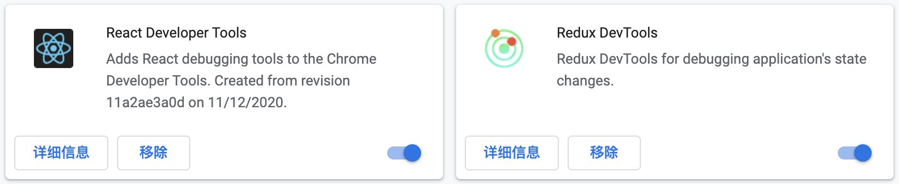

## 搭建开发环境

1. 安装 homebrew
2. 添加 MongoDB 仓库源

```
brew tap mongodb/brew
```

3. 安装 mongodb

安装前全包系统已经安装 xcode 命令行编译开发工具

```
xcode-select --install
```

```
brew install mongodb-community
```

4. 启动 MongoDB

```
brew services run mongodb-community
```

5. 停止 MongoDB

```
brew services stop mongodb-community
```

6. 文件位置
   1. 数据库配置文件：/usr/local/etc/mongod.conf
   2. 数据库文件默认存放位置：/usr/local/var/mongodb
   3. 日志存放位置：/usr/local/var/log/mongodb/mongo.log

### 3. 搭建开发环境 (客户端)

#### 3.1 创建项目并安装依赖

1. 使用 create-react-app 脚手架创建 react 项目

   `npx create-react-app ecommerce-front --template typescript `

2. 安装项目依赖

   `npm install antd axios moment redux react-redux react-router-dom redux-saga connected-react-router redux-devtools-extension @types/react-redux @types/react-router-dom`

3. antd CSS 使用 CDN

   https://cdn.bootcdn.net/ajax/libs/antd/4.8.3/antd.min.css

#### 3.2 配置服务器端 API 请求地址

在项目的根目录下新建 .env 文件，并在文件中添加以下内容：

```html
REACT_APP_PRODUCTION_API_URL=http://fullstack.net.cn/api
REACT_APP_DEVLOPMENT_API_URL=http://localhost/api
```

create-react-app 脚手架中内置了 dotenv，允许我们在 React 项目中配置环境变量，但环境变量的名字必须以 REACT_APP_ 开头。

REACT_APP_PRODUCTION_API_URL： 生产环境的服务器端 API 地址

REACT_APP_DEVLOPMENT_API_URL：开发环境的服务器端 API 地址

在项目中可以通过 `process.env.REACT_APP_DEVLOPMENT_API_URL` 方式进行访问，但是这样会有弊端，其一是代码过长写起来不方便，其二是如果在代码中将环境写死，当切换环境时改起来也不方便。

解决方案就是将 API 地址写入配置中，根据环境决定使用哪个 API 地址

```javascript
export let API: string

if (process.env.NODE_ENV === "development") {
  API = process.env.REACT_APP_DEVLOPMENT_API_URL!
} else {
  API = process.env.REACT_APP_PRODUCTION_API_URL!
}
```

#### 3.3 安装 chrome 扩展



React Developer Tools：检查React组件层次结构，在页面上显示React组件。

Redux DevTools：监测 Store 中状态的变化