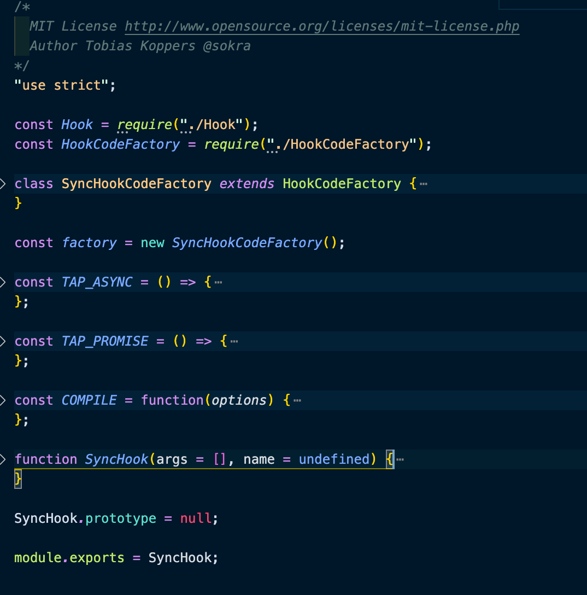
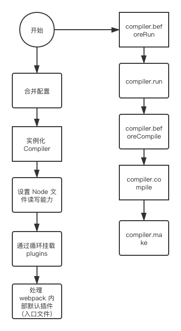

# webpack原理解析

## 打包后文件分析

- 打包后的文件就是一个函数自调用，当前函数调用时传入一个对象

- 这个对象我们为了方便将之称为是模块定义，它就是一个键值对

- 这个键名就是当前被加载模块的文件名与某个目录的拼接（）

- 这个键值就是一个函数，和 node.js 里的模块加载有一些类似，会将被加载模块中的内容包裹于一个函数中

- 这个函数在将来某个时间点上会被调用，同时会接收到一定的参数，利用这些参数就可以实现模块的加载操作
- 打包生成的代码就相当于是将 {}（模块定义） 传递给了 modules
- `__webpack_require__` 方法是 webpack 中自定义的，它的核心作用就是返回模块的 exports

```js
(function (modules) { // webpackBootstrap
  // The module cache
  // 定义对象用于缓存已加载过的模块
  var installedModules = {};

  // The require function
  // webpack 自定义的一个加载方法，核心功能就是返回被加载模块中导出的内容（具体内部是如何实现的，后续再分析）
  function __webpack_require__(moduleId) {

    // Check if module is in cache
    if (installedModules[moduleId]) {
      return installedModules[moduleId].exports;
    }
    // Create a new module (and put it into the cache)
    var module = installedModules[moduleId] = {
      i: moduleId,
      l: false,
      exports: {}
    };

    // Execute the module function
    modules[moduleId].call(module.exports, module, module.exports, __webpack_require__);

    // Flag the module as loaded
    module.l = true;

    // Return the exports of the module
    return module.exports;
  }

  // expose the modules object (__webpack_modules__)
  // 将模块定义保存一份，通过 m 属性挂载到自定义的方法身上
  __webpack_require__.m = modules;

  // expose the module cache
  __webpack_require__.c = installedModules;

  // Object.prototype.hasOwnProperty.call
  // 判断被传入的对象 obj 身上是否具有指定的属性 **** ,如果有则返回 true 
  __webpack_require__.o = function (object, property) { return Object.prototype.hasOwnProperty.call(object, property); };

  // define getter function for harmony exports
  __webpack_require__.d = function (exports, name, getter) {
    // 如果当前 exports 身上不具备 name 属性，则条件成立
    if (!__webpack_require__.o(exports, name)) {
      Object.defineProperty(exports, name, { enumerable: true, get: getter });
    }
  };

  // define __esModule on exports
  __webpack_require__.r = function (exports) {
    // 下面的条件如果成立就说明是一个  esModule 
    if (typeof Symbol !== 'undefined' && Symbol.toStringTag) {
      // Object.prototype.toString.call(exports)
      Object.defineProperty(exports, Symbol.toStringTag, { value: 'Module' });
    }
    // 如果条件不成立，我们也直接在 exports 对象的身上添加一个 __esModule 属性，它的值就是true 
    Object.defineProperty(exports, '__esModule', { value: true });
  };

  // create a fake namespace object
  // mode & 1: value is a module id, require it
  // mode & 2: merge all properties of value into the ns
  // mode & 4: return value when already ns object
  // mode & 8|1: behave like require
  __webpack_require__.t = function (value, mode) {
    // 01 调用 t 方法之后，我们会拿到被加载模块中的内容 value 
    // 02 对于 value 来说我们可能会直接返回，也可能会处理之后再返回
    if (mode & 1) value = __webpack_require__(value);
    if (mode & 8) return value;
    if ((mode & 4) && typeof value === 'object' && value && value.__esModule) return value;
    var ns = Object.create(null);
    __webpack_require__.r(ns);
    Object.defineProperty(ns, 'default', { enumerable: true, value: value });
    if (mode & 2 && typeof value != 'string') for (var key in value) __webpack_require__.d(ns, key, function (key) { return value[key]; }.bind(null, key));
    return ns;
  };

  // getDefaultExport function for compatibility with non-harmony modules
  __webpack_require__.n = function (module) {
    var getter = module && module.__esModule ?
      function getDefault() { return module['default']; } :
      function getModuleExports() { return module; };
    __webpack_require__.d(getter, 'a', getter);
    return getter;
  };

  // __webpack_public_path__
  __webpack_require__.p = "";

  // Load entry module and return exports
  return __webpack_require__(__webpack_require__.s = "./src/index.js");
})
  /************************************************************************/
  ({
    "./src/index.js":
      /*! no static exports found */
      (function (module, exports, __webpack_require__) {
        let name = __webpack_require__(/*! ./login.js */ "./src/login.js")
        console.log('index.js内容执行了')
        console.log(name)
      }),
    "./src/login.js":
      /*! no static exports found */
      (function (module, exports) {
        module.exports = '拉勾教育'
      })
  });
```

在 webpack 打包前的代码，commonjs 规范和 esmodule 规范都是可以混着用的，CommonJS 规范比较简洁，esmodule 是标准化的东西也不能放弃

## 手写功能函数

使用 webpack 打包，不管前面经历了什么，最终都会产出一个或者多个 js 文件，而在这些文件中主要会生成一个自调用的函数，会接受一个对象作为参数，这个参数就是模块定义，用键作为模块查询的 id，将它的值作为要执行的函数，在执行函数的过程中，就完成了当前模块 id 对应的模块内容的加载，对于不同的模块内容还会去使用不同的工具方法

先实现工具方法，参数直接先用 webpack 生成的（后面会自己实现）

```js
(function (modules) {
  // 01 定义对象用于将来缓存被加载过的模块
  let installedModules = {}

  // 02 定义一个 __webpack_require__ 方法来替换 import require 加载操作
  function __webpack_require__(moduleId) {
    // 2-1 判断当前缓存中是否存在要被加载的模块内容，如果存在则直接返回
    if (installedModules[moduleId]) {
      return installedModules[moduleId].exports
    }

    // 2-2 如果当前缓存中不存在则需要我们自己定义{} 执行被导入的模块内容加载
    let module = installedModules[moduleId] = {
      i: moduleId,
      l: false,
      exports: {}
    }

    // 2-3 调用当前 moduleId 对应的函数，然后完成内容的加载
    modules[moduleId].call(module.exports, module, module.exports, __webpack_require__)

    // 2-4 当上述的方法调用完成之后，我们就可以修改 l 的值用于表示当前模块内容已经加载完成了
    module.l = true

    // 2-5 加载工作完成之后，要将拿回来的内容返回至调用的位置 
    return module.exports
  }

  // 03 定义 m 属性用于保存 modules 
  __webpack_require__.m = modules

  // 04 定义 c 属性用于保存 cache 
  __webpack_require__.c = installedModules

  // 05 定义 o 方法用于判断对象的身上是否存在指定的属性
  __webpack_require__.o = function (object, property) {
    return Object.prototype.hasOwnProperty(object, property)
  }

  // 06 定义 d 方法用于在对象的身上添加指定的属性，同时给该属性提供一个 getter 
  __webpack_require__.d = function (exports, name, getter) {
    if (!__webpack_require__.o(exports, name)) {
      Object.defineProperty(exports, name, { enumerable: true, get: getter })
    }
  }

  // 07 定义 r 方法用于标识当前模块是 es6 类型
  __webpack_require__.r = function (exports) {
    if (typeof Symbol !== 'undefined' && Symbol.toStringTag) {
      Object.defineProperty(exports, Symbol.toStringTag, { value: "Module" })
    }
    Object.defineProperty(exports, '__esModule', { value: true })
  }

  // 08 定义 n 方法，用于设置具体的 getter 
  __webpack_require__.n = function (module) {
    let getter = module && module.__esModule ?
      function getDefault() { return module['default'] } :
      function getModuleExports() { return module }

    __webpack_require__.d(getter, 'a', getter)

    return getter
  }

  // 09 定义 P 属性，用于保存资源访问路径
  __webpack_require__.p = ""

  // 10 调用 __webpack_require__ 方法执行模块导入与加载操作
  return __webpack_require__(__webpack_require__.s = './src/index.js')

})
  ({
    "./src/index.js":
      (function (module, __webpack_exports__, __webpack_require__) {

        "use strict";
        __webpack_require__.r(__webpack_exports__);
        var _login_js__WEBPACK_IMPORTED_MODULE_0__ = __webpack_require__(/*! ./login.js */ "./src/login.js");
        console.log('index.js 执行了')
        console.log(_login_js__WEBPACK_IMPORTED_MODULE_0__["default"], '<------')
        console.log(_login_js__WEBPACK_IMPORTED_MODULE_0__["age"], '<------')
      }),
    "./src/login.js":
      (function (module, __webpack_exports__, __webpack_require__) {
        "use strict";
        __webpack_require__.r(__webpack_exports__);
        __webpack_require__.d(__webpack_exports__, "age", function () { return age; });
        __webpack_exports__["default"] = ('zce是一个帅哥');
        const age = 40
      })

  })
```

懒加载实现

```js
// install a JSONP callback for chunk loading
  function webpackJsonpCallback(data) {
    var chunkIds = data[0];
    var moreModules = data[1];
    // add "moreModules" to the modules object,
    // then flag all "chunkIds" as loaded and fire callback
    var moduleId, chunkId, i = 0, resolves = [];
    for (; i < chunkIds.length; i++) {
      chunkId = chunkIds[i];
      if (Object.prototype.hasOwnProperty.call(installedChunks, chunkId) && installedChunks[chunkId]) {
        resolves.push(installedChunks[chunkId][0]);
      }
      installedChunks[chunkId] = 0;
    }
    for (moduleId in moreModules) {
      if (Object.prototype.hasOwnProperty.call(moreModules, moduleId)) {
        modules[moduleId] = moreModules[moduleId];
      }
    }
    if (parentJsonpFunction) parentJsonpFunction(data);

    while (resolves.length) {
      resolves.shift()();
    }

  };

  // object to store loaded and loading chunks
  // undefined = chunk not loaded, null = chunk preloaded/prefetched
  // Promise = chunk loading, 0 = chunk loaded
  var installedChunks = {
    "main": 0
  };

  // This file contains only the entry chunk.
  // The chunk loading function for additional chunks
  __webpack_require__.e = function requireEnsure(chunkId) {
    var promises = [];


    // JSONP chunk loading for javascript

    var installedChunkData = installedChunks[chunkId];
    if (installedChunkData !== 0) { // 0 means "already installed".

      // a Promise means "currently loading".
      if (installedChunkData) {
        promises.push(installedChunkData[2]);
      } else {
        // setup Promise in chunk cache
        var promise = new Promise(function (resolve, reject) {
          installedChunkData = installedChunks[chunkId] = [resolve, reject];
        });
        promises.push(installedChunkData[2] = promise);

        // start chunk loading
        var script = document.createElement('script');
        var onScriptComplete;

        script.charset = 'utf-8';
        script.timeout = 120;
        if (__webpack_require__.nc) {
          script.setAttribute("nonce", __webpack_require__.nc);
        }
        script.src = jsonpScriptSrc(chunkId);

        // create error before stack unwound to get useful stacktrace later
        var error = new Error();
        onScriptComplete = function (event) {
          // avoid mem leaks in IE.
          script.onerror = script.onload = null;
          clearTimeout(timeout);
          var chunk = installedChunks[chunkId];
          if (chunk !== 0) {
            if (chunk) {
              var errorType = event && (event.type === 'load' ? 'missing' : event.type);
              var realSrc = event && event.target && event.target.src;
              error.message = 'Loading chunk ' + chunkId + ' failed.\n(' + errorType + ': ' + realSrc + ')';
              error.name = 'ChunkLoadError';
              error.type = errorType;
              error.request = realSrc;
              chunk[1](error);
            }
            installedChunks[chunkId] = undefined;
          }
        };
        var timeout = setTimeout(function () {
          onScriptComplete({ type: 'timeout', target: script });
        }, 120000);
        script.onerror = script.onload = onScriptComplete;
        document.head.appendChild(script);
      }
    }
    return Promise.all(promises);
  };

// ...
// ...
// ...
  var jsonpArray = window["webpackJsonp"] = window["webpackJsonp"] || [];
  var oldJsonpFunction = jsonpArray.push.bind(jsonpArray);
  jsonpArray.push = webpackJsonpCallback;
  jsonpArray = jsonpArray.slice();
  for (var i = 0; i < jsonpArray.length; i++) webpackJsonpCallback(jsonpArray[i]);
  var parentJsonpFunction = oldJsonpFunction;
```

`__webpack_require__.e` 实现 `jsonp` 来加载内容，利用 `promise` 来实现异步加载操作

`jsonp`的 的内容写好了之后，懒加载的代码就是直接调用 `webpackJsonpCallback`

```js
(window["webpackJsonp"] = window["webpackJsonp"] || []).push([["login"], {
  "./src/login.js":
    (function (module, exports) {
      module.exports = "懒加载导出内容"
    })
}]);
```

# tapable

webpack 和 tapable 是密不可分的

## Webpack 编译流程

- 配置初始化
- 内容编译
- 输出编译后内容

这是一个事件驱动型事件流工作机制

其中最为核心的就是负责编译的 complier，负责创建 bundles 的 compilation，它们都是 tapable 的实例对象

## tapable 工作流程

- 实例化 hook 注册事件监听
- 通过 hook 触发事件监听
- 执行懒编译生成的可执行代码

Hook 本质是 tapable 实例对象

从机制上来说，hook 执行机制可分为同步和异步

- Hook：普通钩子，监听器之间互相独立不干扰
- BailHook：熔断钩子，某个监听返回非 undefined 时后续不再执行
- WaterfallHook：瀑布钩子，上一个监听的返回值可传递至下一个
- LoopHook：循环钩子，如果当前未返回 false 则一直执行，并不常用

tapable 库同步钩子

- SynckHook
- SynckBailHook
- SynckWaterfallHook
- SynckLoopHook

异步串行钩子

- AsyncSeriesHook
- AsyncSeriesBailHook
- AsyncSeriesWaterfallHook

异步并行钩子

- AsyncParalleHook
- AsyncParalleBailHook

## 同步钩子的使用

*SyncHook*

```js
const { SyncHook } = require('tapable')

let hook = new SyncHook(['name', 'age'])

hook.tap('fn1', function (name, age) {
  console.log('fn1--->', name, age)
})

hook.tap('fn2', function (name, age) {
  console.log('fn2--->', name, age)
})

hook.call('zqc', 18)
// fn1---> zqc 18
// fn2---> zqc 18
```

*SyncBailHook*

```js
const { SyncBailHook } = require('tapable')

let hook = new SyncBailHook(['name', 'age'])

hook.tap('fn1', function (name, age) {
  console.log('fn1--->', name, age)
})

hook.tap('fn2', function (name, age) {
  console.log('fn2--->', name, age)
  return undefined // 这里如果返回除了 undefined 以外的值，后面的钩子就不执行了
})

hook.tap('fn3', function (name, age) {
  console.log('fn3--->', name, age)
})

hook.call('zqc', 100)
// fn1---> zqc 18
// fn2---> zqc 18
// fn3---> zqc 18
```

*SyncWaterfallHook*，就是可以传递值

```js
const { SyncWaterfallHook } = require('tapable')

let hook = new SyncWaterfallHook(['name', 'age'])

hook.tap('fn1', function (name, age) {
  console.log('fn1--->', name, age)
  return 'ret1'
})

hook.tap('fn2', function (name, age) {
  console.log('fn2--->', name, age)
  return 'ret2'
})

hook.tap('fn3', function (name, age) {
  console.log('fn3--->', name, age)
  return 'ret3'
})

hook.call('zqc', 18)
// fn1---> zqc 18
// fn2---> ret1 18
// fn3---> ret2 18
```

## 异步钩子的使用

并行钩子*AsyncParallelHook*

```js
const { AsyncParallelHook } = require('tapable')

let hook = new AsyncParallelHook(['name'])

// 对于异步钩子的使用，在添加事件监听时会存在三种方式： tap tapAsync tapPromise
/* tap */
hook.tap('fn1', function (name) {
  console.log('fn1--->', name)
})

hook.tap('fn2', function (name) {
  console.log('fn2--->', name)
})

hook.callAsync('zoe', function () {
  console.log('最后执行了回调操作')
})
// fn1---> zoe
// fn2---> zoe
// 最后执行了回调操作

/* tapAsync */
console.time('time')
hook.tapAsync('fn1', function (name, callback) {
  setTimeout(() => {
    console.log('fn1--->', name)
    callback()
  }, 1000)
})

hook.tapAsync('fn2', function (name, callback) {
  setTimeout(() => {
    console.log('fn2--->', name)
    callback()
  }, 2000)
})

hook.callAsync('lg', function () {
  console.log('最后一个回调执行了')
  console.timeEnd('time')
})
// fn1---> lg
// fn2---> lg
// 最后一个回调执行了
// time: 2.006s

/* tapPromise */
console.time('time')
hook.tapPromise('fn1', function (name) {
  return new Promise(function (resolve, reject) {
    setTimeout(() => {
      console.log('fn1--->', name)
      resolve()
    }, 1000)
  })
})

hook.tapPromise('fn2', function (name) {
  return new Promise(function (resolve, reject) {
    setTimeout(() => {
      console.log('fn2--->', name)
      resolve()
    }, 2000)
  })
})

hook.promise('foo').then(() => {
  console.log('end执行了')
  console.timeEnd('time')
})
// fn1---> foo
// fn2---> foo
// end执行了
// time: 2.003s
```

并行*AsyncParallelBailHook*

```js
const { AsyncParallelBailHook } = require('tapable')

let hook = new AsyncParallelBailHook(['name'])

console.time('time')
hook.tapAsync('fn1', function (name, callback) {
  setTimeout(() => {
    console.log('fn1--->', name)
    callback()
  }, 1000)
})

hook.tapAsync('fn2', function (name, callback) {
  setTimeout(() => {
    console.log('fn2--->', name)
    callback('err')
  }, 2000)
})

hook.tapAsync('fn3', function (name, callback) {
  setTimeout(() => {
    console.log('fn3--->', name)
    callback()
  }, 3000)
})

hook.callAsync('zce', function () {
  console.log('最后的回调执行了')
  console.timeEnd('time')
})
// fn1---> zce
// fn2---> zce
// 最后的回调执行了
// time: 2.007s
// fn3---> zce
```

串行*AsyncSeriesHook*

```js
const { AsyncSeriesHook } = require('tapable')

let hook = new AsyncSeriesHook(['name'])

console.time('time')
hook.tapPromise('fn1', function (name) {
  return new Promise((resolve, reject) => {
    setTimeout(() => {
      console.log('fn1--->', name)
      resolve()
    }, 1000)
  })
})

hook.tapPromise('fn2', function (name) {
  return new Promise((resolve, reject) => {
    setTimeout(() => {
      console.log('fn2--->', name)
      resolve()
    }, 2000)
  })
})

hook.promise('foo').then(function () {
  console.log('~~~~')
  console.timeEnd('time')
})
// fn1---> foo
// fn2---> foo
// ~~~~
// time: 3.022s
```

## SyncHook 源码分析

我们以 VSCode 为例，用上面的最简单的 SyncHook 的代码，第一行打上断点，然后到“run and debug”栏，“create a lunch.json file” > “Node.js(legacy)”，然后开始 debug，到实例化的时候进入 SyncHook 内部

SyncHook 其实是继承的 Hook，还有个 SyncHookCodeFactory 继承了 HookCodeFactory



其实主要是去 `new Hook(args, name)` 得到 hook 实例后，再把同步钩子不能用的方法给重写了

那在 Hook 实例上，比较重要的是 `taps` 数组和 `_x`，调用实例的 `tap` 方法会生成一个对象，有以下属性

- `name`：对应调用 `tap` 函数的第一个参数
- `type`：代表这是个什么类型的 hook，这里就是 sync
- `fn`：对应调用的 `tap` 函数时的第二个参数，即回调

这个对象会被放到 taps 数组中去

在 `call` 的时候会去根据 `hook` 类型生成一个 `call` 方法，然后把 `taps` 数组拷贝到 `_x` 上，接着 `HookCodeFactory` 的 `create` 去 `new` 一个 `Function`，然后将调用 call 时的入参透传给这个函数

相当于 `Hook.js` 几乎完成了所有的功能，子类去约束一些方法的使用，`HookCodeFactory.js` 去拼接一个函数出来被调用

## 手写 SyncHook

```js
const { SyncHook } = require('tapable')

let hook = new SyncHook(['name', 'age'])

hook.tap('fn1', function (name, age) {
  console.log('fn1--->', name, age)
})

hook.tap('fn2', function (name, age) {
  console.log('fn2--->', name, age)
})

hook.call('zqc', 18)
// fn1---> zqc 18
// fn2---> zqc 18
```

理一下流程

1. 实例化 hook，定义 `_x = [f1, f2, ...]; taps = [ {}, {} ]` 
2. 实例调用 tap 方法，`taps = [{}, {},]`
3. HookCodeFactory 对不同的 hook 去 setup 后 create 一个要执行的函数
4. 调用自定义的 call 方法去执行生成的函数

Hook.js

```js
class Hook {
  constructor(args = []) {
    this.args = args
    this.taps = []  // 将来用于存放组装好的 {}
    this._x = undefined  // 将来在代码工厂函数中会给 _x = [f1, f2, f3....]
  }

  tap(options, fn) {
    if (typeof options === 'string') {
      options = { name: options }
    }
    options = Object.assign({ fn }, options)  // { fn:... name:fn1 }

    // 调用以下方法将组装好的 options 添加至 []
    this._insert(options)
  }

  _insert(options) {
    this.taps[this.taps.length] = options
  }

  call(...args) {
    // 01 创建将来要具体执行的函数代码结构
    let callFn = this._createCall()
    // 02 调用上述的函数（args传入进去）
    return callFn.apply(this, args)
  }

  _createCall() {
    return this.compile({ // compile 方法由子类实现
      taps: this.taps,
      args: this.args
    })
  }
}

module.exports = Hook
```

SyncHook.js

```js
let Hook = require('./Hook.js')

class HookCodeFactory {
  args() {
    return this.options.args.join(',')  // ["name", "age"]===> name, age
  }
  head() {
    return `var _x = this._x;`
  }
  content() {
    let code = ``
    for (var i = 0; i < this.options.taps.length; i++) {
      code += `var _fn${i} = _x[${i}];_fn${i}(${this.args()});`
    }
    return code
  }
  setup(instance, options) {  // 先准备后续需要使用到的数据
    this.options = options  // 这里的操作在源码中是通过 init 方法实现，而我们当前是直接挂在了 this 身上
    instance._x = options.taps.map(o => o.fn)   // this._x = [f1, f2, ....]
  }
  create() { // 核心就是创建一段可执行的代码体然后返回
    let fn
    // fn = new Function("name, age", "var _x = this._x, var _fn0 = _x[0]; _fn0(name, age);")
    fn = new Function(
      this.args(),
      this.head() + this.content()
    )
    return fn
  }
}

let factory = new HookCodeFactory()

class SyncHook extends Hook {
  constructor(args) {
    super(args)
  }

  compile(options) {  // {taps: [{}, {}], args: [name, age]}
    factory.setup(this, options)
    return factory.create(options)
  }
}

module.exports = SyncHook
```

## AsyncParallelHook 源码分析

其实核心的流程和 SyncHook 是一样的，不过是在生成代码的时候有点不一样，调用的每一个函数的时候会接受一个回调，这个回调里会去判断状态，有一个计数器为所有的函数数量，完成一个就减一，到零就是完成了去执行回调（不考虑失败的情况的话）

## 手写 AsyncParallelHook

Hook.js

```js
class Hook {
  constructor(args = []) {
    this.args = args
    this.taps = []  // 将来用于存放组装好的 {}
    this._x = undefined  // 将来在代码工厂函数中会给 _x = [f1, f2, f3....]
  }

  tap(options, fn) {
    if (typeof options === 'string') {
      options = { name: options }
    }
    options = Object.assign({ fn }, options)  // { fn:... name:fn1 }

    // 调用以下方法将组装好的 options 添加至 []
    this._insert(options)
  }

  tapAsync(options, fn) {
    if (typeof options === 'string') {
      options = { name: options }
    }
    options = Object.assign({ fn }, options)  // { fn:... name:fn1 }

    // 调用以下方法将组装好的 options 添加至 []
    this._insert(options)
  }

  _insert(options) {
    this.taps[this.taps.length] = options
  }

  call(...args) {
    // 01 创建将来要具体执行的函数代码结构
    let callFn = this._createCall()
    // 02 调用上述的函数（args传入进去）
    return callFn.apply(this, args)
  }

  callAsync(...args) {
    let callFn = this._createCall()
    return callFn.apply(this, args)
  }

  _createCall() {
    return this.compile({
      taps: this.taps,
      args: this.args
    })
  }
}

module.exports = Hook
```

AsyncParallelHook.js

```js
let Hook = require('./Hook.js')

class HookCodeFactory {
  args({ after, before } = {}) {
    let allArgs = this.options.args
    if (before) allArgs = [before].concat(allArgs)
    if (after) allArgs = allArgs.concat(after)
    return allArgs.join(',')  // ["name", "age"]===> name, age
  }
  head() {
    return `"use strict";var _context;var _x = this._x;`
  }
  content() {
    let code = `var _counter = ${this.options.taps.length};var _done = (function () {
      _callback();
    });`
    for (var i = 0; i < this.options.taps.length; i++) {
      code += `var _fn${i} = _x[${i}];_fn${i}(name, age, (function () {
        if (--_counter === 0) _done();
      }));`
    }
    return code
  }
  setup(instance, options) {  // 先准备后续需要使用到的数据
    this.options = options  // 这里的操作在源码中是通过 init 方法实现，而我们当前是直接挂在了 this 身上
    instance._x = options.taps.map(o => o.fn)   // this._x = [f1, f2, ....]
  }
  create() { // 核心就是创建一段可执行的代码体然后返回
    let fn
    // fn = new Function("name, age", "var _x = this._x, var _fn0 = _x[0]; _fn0(name, age);")
    fn = new Function(
      this.args({ after: '_callback' }),
      this.head() + this.content()
    )
    return fn
  }
}

let factory = new HookCodeFactory()

class AsyncParallelHook extends Hook {
  constructor(args) {
    super(args)
  }

  compile(options) {  // {taps: [{}, {}], args: [name, age]}
    factory.setup(this, options)
    return factory.create(options)
  }
}

module.exports = AsyncParallelHook
```

写这个并不是为了完全复现 tapable 的代码，主要是对主要的流程有个更深刻的理解，方便后续使用的时候能更加灵活，因为我们在写 webpack 插件的时候或多次用到它

# webpack 分析

基于 webpack4，不过好像除了联合模块，webpack5 和 webpack4 也没太大的区别

## 定位 webpack 打包命令入口

1. cmd （可执行命令文件）核心的作用就组装了 node \*\*\*\*\*/webpack/bin/webpack.js
2. webpack.js 中核心的操作就是 require 了 node_modules/webpack-cli/bin/cli.js
3. cli.js 
   1. 当前文件一般有二个操作，处理参数，将参数交给不同的逻辑（分发业务）
   2. options 
   3. complier 
   4. complier.run( 至于run 里面做了什么，后续再看，当前只关注代码入口点 )

complier 上已经生成好了很多 hooks（包括但不限于以下）：

- beforeRun
- run
- thisCompilation
- compilation
- beforeCompile
- compile
- make
- afterCompile



## 打包流程

上面提到的是 cli 的执行流程，其实不管是 cli 还是 webpack 本身，在执行前都要做大量的准备工作，所以有很多的校验代码，这种代码对我们理解核心流程没什么用，千万不要去纠结，先对代码的整体有个大概的认识，再根据流程看具体的执行，至于校验的部分应该不是很重要，建议不要看，时间宝贵，有那时间去陪陪家人打打游戏不好吗？

其实要分析 webpack 的打包流程，需要 node debug，准备好 webpack.config.js

然后在准备一个 `runWebpack.js`

```js
let webpack = require('webpack')
let options = require('./webpack.config.js')

let compiler = webpack(options)

compiler.run((err, stats) => {
  console.log(err)
  console.log(stats.toJson({
    entries: true,
    chunks: false,
    modules: false,
    assets: false
  }))
})
```

直接打断点调试，这样就可以看到 webpack 是怎么运行起来的

## 手写 webpack.js 实现

一、make 之前步骤

1. 实例化 compiler 对象（ 它会贯穿整个webpack工作的过程 ）
2. 由 compiler 调用 run 方法

二、compiler 实例化操作

1. compiler 继承 tapable，因此它具备钩子的操作能力（监听事件，触发事件，webpack是一个事件流）
2. 在实例化了 compiler 对象之后就往它的身上挂载很多属性，其中 NodeEnvironmentPlugin 这个操作就让它具备了文件读写的能力（我们的模拟时采用的是 node 自带的 fs )
3. 具备了 fs 操作能力之后又将 plugins 中的插件都挂载到了 compiler 对象身上  
4. 将内部默认的插件与 compiler 建立关系，其中 EntryOptionPlugin 处理了入口模块的 id 
5. 在实例化 compiler 的时候只是监听了 make 钩子（SingleEntryPlugin)
   1. 在 SingleEntryPlugin 模块的 apply 方法中有二个钩子监听
   2. 其中 compilation 钩子就是让 compilation 具备了利用 normalModuleFactory 工厂创建一个普通模块的能力
   3. 因为它就是利用一个自己创建的模块来加载需要被打包的模块 
   4. 其中 make 钩子 在 compiler.run 的时候会被触发，走到这里就意味着某个模块执行打包之前的所有准备工作就完成了
   5. addEntry 方法调用（）

三、run 方法执行（ 当前想看的是什么时候触发了 make 钩子 ）

1. run 方法里就是一堆钩子按着顺序触发（beforeRun run compile）
2. compile 方法执行
   1. 准备参数(其中 normalModuleFactory 是我们后续用于创建模块的)
   2. 触发beforeCompile
   3. 将第一步的参数传给一个函数，开始创建一个 compilation （newCompilation）
   4. 在调用 newCompilation 的内部
      - 调用了 createCompilation 
      - 触发了 this.comilation 钩子 和 compilation 钩子的监听
3. 当创建了 compilation 对象之后就触发了 make 钩子
4. 当我们触发 make 钩子监听的时候，将 compilation 对象传递了过去 

这里解耦的东西比较多，所以看起来比较麻烦，跳来跳去的

四、总结 

1. 实例化 compiler  
2. 调用 compile 方法
3. newCompilation 
4. 实例化了一个compilation 对象（它和 compiler 是有关系）
5. 触发 make 监听 
6. addEntry 方法（这个时候就带着 context name entry  一堆的东西） 就奔着编译去了.....

make 中的内容： 

1. make 钩子在被触发的时候，接收到了 compilation 对象实现，它的身上挂载了很多内容
2. 从 compilation 当中解构了三个值 
   - entry : 当前需要被打包的模块的相对路径（./src/index.js)
   - name: main 
   - context: 当前项目的根路径 
3. dep 是对当前的入口模块中的依赖关系进行处理 
4. 调用了 addEntry 方法 
5. 在 compilation实例的身上有一个 addEntry 方法，然后内部调用了 _addModuleChain 方法，去处理依赖
6. 在 compilation 当中我们可以通过 NormalModuleFactory 工厂来创建一个普通的模块对象  
7. 在 webpack 内部默认启了一个 100 并发量的打包操作，当前我们看到的是 normalModule.create()
8. 在 beforeResolve 里面会触发一个 factory 钩子监听【 这个部分的操作其实是处理 loader， 当前我们不重点去看 】
9. 上述操作完成之后获取到了一个函数被存在 factory 里，然后对它进行了调用  
10. 在这个函数调用里又触发了一个叫 resolver 的钩子（ 处理 loader的，拿到了 resolver方法就意味着所有的Loader 处理完毕 ）
11. 调用 resolver() 方法之后，就会进入到  afterResolve 这个钩子里，然后就会触发  new NormalModule 
12. 在完成上述操作之后就将module 进行了保存和一些其它属性的添加  
13. 调用 buildModule 方法开始编译---> 调用 build ---> doBuild 

`_addModuleChain` 里会将 index.js 里的 require 方法替换成 `__webpack_require__` ，还有将 ./title 替换成 ./src/title.js ,实现递归的操作 ，所以要将依赖的模块信息保存好，返回交给下一次 create 

webpack 的源码东西真的非常多，就不一一贴出来了，https://github.com/zqcccc/fakeWebpack

