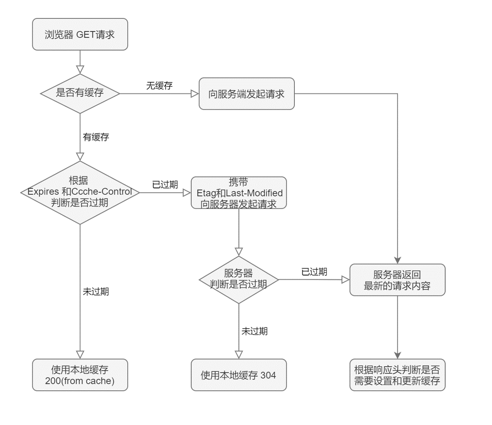
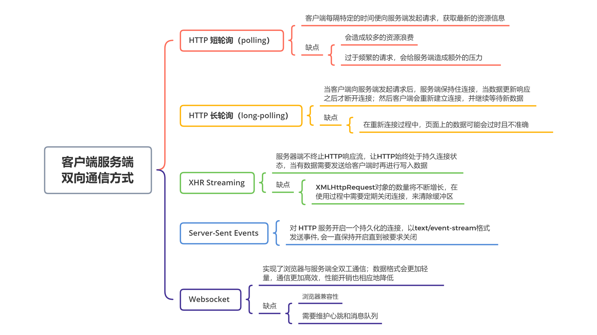
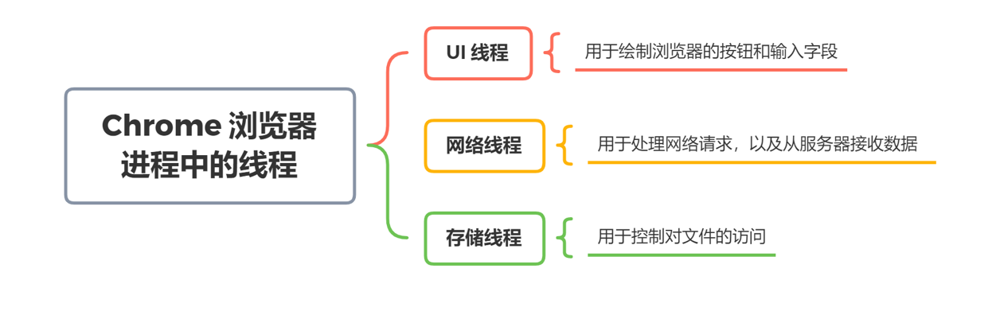
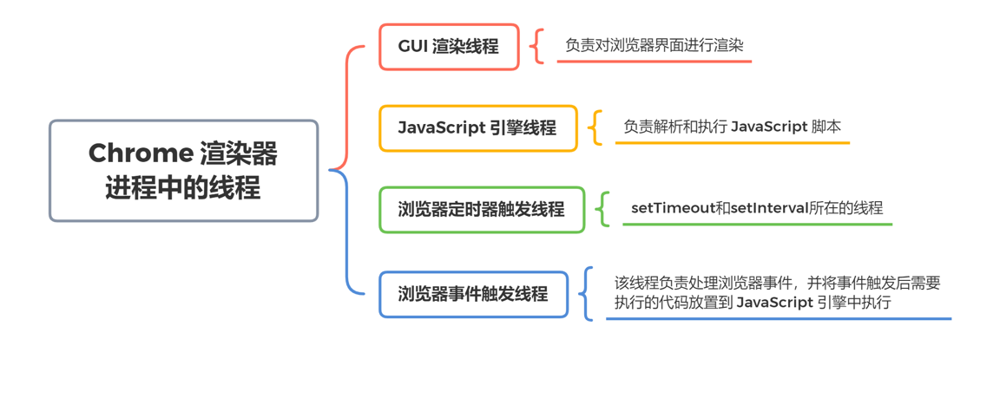
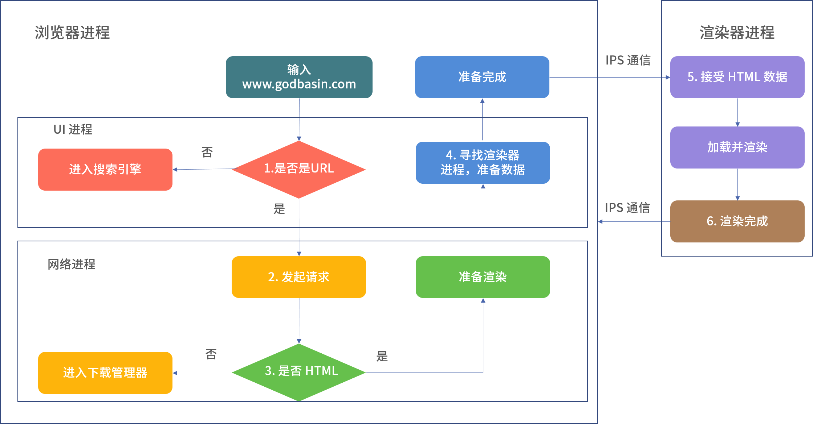
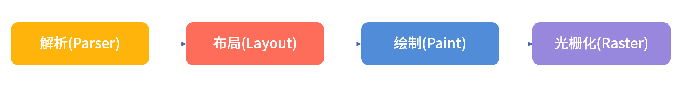
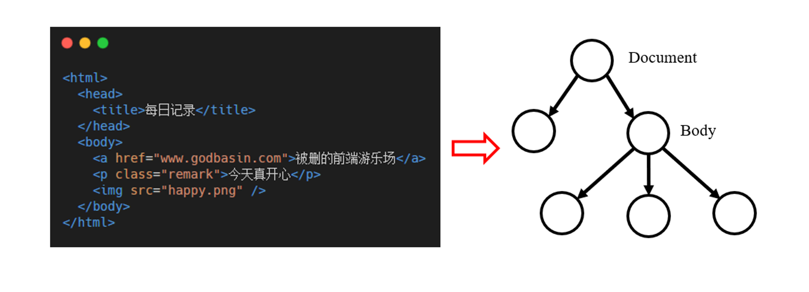
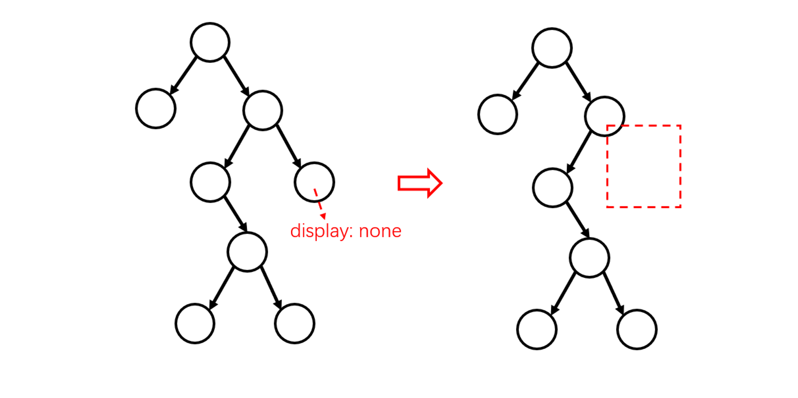
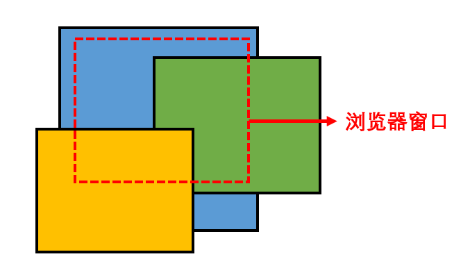

函数调用栈栈底永远是全局执行上下文，栈顶永远是当前执行上下文

异步任务需要提供回调函数，当异步任务有了运行结果之后，该任务则会被添加到回调队列中，主线程在适当的时候会从回调队列中取出相应的回调函数并执行

JavaScript 在运行的时候，除了函数调用栈之外，还包含了一个待处理的回调队列。在回调队列中的都是已经有了运行结果的异步任务，每一个异步任务都会关联着一个回调函数。

回调队列则遵循 FIFO（先进先出）的原则，JavaScript 执行代码过程中，会进行以下的处理：

- 运行时，会从最先进入队列的任务开始，处理队列中的任务；

- 被处理的任务会被移出队列，该任务的运行结果会作为输入参数，并调用与之关联的函数，此时会产生一个函数调用栈；

- 函数会一直处理到调用栈再次为空，然后 Event Loop 将会处理队列中的下一个任务。

这里我们提到了 Event Loop，它主要是用来管理单线程的 JavaScript 中同步任务和异步任务的执行问题。

JavaScript 有一个基于事件循环的并发模型，称为事件循环（Event Loop），它的设计解决了同步任务和异步任务的管理问题。

根据 JavaScript 运行环境的不同，Event Loop 也会被分成浏览器的 Event Loop 和 Node.js 中的 Event Loop。

## 宏任务和微任务

事件循环中的异步回调队列有两种：宏任务（MacroTask）和微任务（MicroTask）队列。

- 宏任务：包括 script 全部代码、setTimeout、setInterval、setImmediate（Node.js）、requestAnimationFrame（浏览器）、I/O 操作、UI 渲染（浏览器），这些代码执行便是宏任务。

- 微任务：包括process.nextTick（Node.js）、Promise、MutationObserver，这些代码执行便是微任务。

为什么要将异步任务分为宏任务和微任务呢？这是为了避免回调队列中等待执行的异步任务（宏任务）过多，导致某些异步任务（微任务）的等待时间过长。在每个宏任务执行完成之后，会先将微任务队列中的任务执行完毕，再执行下一个宏任务。

## 浏览器网络相关

在浏览器输入网页地址，按下回车键后，浏览器的处理过程如下：

1. DNS 域名解析（此处涉及 DNS 的寻址过程），找到网页的存放服务器；
2. 浏览器与服务器建立 TCP 连接；
3. 浏览器发起 HTTP 请求；
4. 服务器响应 HTTP 请求，返回该页面的 HTML 内容；
5. 浏览器解析 HTML 代码，并请求 HTML 代码中的资源（如 JavaScript、CSS、图片等，此处可能涉及 HTTP 缓存）；
6. 浏览器对页面进行渲染呈现给用户（此处涉及浏览器的渲染原理）。

在建立 TCP 连接前，我们需要找到建立连接的服务器，DNS 的解析过程可以让用户通过域名找到存放文件的服务器。

DNS 解析过程会进行递归查询，分别依次尝试从以下途径，按顺序地获取该域名对应的 IP 地址。

- 浏览器缓存
- 系统缓存（用户操作系统 Hosts 文件 DNS 缓存）
- 路由器缓存
- 互联网服务提供商 DNS 缓存（联通、移动、电信等互联网服务提供商的 DNS 缓存服务器）
- 根域名服务器
- 顶级域名服务器
- 主域名服务器

DNS 解析过程会根据上述步骤进行递归查询，如果当前步骤没查到，则自动跳转到到下一步骤通过下一个 DNS 服务器进行查找。如果最终依然没找到，浏览器便会将页面响应为打开失败。

我们在前后端联调过程中也常常需要配置 HOST，这个过程便是修改了浏览器缓存或是系统缓存。通过将特定域名指向我们自身的服务器 IP 地址，便可以实现通过域名访问本地环境、测试环境、预发布环境的服务器资源。

### 同源策略

那为什么需要配置域名 HOST，而不直接使用 IP 地址进行访问呢？这是因为**浏览器的同源策略会导致跨域问题**。

同源策略要求，只有当请求的协议、域名和端口都相同的情况下，我们才可以访问当前页面的 Cookie/LocalStorage/IndexDB、获取和操作 DOM 节点，以及发送 Ajax 请求。通过同源策略的限制，可以避免恶意的攻击者盗取用户信息，从而可以保证用户信息的安全。

对于非同源的请求，我们常常称为跨域请求，需要进行跨域处理。常见的跨域解决方案有这几种。

- 使用`document.domain + iframe`：只有在主域相同的时候才能使用该方法。
- 动态创建 script(JSONP)：通过指定回调函数以及函数的传参数据，让页面执行相应的脚本内容。
- 使用`location.hash + iframe`：利用`location.hash`来进行传值。
- 使用`window.name + iframe`：原理是`window.name`值在不同的页面（甚至不同域名）加载后依旧存在。
- 使用`window.postMessage()`实现跨域通信。
- 使用跨域资源共享 CORS（Cross-origin resource sharing）。
- 使用 Websockets。

其中，CORS 作为现在的主流解决方案，它允许浏览器向跨源服务器，发出 XMLHttpRequest 请求，从而克服了 Ajax 只能同源使用的限制。实现 CORS 通信的关键是服务器，只要服务端实现了 CORS 接口，就可以进行跨源通信。

DNS 解析完成后，浏览器获得了服务端的 IP 地址，接下来便可以向服务端发起 HTTP 请求。目前大多数 HTTP 请求都建立在 TCP 连接上，因此客户端和服务端会先建立起 TCP 连接。

### TCP 连接的建立

TCP 连接的建立过程比较偏通信底层，在前端日常开发过程中不容易接触到。但有时候我们需要优化应用的加载耗时、请求耗时或是定位一些偏底层的问题（请求异常、HTTP 连接无法建立等），都会或多或少依赖这些偏底层的知识。

另外，从面试的角度看，我们需要掌握 TCP/UDP 的区别、TCP 的三次握手和四次挥手内容。

- TCP 协议提供可靠传输服务，UDP 协议则可以更快地进行通信；
- 三次握手：指 TCP 连接的建立过程，该过程中客户端和服务端总共需要发送三个包，从而确认连接存在。
- 四次挥手：指 TCP 连接的断开过程，该过程中需要客户端和服务端总共发送四个包以，从而确认连接关闭。

当客户端和服务端建立起 TCP 连接之后，HTTP 服务器会监听客户端发起的请求，此时客户端会发起 HTTP 请求。

### HTTP 请求与 TCP 协议

由客户端发起的 HTTP 请求，服务器收到后会进行回复，回复内容通常包括 HTTP 状态、响应消息等，更具体的会在下一讲 HTTP 协议中进行介绍。

前面说过，目前大多数 HTTP 请求都是基于 TCP 协议。TCP 协议的目的是提供可靠的数据传输，它用来确保可靠传输的途径主要包括两个：

1. 乱序重建：通过对数据包编号来对其排序，从而使得另一端接收数据时，可以重新根据编号还原顺序。
2. 丢包重试：可通过发送方是否得到响应，来检测出丢失的数据并重传这些数据。

通过以上方式，TCP 在传输过程中不会丢失或破坏任何数据，这也是即使出现网络故障也不会损坏文件下载的原因。

因此，目前大多数 HTTP 连接基于 TCP 协议。不过，在 HTTP/3 中底层支撑是 QUIC 协议，该协议使用的是 UDP 协议。因为 UDP 协议丢弃了 TCP 协议中所有的错误检查内容，因此可以更快地进行通信，更常用于直播和在线游戏的应用。

### XMLHttpRequest

XMLHttpRequest让发送一个 HTTP 请求变得非常容易

```js
function Ajax({ method, url, params, contentType }) {
  const xhr = new XMLHttpRequest()

  const formData = new FormData()

  Object.keys(params).forEach((key) => {
    formData.append(key, params[key])
  })

  return new Promise((resolve, reject) => {
    try {
      xhr.open(method, url, false)

      xhr.setRequestHeader('Content-Type', contentType)

      xhr.onreadystatechange = function() {
        if (xhr.readyState === 4) {
          if (xhr.status >= 200 && xhr.status < 400) {
            // 这里我们使用200-400来判断

            resolve(xhr.responseText)
          } else {
            // 返回请求信息

            reject(xhr)
          }
        }
      }

      xhr.send(formData)
    } catch (err) {
      reject(err)
    }
  })
}
```

## HTTP 协议和前端开发

### HTTP 协议的演变

HTTP 协议从被创造以来，一直在不断演变着：从 HTTP/1.0、HTTP/1.1，到 HTTP/2、HTTP/3，HTTP 协议在保持协议简单性的同时，拓展了灵活性，提供越来越快、更加可靠的传输服务。

**HTTP/1.0 到 HTTP/1.1，主要实现了对 TCP 连接的复用。** 最初在 HTTP/1.0 中，每一对 HTTP 请求和响应都需要打开一个单独的 TCP 连接。这样的方式对资源消耗很大，因此 HTTP/1.1 中引入了持久连接的概念，通过设置 Connection 头部为 keep-alive 的方式，可以让 TCP 连接不会关闭。该功能避免了 TCP 连接的重新建立，客户端可在已建立的 TCP 连接上，长时间地对同一个服务端的发起请求。

**HTTP/1.1 到 HTTP/2，主要实现了多个请求的复用。** HTTP/2 通过将 HTTP 消息拆分为独立的帧，进行交错发送，实现在同一个连接上并行多个请求，来减少网络请求的延迟。为了实现多路复用，HTTP/2 协议对 HTTP 头部进行了二进制编码，因此不再语义可读。除此之外，HTTP2 还实现了 Header 压缩、服务端主动推动、流优先级等能力。

**HTTP/2 到 HTTP/3，主要实现了基于 UDP 协议、更快的传输。** HTTP/3 使用了基于 UDP 的 QUIC 协议，实现了又快又可靠的传输。由于 UDP 协议中没有错误检查内容，因此可以更快地实现通信。同时，QUIC 协议负责合并纠错、重建丢失的数据，解决了 UDP 协议传输丢包的问题。

总的来说，**HTTP 协议的演变过程主要围绕着传输效率和速度上的优化**，我们可以通过升级 HTTP 协议来优化前端应用。除此之外，我们在日常的工作中，同样可以借鉴 HTTP 协议的优化手段。比如，可以使用资源压缩、资源复用等技术手段，来优化前端性能。技术常常是通用的，我们在学习一些看起来不相关的内容时，会发现其实很多技术转变都是值得思考和参考的。

下面我们来看一下常见的一些 HTTP 协议场景。

### HTTP Cookie

HTTP 协议是无状态的，这意味着在同一个 TCP 连接中，先后发起的请求之间没有任何关系。这给服务端带来了挑战：用户在同一个网站中进行连续的操作，服务端无法知道这些操作来自哪里。

使用 HTTP Cookie 可以解决这个问题。当服务端将 HTTP 响应返回给客户端时，通过在响应头里面添加一个Set-Cookie信息，浏览器收到带Set-Cookie信息的响应后会将 Cookie 保存，在后面发送给该服务端的每个请求中，都会自动带上 Cookie 信息。服务端根据 Cookie 信息，就能取得客户端的数据信息。

由于 Cookie 信息是被浏览器识别并自动保存和发送的，因此在默认情况下，浏览器关闭之后它就会被自动删除。但我们也可以通过指定过期时间（Expires）或者有效期（Max-Age），来让 Cookie 获得更久的有效期。

需要注意的是，某个网站在设置了 Cookie 之后，所有符合条件（有效期、域名、路径、适用站点等）的请求都会被自动带上 Cookie。这带来了一个 Web 安全隐患：服务端只知道请求来自某个用户的浏览器，却不知道请求本身是否用户自愿发出的。

利用这一漏洞，攻击者可通过一些技术手段（图片地址、超链接等）欺骗用户的浏览器访问曾经认证过的网站，并利用用户的登录态进行一些操作，可能导致用户信息泄露、资产被转移、在不知情的情况下发送信息等，带来了恶劣的后果。这便是我们常说的 Web 安全问题之一：跨站请求伪造（CSRF）。

为了应对这种情况，我们可以校验 HTTP 请求头中的Referer字段，这个字段用以标明请求来源于哪个地址。但由于该字段可能会被篡改，因此只能作为辅助校验手段。

防范跨站请求伪造攻击的有效方法，就是避免依赖浏览器自动带上的 Cookie 信息。我们可以使用其他方式校验用户登录态，比如将用户登录态保存在浏览器缓存中，在发送请求的时候添加用于标识用户的参数值，现在大多数应用也是使用 Token 来进行用户标识。

除了 HTTP Cookie 之外，浏览器中 HTTP 缓存机制也同样依赖 HTTP 协议。

### HTTP 缓存

缓存常常被用作性能优化的技术方案之一，通过缓存我们可以有效地减少资源获取的耗时，减少用户的等待时长，从而提升用户的体验。

其中，我们可以通过 HTTP 协议，设置浏览器对 HTTP 响应资源进行缓存。使用浏览器缓存后，当我们再发起 HTTP 请求时，如果浏览器缓存发现请求的资源已经被存储，它会拦截请求并返回该资源的副本，不需要再去请求服务端获取资源，因此减少了 HTTP 请求的耗时，同时也能有效地缓解服务端压力。

一般来说，HTTP 缓存只能存储 GET 请求的响应内容，对于这些响应内容可能会存在两种情况：

1. 不缓存内容，每次请求的时候都会从服务端获取最新的内容；
2. 设置了缓存内容，则在有效期内会从缓存获取，如果用户刷新或内容过期则去服务端获取最新的内容。

那么，要如何给 GET 请求设置缓存呢？在浏览器中，便是依靠请求和响应中的头信息来控制缓存的。根据缓存的行为，我们可以将它们分为强制缓存和协商缓存两种。

1. 强制缓存， 在规定有效期内，直接使用缓存。可以通过以下的方式使用强制缓存：
   1. 服务端通过设置Expires和Cache-Control，和客户端约定缓存内容的有效时间；
   2. 若符合缓存条件，浏览器响应HTTP 200(from cache)。
2. 协商缓存， 与服务端协商是否使用缓存。可以通过以下的方式使用协商缓存：
   1. 服务端通过设置If-Modified-Since和If-None-Match，和客户端约定标识协商缓存的值；
   2. 当有效期过后，浏览器将缓存信息中的 Etag 和 Last-Modified 信息，分别使用 If-None-Match 和 If-Modified-Since 请求头设置，提交给服务端。
   3. 若符合缓存条件，服务端则响应HTTP 304，浏览器将从缓存读数据。

若以上缓存条件均不符合，服务端响应HTTP 200，返回更新后的数据，同时通过响应头更新 HTTP 缓存设置。整个过程可以用下面的流程图来表示：



浏览器会在第一次请求完服务端后得到响应，通过适当地设置响应头信息，我们可以使用更多的缓存资源，从而提升网站的响应速度和性能，给到用户更好的体验。

除了常见的 Cookie 和 GET 请求的缓存，客户端和服务端在实现双向通信的时候，同样会依赖 HTTP 协议来完成。

### 客户端服务端双向通信

客户端和服务端的通信方式有很多种，大多数场景下都是由客户端主动发送数据给服务端，但在特定的场景下（如多人协作、在线游戏）客户端还需要和服务端保持实时通信，此时需要使用双向通信。

常见的双向通信方式包括 HTTP 短轮询（polling）、HTTP 长轮询（long-polling）、XHR Streaming、Server-Sent Events、Websocket 等。

其中，最简单粗暴的莫过于 HTTP 短轮询，客户端每隔特定的时间（比如 1s）便向服务端发起请求，获取最新的资源信息。该方式会造成较多的资源浪费，尤其当服务端内容更新频率低于轮询间隔时，就会造成服务端资源、客户端资源的浪费。除此之外，过于频繁的请求也会给服务端造成额外的压力，当服务端负载较高的时候，甚至可能导致雪崩等情况发生。

HTTP 长轮询解决了短轮询的一些问题，长轮询实现特点主要为当客户端向服务端发起请求后，服务端保持住连接，当数据更新响应之后才断开连接。然后客户端会重新建立连接，并继续等待新数据。此技术的主要问题在于，在重新连接过程中，页面上的数据可能会过时且不准确。

相比 HTTP 长轮询，XHR Streaming 可以维护客户端和服务端之间的连接。但使用 XHR Streaming 过程中，XMLHttpRequest对象的数量将不断增长，因此在使用过程中需要定期关闭连接，来清除缓冲区。

SSE（Server-Sent Events）方案思想便是 XHR Streaming，主要基于浏览器中EventSourceAPI 的封装和协议。它会对 HTTP 服务开启一个持久化的连接，以text/event-stream格式发送事件， 会一直保持开启直到被要求关闭。

最后我们来介绍 WebSocket，它实现了浏览器与服务端全双工通信。前面我们提到，HTTP 短轮询、长轮询都会带来额外的资源浪费，因此 Websocket 在实现实时通信的同时，能更好地节省服务端资源和带宽。

Websoctet 是如何实现全双工通信的呢？Websocket 建立在 TCP 协议之上，握手阶段采用 HTTP 协议，但这个 HTTP 协议的请求头中，有以下的标识性内容。

`Connection: Upgrade`、`Upgrade: websocket`：表示这个连接将要被转换为 WebSocket 连接。

`Sec-WebSocket-Key`：向服务端提供所需的信息，以确认客户端有权请求升级到 WebSocket。

`Sec-WebSocket-Protocol`：指定一个或多个的 WebSocket 协议。

`Sec-WebSocket-Version`：指定 WebSocket 的协议版本。

如果服务端同意启动 WebSocket 连接，会在握手过程中的 HTTP 协议中返回包含 `Sec-WebSocket-Accept` 的响应消息，接下来客户端和服务端便建立 WebSocket 连接，并通过 WebSocket 协议传输数据。

由于不再需要通过 HTTP 协议通信，省去请求头等内容设置，Websocket 数据格式会更加轻量，通信更加高效，性能开销也相应地降低。除此之外，不同于 HTTP 协议，Websocket 协议没有同源限制，因此客户端可以与任意服务端通信。

以上这些，都是客户端和服务端双向通信的一些解决方案，我帮你简单整理成思维导图：



在依赖双向通信的场景中，这些方案并没有绝对的最优解，更多时候都是不同场景和架构设计下的选择。

如果你去仔细研究在线协作的办公工具，比如谷歌文档、石墨文档、金山文档、腾讯文档，你会发现它们的双向通信都分别使用了不同的解决方案。

## 浏览器渲染

### 浏览器的内部结构

从结构上来说，浏览器主要包括了八个子系统：用户界面、浏览器引擎、渲染引擎、网络子系统、JavaScript 解释器、XML 解析器、显示后端、数据持久性子系统。

这些子系统组合构成了我们的浏览器。页面的加载和渲染过程，离不开网络子系统、渲染引擎、JavaScript 解释器和浏览器引擎。

以前端开发最常使用的 Chrome 浏览器为例， Chrome 浏览器是使用多进程架构的方式来管理这些子系统。

### Chrome 多进程架构

Chrome 浏览器采用的多进程架构，主要包括四个进程：

1. **浏览器进程**：选项卡之外的所有内容都由浏览器进程处理，浏览器进程则主要用于控制和处理用户可见的 UI 部分（包括地址栏，书签，后退和前进按钮）和用户不可见的隐藏部分（例如网络请求和文件访问）。
2. **GPU 进程**：该进程用于完成图像处理任务，同时还支持分解成多个进程进行处理。
3. **渲染器进程**：Chrome 浏览器中支持多个选项卡，其中每个选项卡在单独的渲染器进程中运行，渲染器进程主要用于控制和处理选项卡中的网站内容显示。
4. **插件进程**：管理 Chrome 浏览器中的各个插件。

对于“在浏览器的地址栏中输入 URL，按下回车键，到浏览器渲染页面”这个过程，浏览器内部会通过浏览器进程和渲染器进程，进行很多交互逻辑，最终才得以将页面内容显示在屏幕上。

其中，浏览器进程和渲染器进程同样支持多线程，包括以下这些线程。





这些线程其实并不陌生，在前面介绍的内容中有提到，比如：

在页面的加载过程中，涉及 GUI 渲染线程与 JavaScript 引擎线程间的互斥关系，因此页面中的 `<script>` 和`<style>` 元素设计不合理会影响页面加载速度；

在 UI 线程、网络线程、存储线程、浏览器事件触发线程、浏览器定时器触发线程中，I/O 事件通过异步任务完成时触发的函数回调，解决了单线程的 Javascript 阻塞问题。

下面我们再来看下 Chrome 浏览器中页面的渲染过程，包括浏览器进程和线程如何通信来显示页面。

### 浏览器中页面的渲染过程

首先我们将浏览器中页面的渲染过程分为两部分。

- 页面导航：用户输入 URL，浏览器进程进行请求和准备处理。

- 页面渲染：获取到相关资源后，渲染器进程负责选项卡内部的渲染处理。

### 页面导航过程

当用户在地址栏中输入内容时，浏览器内部会进行以下处理。

1. 首先浏览器进程的 UI 线程会进行处理：如果是 URI，则会发起网络请求来获取网站内容；如果不是，则进入搜索引擎。
2. 如果需要发起网络请求，请求过程由网络线程来完成。HTTP 请求响应如果是 HTML 文件，则将数据传递到渲染器进程；如果是其他文件则意味着这是下载请求，此时会将数据传递到下载管理器。
3. 如果请求响应为 HTML 内容，此时浏览器应导航到请求站点，网络线程便通知 UI 线程数据准备就绪。
4. 接下来，UI 线程会寻找一个渲染器进程来进行网页渲染。当数据和渲染器进程都准备好后，HTML 数据通过 IPC 从浏览器进程传递到渲染器进程中。
5. 渲染器进程接收 HTML 数据后，将开始加载资源并渲染页面。
6. 渲染器进程完成渲染后，通过 IPC 通知浏览器进程页面已加载。

以上是用户在地址栏输入网站地址，到页面开始渲染的整体过程。为了方便理解，我帮你梳理了一个流程图：



如果当前页面跳转到其他网站，浏览器将调用一个单独的渲染进程来处理新导航，同时保留当前渲染进程来处理像 `unload` 这类事件。

在上面的过程中可以看到，页面导航主要依赖浏览器进程。其中，上述过程中的步骤 5 便是页面的渲染部分，该过程同样依赖渲染器进程，我们一起来看看。

### 页面渲染过程

前面说过，渲染器进程负责选项卡内部发生的所有事情，它的核心工作是将 HTML、CSS 和 JavaScript 转换为可交互的页面。

整体上，渲染器进程渲染页面的流程基本如下。

- 解析(Parser)：解析 HTML/CSS/JavaScript 代码。
- 布局(Layout)：定位坐标和大小、是否换行、各种position/overflow/z-index属性等计算。
- 绘制(Paint)：判断元素渲染层级顺序。
- 光栅化(Raster)：将计算后的信息转换为屏幕上的像素。

大致流程如下图：



我们来分别看下。

1. 解析。

渲染器进程的主线程会解析以下内容：

- 解析 HTML 内容，产生一个 DOM 节点树；
- 解析 CSS，产生 CSS 规则树；
- 解析 Javascript 脚本，由于 Javascript 脚本可以通过 DOM API 和 CSSOM API 来操作 DOM 节点树和 CSS 规则树，因此该过程中会等待 JavaScript 运行完成才继续解析 HTML。



解析完成后，我们得到了 DOM 节点树和 CSS 规则树，布局过程便是通过 DOM 节点树和 CSS 规则树来构造渲染树（Render Tree）。

2. 布局。

通过解析之后，渲染器进程知道每个节点的结构和样式，但如果需要渲染页面，浏览器还需要进行布局，布局过程便是我们常说的渲染树的创建过程。

在这个过程中，像 `header` 或 `display:none` 的元素，它们会存在 DOM 节点树中，但不会被添加到渲染树里。



布局完成后，将会进入绘制环节。

3. 绘制

在绘制步骤中，渲染器主线程会遍历渲染树来创建绘制记录。

需要注意的是，如果渲染树发生了改变，则渲染器会触发重绘（Repaint）和重排（Reflow）。

- 重绘：屏幕的一部分要重画，比如某个 CSS 的背景色变了，但是元素的几何尺寸没有变。
- 重排：元素的几何尺寸变了（渲染树的一部分或全部发生了变化），需要重新验证并计算渲染树。

为了不对每个小的变化都进行完整的布局计算，渲染器会将更改的元素和它的子元素进行脏位标记，表示该元素需要重新布局。其中，全局样式更改会触发全局布局，部分样式或元素更改会触发增量布局，增量布局是异步完成的，全局布局则会同步触发。

重排需要涉及变更的所有的结点几何尺寸和位置，成本比重绘的成本高得多的多。所以我们要注意以避免频繁地进行增加、删除、修改 DOM 结点、移动 DOM 的位置、Resize 窗口、滚动等操作，因为这些操作可能会导致性能降低。

4. 光栅化

通过解析、布局和绘制过程，浏览器获得了文档的结构、每个元素的样式、绘制顺序等信息。将这些信息转换为屏幕上的像素，这个过程被称为光栅化。

光栅化可以被 GPU 加速，光栅化后的位图会被存储在 GPU 内存中。根据前面介绍的渲染流程，当页面布局变更了会触发重排和重绘，还需要重新进行光栅化。此时如果页面中有动画，则主线程中过多的计算任务很可能会影响动画的性能。

因此，现代的浏览器通常使用合成的方式，将页面的各个部分分成若干层，分别对其进行栅格化（将它们分割成了不同的瓦片），并通过合成器线程进行页面的合成。



合成过程如下：

1. 当主线程创建了合成层并确定了绘制顺序，便将这些信息提交给合成线程；
2. 合成器线程将每个图层栅格化，然后将每个图块发送给光栅线程；
3. 光栅线程栅格化每个瓦片，并将它们存储在 GPU 内存中；
4. 合成器线程通过 IPC 提交给浏览器进程，这些合成器帧被发送到 GPU 进程处理，并显示在屏幕上。

合成的真正目的是，在移动合成层的时候不用重新光栅化。因为有了合成器线程，页面才可以独立于主线程进行流畅的滚动。

到这里，页面才真正渲染到屏幕上。

我们在绘制页面的时候，也可能会遇到很多奇怪的渲染问题，比如使用了 `transform:scale` 可能会导致某些浏览器中渲染模糊，究其原因则是由于光栅化过程导致的。像前面所说，前端开发需要频繁跟浏览器打交道，所谓知己知彼百战不殆，我们应该对其运行过程有更好的了解。

## 从事件驱动到数据驱动

### 事件驱动

首先，我们先来看看什么是事件驱动的编程方式。

前端开发在实现功能的时候，会更倾向于使用事件驱动，这是因为受到 JavaScript 语言的设计和使用场景的影响。

作为浏览器脚本语言，JavaScript 的主要用途是与用户互动、操作 DOM，实现页面 UI 和交互操作，属于 GUI（图形用户界面）编程。而 GUI 则是基于事件 I/O 模式的编程方式。

### GUI 与事件

GUI 应用程序注重与用户的交互，大部分的程序执行需要等到用户的交互动作发生之后，所以 GUI 程序的执行取决于与用户的实时交互情况。

然而，用户在访问程序期间，与程序进行交互的频率并不高。若不停轮询获取用户输入（类似 HTTP 短轮询），不仅资源利用率低，还无法做到真正的同步。因此，GUI 程序会将执行流程交由用户控制，当用户触发事件的时候进行响应，调用预先绑定好的代码来对事件进行处理。

JavaScript 也一样，前面我们介绍了事件循环机制，所有的异步事件都会通过执行回调的方式来触发相应的逻辑执行。因此，前端开发在实现业务功能的时候，更容易倾向与用户交互流程（用户输入->事件响应->执行相应的代码逻辑->更新页面状态）结合，来完成与用户的交互操作。

我们在写代码实现页面功能的时候，思路常常是这样的：

1. 编写静态页面（HTML 和样式）；
2. 在特定的元素上添加事件监听，监听用户交互（点击、输入、拖拽）等事件；
3. 将事件绑定到对应的函数和处理逻辑，比如获取用户输入/应用状态、计算并更新状态等；
4. 根据计算后的数据状态，更新相应的页面元素。

通俗地说，事件驱动思维是从事件响应出发，来完成应用的设计和编程。这种编程方式实现起来既简单又清晰，所以很多开发者会选择（或是下意识地）使用事件驱动方式来写代码。

我们来看看基于事件驱动的编程流程是怎样的。
