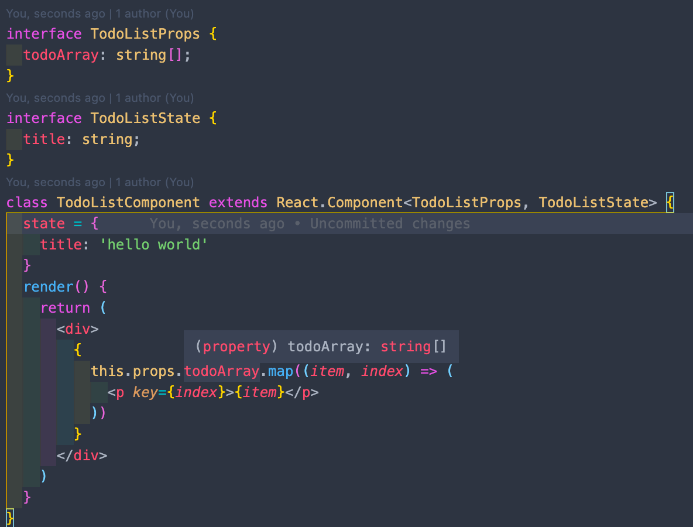
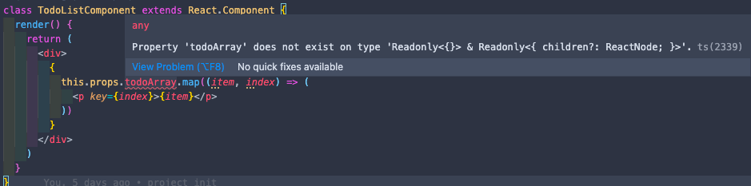
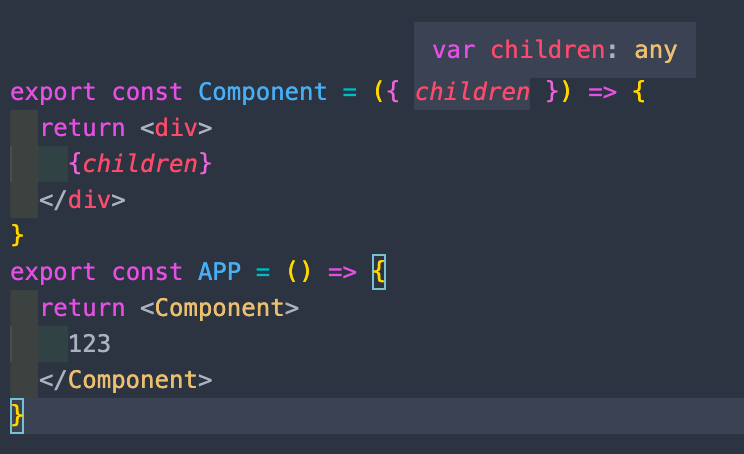
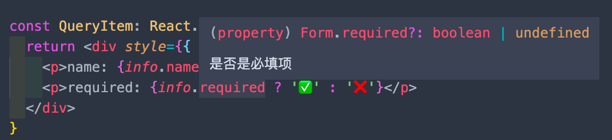
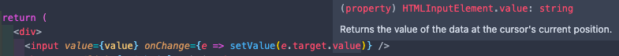
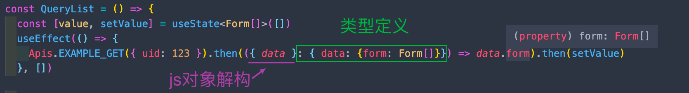
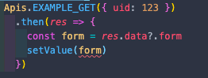
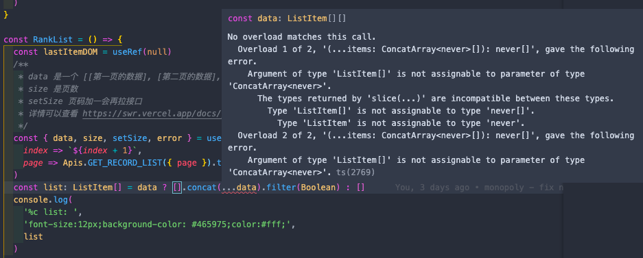

# TS 在项目中的实战

> 免责声明：全面而肤浅，深刻而片面，以下出现肤浅或者片面的地方请见谅

## 背景

1. 部分页面维护周期可能很长，别人负责老的页面，因为对业务具体内容和页面的数据结构不清楚，你接手的时候可能一脸懵，需要花很多时间去理清页面中各种组件的数据流向，而且就算看清楚知道了数据流向，却还是没法光靠代码就知道具体的某个字段数据是什么类型
2. 太多第三方库已经支持 ts 了，VSCode 里跳转到定义都是优先跳到类型文件（VSCode 官方觉得这是个 feature），这时如果你看不懂 TS 类型的话，你还是会一脸懵




这回我们会理解到 ts 的基本类型是哪些，最常用的概念有哪些，如何通过 TS 对我们的 react 组件进行约束

## 基础

学习怎么在项目中应用之前呢，还是要先巩固一下 TS 的基础内容哈

TS 在 VSCode 中的支持非常好，所以文中的代码在 VSCode 中写一遍，然后把鼠标移到变量上直接看到类型的效果会更好

TS 作为 JS 的超集，每个 JS 开发者都能很快上手，你可以把写 TS 理解成在写有显式标注类型的 JS

```ts
/**
 * 原始类型 Primitive type
 */

const a: string = ''

const b: number = 100

const c: boolean = true

const d: null = null

const e: undefined = undefined

const f: void = undefined

/**
 * 非原始类型
 */
let g: object = {}
let g: object = []
let g: object = () => {}

/**
 * 数组类型
 */
const arr1: Array<number> = [1, 2, 3]
const arr2: number[] = [1, 2, 3]

function oldSum(...args) {
  return args.reduce((pre, cur) => pre + cur, 0)
}
oldSum(1, 2, 'str')
function sum(...args: number[]) {
  return args.reduce((pre, cur) => pre + cur, 0)
}
sum(1, 2, 'str')


/**
 * 元组类型 tuple
 * 是长度固定，每一项的类型都确定的数组
 * React.useState
 */
const tuple: [number, string] = [18, 'zqc']

const [age, name] = tuple

const arr = Object.entries({
  age: 18,
  height: 100
})

/**
 * 枚举 Enum
 * 注意里面是等号 =
 */
enum AnchorType {
  freeAnchor = 1, // 自由主播
  laborAnchor = 2, // 工会主播
  ourAnchor = 3, // 直签主播
}
const anchor = {
  name: 'zqc',
  type: AnchorType.freeAnchor // 使用方式跟对象一样
}

/**
 * 函数类型
 */
// 函数声明
function func1 (a: number, b: number): string {
  return ''
}
func1(123)

// 函数表达式
const func2: (a: number, b: number) => string = function(a: number, b: number): string {
  return 'func2'
}
func2(123)

/**
 * 任意类型
 */
function stringify(value: any) {
  return JSON.stringify(value)
}
stringify('string')
stringify(100)
// ts 不会对 any 类型进行检查，所以不会报语法错误，注意只是 ts 不报语法错误，但是兼容老代码的时候是难免会用到 any

/**
 * 隐式类型推断
 */
let age = 18
age = 'string'
let foo
foo = 199
// 还是建议为每个变量明确类型

/**
 * 类型断言
 */
let res

const data1 = res as number // `as` 操作符在 `.ts` 文件和 `.tsx` 文件里都可用

const data2 = <number>res // jsx 下不能使用，所以在项目中我们应该用的也不多

// 类型断言 并不是 类型转换，这里并不是把一个类型转换成了另一类型，因为类型转换是代码在运行时的一个概念，这里的类型断言只是在编译过程的一个概念，当代码编译成 js 后这个断言就不会存在了
```

## 接口

接口和类型是我们使用 TS 必须掌握的概念，大部分情况下我们都是用来定义一个复杂的数据对象

```tsx
/**
 * 接口
 */
interface Pages {
  currentPage: number;
  pageSize?: number; // 可选项
}

function getDataByPage(pages: Pages) {
  console.log(pages.currentPage)
  console.log(pages.pageSize)
  return pages
}
getDataByPage({ currentPage: 1 })

// prop 只是别名，取什么都可以
interface Cache {
  [prop: string]: number;
}
const cache: Cache = {}
cache.foo = 1
cache.bar = 2

/**
 * 类型 type
 * 跟接口差不多，一般我们用的比较多的也是这个
 */
type Example = {
  name: string;
  age: number;
}
```


## 泛型

如果你只接触过 js，泛型算是比较陌生的概念，但其实不难哈

前面有人可能有疑惑，`number[]` 和 `string[]` 这些是什么鬼，怎么也定义了数组的类型，其实它等同于 `Array<string>`，也是调用了数组的泛型，定义数组类型算是一比较特别的例子，只有数组有这种且推荐这种 `xxx[]` 的写法，别的泛型调用还是老老实实用 `<>` 的写法哈

```typescript
// 创建一个数字数组的函数定义
function createNumberArray (length: number, value: number): number[] {
  const arr = Array<number>(length).fill(value)
  return arr
}
// 创建一个字符串数组的函数定义
function createStringArray (length: number, value: string): string[] {
  const arr = Array<string>(length).fill(value)
  return arr
}
createNumberArray(3, 10)
createStringArray(4, '')
// 如果我又需要生成 boolean 或者复杂对象类型的数组，我又得再写一个函数定义，这样看上面的函数定义其实很冗余，可以抽象成下面的泛型写法

/**
 * 泛型
 * 就是指我们在定义函数，接口，类型的时候，没有指定具体的类型
 * 而是在调用的时候才指定具体类型的一种特征
 * 为的是极大程度的复用代码
 */
function createArray<T> (length: number, value: T): T[] {
  // 在 ts 中的写法就是上面这种，一般都是一对中括号，里面就是你传入的模板，这个模板是可以是多个的，名字也不是非得是 `T`，这里 `T` 也就是形参，取什么名字都行哈
  const arr = Array<T>(length).fill(value)
  return arr
}
createArray<number>(3, 10)
createArray<string>(4, '')
```

对我们来说，大部分情况都不需要我们去定义泛型，我们只要像 js 调用函数一样去调用三方库定义好的类型泛型就行了，学会用就足够了，比如说，你要定义一个数组类型，数组里的每个元素是什么东西你得定义一下，不然 ts 怎么知道你数组里都是存的些什么妖魔鬼怪

理解了泛型的概念，其实你就具备了开发 TS 的能力了，只差临门一脚了，相信自己一定行💪

讲到 vscode 里“跳转到定义”都是优先跳到类型文件，如果我们跳转到类型定义的文件，我们甚至不需要翻官方文档就可以知道我们要用的 api 的使用方法，这也算是开发效率上的提升了。

因为其实很多流行的三方库都是有对应的 `@types/xxx` 类型库的，这些类型库都把我们用到的库的类型都定义好了，我们直接使用就有类型约束和类型提示了。比如说 `@types/react` 这个库已经帮我们把 react 的很多内置类型都封装好了，我们学会使用就够了

## 项目

到具体到项目中我们要怎么写呢

我理解 TS 是带类型的 JS，而在项目中最需要的类型的就是项目中的数据，所以我们是围绕着项目中的数据流来学习在项目中的使用的，我们会围绕着从一个普通 React 组件的类型声明到如何带上类型使用 Redux 展开在项目中的应用。

项目结构基本不变，仅添加一个定义类型的 `model.ts` 或 `types.ts` 文件

代码中主要涉及的改动：

- 组件类型的声明
- api 和 model
- redux
  - reducer
  - action
  - store

### props & state

进入到项目中，有一个例子可以帮助我们很好地理解泛型的使用：在 React 中除了傻瓜 UI 组件，几乎所有的组件都有 props 和 state 对象，react 已经定义好一个 react 组件的类型是怎样的了，我们只要传入组件的 `props` 或者 `state` 的类型就行了


```ts
// 这就是 React.Component 的类型声明，P 代表 props 的类型，S 代表 state 的类型
// 如果我们不传入泛型的类型，那它们都默认是空对象类型
interface Component<P = {}, S = {}, SS = any> extends ComponentLifecycle<P, S, SS> { }
```

定义的 `TodoListProps` 和 `TodoListState` 作为 React.Component 的泛型传入，然后我们在就可以看到`this.props.todoArray` 的它的类型是 `string[]`，`this.state` 也是同理

这样就对这个 `TodoListComponent` 组件的 `props` 和 `state` 都定义了类型，它们都受到类型的约束，并且我们在写代码的时候如果错误使用了其中的变量就会报错，可以很好的约束我们正确使用类型，在写代码的时候也会有属性提示

class 写法的组件中，如果我们不传泛型的类型的话，很有可能报错，无法正常编译



前面说到，如果不声明泛型的类型，那 `React.Component` 的 props 和 state 都是空对象类型，在这例子里是访问了 `props` 上的 `todoArray` 属性，这个属性在空对象类型上是不存在的，故报错


当然现在同学们可能更多的还是写 `hooks`，那还有 hooks 的写法哈

```tsx
type TodoArray = string[]
const TodoList: React.FC<{ todoArray: TodoArray }> = ({ todoArray }) => {
  return (
    <div>
      {
        todoArray.map((item, index) => (
          <p key={index}>{item}</p>
        ))
      }
    </div>
  )
}
```

大家可能注意到了，定义一个函数式的组件用的是 `React.FC`，但 hooks 和 class 写法上有点区别，`class` 的 `React.Component` 接受 `props` 和 `state` 的类型，而 hooks 的 `React.FC` 只有接受 `props` 的类型，因为函数式组件内的 `state` 都是用 `useState` 去定义的，所以 `props` 和 `state` 是分开写的，下面是 state 的写法

```tsx
const QueryList = () => {
  const [value, setValue] = useState<Form[]>([]) // 在这里我们传入了 state 类型是 Form[]，这样 value 就是一个数组，数组里的每项都是 Form 类型的数据
  useEffect(() => {
    Apis.EXAMPLE_GET({ uid: 123 }).then(({ data }) => data.form).then(setValue)
  }, [])
  return (
    <>
      {value.map(item => <QueryItem info={item} key={item.name}/>)}
    </>
  )
}
```

**讲到这里，要说写 TS + react 有什么硬性的要求，应该就是如果一个组件用到了 props 或者 state，就要写这个 props 和 state 的类型定义，这是写 react 项目最基础也是最核心的部分**

如果不写 `React.FC` 这类，但又用到 props 里东西，就没法推导出类型了



TS 有一定的推导类型的能力，这里 `children` 被 TS 推导成了 any 类型，这并不是我们希望看到的情况

如果组件用到了 props，应该写上 `React.FC` 并传入 `props` 的类型

这样你在写代码的时候，既有类型提示也有类型约束，可以一定程度地减少类型错误的问题

另外你在看别人写的业务代码的时候，如果有这样的类型定义，你只要把鼠标移到那个 props 或者 state 上面，就能知道它们的数据类型，加上大部分情况下变量的命名都是语义化的，这样你重新看懂这个业务的代码的效率应该是可以提升的



react 定义好的类型还有很多哈，比如说在 `react` 中写一个 `input` 标签的 `onChange` 事件方法就是

```tsx
const onChange = (e: React.ChangeEvent<HTMLInputElement>) => {
  	// 也是通过尖括号将类型传入 React.ChangeEvent 中，然后就定义了 e 的类型
  	// HTMLInputElement 就是这个方法要挂载到的元素类型上
    setValue(e.target.value)
}
...
return <input onChange={onChange}/>
```

```tsx
// @types/react 中的定义部分，有兴趣可以自己去看看哈
interface ChangeEvent<T = Element> extends SyntheticEvent<T> {
    target: EventTarget & T;
}
```

当然了这里只是举例子说明一下 react 中泛型的用法，也不是所有的事件都要写这么详细哈，其实简单的 `onChange` 事件是不用的写类型的，直接写个行内函数我觉得也可以哈，因为 TS 是有一定推导能力，这里 TS 其实已经正确推导出了这个函数的类型

```tsx
return <input onChange={e => setValue(e.target.value)}/>
```



问：什么地方需要类型声明，什么地方不需要？

### api部分

上面定义 hooks state 的部分你们可能看出来了，我是没有定义请求后端接口 `Apis.EXAMPLE_GET` 的返回值的类型的，这里只是我的理解啊，因为 react 中最重要的是 props 和 state 数据的流动，只要定义好了这两个类型，就足够了，要是接口返回的值变了，而我们也在业务中用到了这个值的话，没有定义正确的类型就会报错的，一样能起到类型约束的作用，不过**如果你的后端数据是需要处理才使用的话，这里定义接口的数据类型就很有必要哈**



这里没法在 js 对象解构里面去写类型哈，因为会跟解构的重命名语法冲突哈，需要把整个对象的类型定义一下

有时候我们的后端接口返回的数据可能比较复杂，有很多工具可以帮我们完成这样的数据类型生成：

- 搜索 typescript model generator，会有很多 json 转 ts model 的网站，可以帮我我们生成类型声明的文件，比如 https://app.quicktype.io/
- 或者你可以用 vscode 里的拓展插件 [JSON to TS](https://marketplace.visualstudio.com/items?itemName=MariusAlchimavicius.json-to-ts)，不止这一款，可以尝试别的拓展，有好用的可以试着分享出来给大家一起用哈

生成的类型可以单独放在对应目录的 model.ts 或者 types.ts，导出所有会用到的类型供其他组件使用

```ts
// model.ts
/* eslint-disable camelcase */
// 这下面就是我用前面提到的插件生成的 model 类型，这里我还把我觉得比较重要的属性加上了注释，建议大家可以适当加点注释，便于别人维护
export interface Form {
  label: string;
  type: string;
  options?: Option[];
  /**
   * 单项名称
   */
  name: string;
  /**
   * 是否是必填项
   */
  required?: boolean;
  is_sub: boolean;
  is_text?: boolean;
  sub_name?: string;
  sub_label?: string;
}
export interface Option {
  label: string;
  value: string;
  children?: Option[];
}

// apis.ts
import { Form } from './model' // 哪个组件需要用到哪种类型，就像引入一个变量一样引入就好了
interface IKResponse<Data>{
  code: number;
  message: string;
  data: Data | null;
}
interface IKRequest<Res = {}, Params = {}> { // 等号的意思就是默认类型，这里是空对象
  (data?: Params): Promise<IKResponse<Res>>; // 这里是声明了一个函数的类型
}
type Data = {
  form: Form[];
}
export default class Apis {
  /**
   * @name 获取信息
   * @method get
   * @param atom
   */
  @setParamsDecorate(queryParams)
  @messageDecorator({ errorMsg: getErrorMsg('请求失败,请稍后再试~') })
  // static EXAMPLE_GET = baseGet('/api/play/social/lag/page', requestConfig)
  static EXAMPLE_GET: IKRequest<Data> = baseGet('/api/play/social/lag/page', requestConfig)
}
// 不这样加类型如何，这样加会如何，这样写的原理，还有ikresponse 为啥那里有一个null，有什么用？

// index.tsx
Apis
  .EXAMPLE_GET({ uid: 123 })
  .then(res => {
    const form = res.data?.form
    if (form) setValue(form) // 这样加类型了后，接口拿到的 res 是有类型的
  })
```

如果我们去掉 `if (form)` 就会报错，因为 null 和我们的 setValue 的入参类型不一样



这样可以让我们在写代码的时候多判断一下 data 是否是空

而如果没有标明 `EXAMPLE_GET` 类型，那这里整个都是 any，我们很可能会忽略 data 为 null 的情况

### redux

有时候项目中难免会用到 redux 这样的全局状态管理，因为原来的 `redux-action` 对 ts 的支持很差，这里会讲一套 redux 比较原始的写法

#### actionCreator

主要是 action 生成器

```ts
// action.ts
// 同步写法
// 这里的 content 也就是形参，根据具体的业务传就行了，类型也是根据业务来决定
export const addTodo = (content: string) => ({
  type: actionTypes.ADD_TODO,
  payload: content
})

// 异步写法，调用的时候其实就是返回一个函数，让 redux-thunk 去处理
export const asyncAdd = (content: string) => (dispatch, getState) => {
  Apis.EXAMPLE_GET({ uid: 123 })
    .then(({ data }) => data)
    .then(data => dispatch(addTodo(data)))
}

```

#### reducer

生成 store state 的纯函数

```ts
// reducer
const defaultState = [ // 先定义好页面的默认数据结构，然后
  '学习recoil',
  '学习swr'
]
const todoReducer = (state = defaultState, action): typeof defaultState => { // 注意这里的 typeof
  switch (action.type) {
    case ADD_TODO: {
      return [...state, action.payload]
    }
    default: {
      return state
    }
  }
}
```

在 ts 中 `typeof 值` 可以很方便我们直接将已有的数据直接转换成我们想要的类型，如果是直接用的接口返回的值，可以将定义好了 reducer 函数，接下来就看看 store 生成的部分

#### store

```ts
import configureStore from 'entry/configureStore'
import { combineReducers, bindActionCreators } from 'redux'
import * as originActions from './actions'

const store = configureStore(() => combineReducers({
  todoArray: todoReducer,
  counter: counterReducer
}))

export const actions = bindActionCreators(originActions, store.dispatch)

export type RootState = ReturnType<typeof store.getState>
export default store
```

redux 已经是用 TS 重写了，所以这里的 combineReducers，bindActionCreators 对类型推导都是支持的

configureStore : 生成了一个根 store，这里的 configureStore 是有定义了类型的，所以生成的 store 也是带类型提示和约束的

actions: 通过 `import * as originActions from './actions'` 一次性将所有的 actionCreator 导入，然后通过 redux 的 bindActionCreators 就可以将所有的 actions 和 dispatch 结合在一起，在使用的时候只要从这里引入这个 actions 调用，就有类型提示，也有类型约束，很方便使用的

这里比较难理解的理解的应该就是 `ReturnType<typeof store.getState>`

`store.getState` 是 `store` 获取 `state` 的方法，这个函数的返回值一定是 `store` 的根 `state`

前面我讲了 `typeof` 可以将一个 js 值变成类型，这样我们获得了 `store.getState` 这个函数的类型

而 `ReturnType` 是 TS 官方给我们的一个写好的一个工具泛型，可以可以来获取一个函数类型的返回值类型

比如说：

```ts
type ActionCreator = () => { type: string; payload: any; }
type Action = ReturnType<ActionCreator>
// 这样我们的 Action 类型就是 { type: string; payload: any; }
```

如果上面我为了定义 `Store` 的 `state` 不使用 `ReturnType` 的话，那我还要去手动去维护这个根 `state` 的类型

```ts
export type RootState = {
  todoArray: string[];
  counter: number
}
// 看着好像也没有多很多代码的样子，不过这还是数据很少的情况，如果数据多起来的话
// 每个 reducer 那要维护一份数据类型，store 这也要维护一份总的数据类型，这就有点麻烦了
// 所以使用 ReturnType 来获取 store 的 state 很有必要哈
export type RootState = ReturnType<typeof store.getState>
```

讲这个主要是为了大家写代码的时候可以少写一些类型的定义代码哈，对 `ReturnType` 的具体原理感兴趣的同学可以自己下去研究哈，我们现在知道怎么用它就够了哈

#### 函数式组件中使用

useSelector：react-redux 中的工具 hooks，来获取 redux Store 中的 state

```tsx
import { useSelector } from 'react-redux'
import { RootState } from '../store/originRedux'

const TodoList: React.FC = () => {
  const todoArray = useSelector((state: RootState) => state.todoArray)
  return (
    <div>
      {
        todoArray.map((item, index) => (
          <p key={index}>{item}</p>
        ))
      }
    </div>
  )
}
```

useDispatch：react-redux 中的工具 hooks，来获取 redux Store 中的 dispatch 方法

```tsx
import { RootState } from '../store/originRedux'
import { useDispatch } from 'react-redux'
import { addTodo } from '../store/actions'

const Input = () => {
  const [value, setValue] = useState('')
  const dispatch = useDispatch()

  const onSubmit = () => {
    dispatch(addTodo(value))
    setValue('')
  }

  return (
    <div>
      <input value={value} onChange={e => setValue(e.target.value)} />
      <button onClick={onSubmit}>submit</button>
    </div>
  )
}
```

其实也可以直接用前面我们定义好的 actions，一样有类型提示和约束

```tsx
import { RootState, actions } from '../store/originRedux'

const Input = () => {
  const [value, setValue] = useState('')

  const onSubmit = () => {
    actions.addTodo(value)
    setValue('')
  }

  return (
    <div>
      <input value={value} onChange={e => setValue(e.target.value)} />
      <button onClick={onSubmit}>submit</button>
    </div>
  )
}
```

#### class 组件中使用

**mapDispatch**

可能还有同学有 class 写法的需求，所以罗列了 mapDispatch 和 mapState 的写法，但并不打算细讲

```tsx
// action
const addTodo = (content: string) => dispatch => {
  dispatch({
    type: 'ADD_TODO',
    payload: content
  })
}

// 组件中 mapDispatch
const mapDispatchToProps = (dispatch) => {
	return bindActionCreators({
    addTodo
  }, dispatch)
}

// 这就会根据action自动生成类型，如果有其他组件的传过来的属性直接和这个类型合并就行了
type TodoInputProps = ReturnType<typeof mapDispatchToProps>

class DemoComponent extends React.Component<TodoInputProps> {}
const Demo = connect(undefined, mapDispatchToProps)(DemoComponent)
```

**mapState**

前面有定义出 store 的根 state 的类型，那在组件拿 store 的 state 的时候就会有类型了

```tsx
const mapStateToProps = (state: RootState) => ({ todoArray: state.todoArray })
type TodoListProps = ReturnType<typeof mapStateToProps> & TodoInputProps
// 如果 props 不光有从 Redux 传过来的，可能从父组件也有值要传过来的时候也是用 & 连起来
type TodoListProps = ReturnType<typeof mapStateToProps> & TodoInputProps & { num: number }

class TodoListComponent extends React.Component<TodoListProps> {}
const TodoList = connect(mapStateToProps, mapDispatchToProps)(TodoListComponent)
```

到这里，你可能发现了，TS 就是只关心“类型”这个东西，用上 TS 后我们十分关心组件 props 和 state 的各种类型使用，我对 TS 在 react 中应用的理解也是这样的，它关心的就是页面的数据流，并不会对 UI 视图产生直接的影响哈，其实到这里你已经完全具备用 TS 开发页面的能力


## 类型约束

大家不知道有没有想过，定义了这些类型到底是怎么用起来的，前面讲到了那么多次“类型约束”到底是怎么约束起来的


我的理解就是类型报错哈，TS 会尽可能的给你报它所认为的错来约束你要正确使用 value


### 最常见问题 Argument of type 'xxx' is not assignable to parameter of type 'xxx'. 

或者是 Type 'xxx' is not assignable to type 'xxx'

这个应该可能是大家写 ts 遇到的最多的报错之一了，其实都是类型不匹配导致的报错

错误大概长这样：



一种情况是你类型使用错了，检查一下到底是不是写错了

```tsx
const num: number = 1
let str: string = ''
str = num // Type 'number' is not assignable to type 'string'.ts(2322)
```

另一种情况是类型可能是联合类型，带了些不符合要求的空值类型，这种联合类型可能也不能把空值给去掉，因为我们的数据是存在有空值的情况的，这个时候就可以用条件判断的语句让数据类型确定，这里也体现了 TS 是如何在编码阶段就干掉了一些错误

```tsx
const Demo = () => {
  const dom = useRef<HTMLDivElement>(null) // 这个 ref 就是为了拿真实 DOM 节点

  useEffect(() => {
    const SwiperInstance = new Swiper(dom.current, {}) // 这里会报错哈，实例化 Swiper 的时候，入参只能是真实 DOM 或者 css选择器string
  }, [])

  useEffect(() => {
    if (dom.current) { // 条件判断让 dom.current 不会是 null
      const SwiperInstance = new Swiper(dom.current, {}) // 不会报错
    }
  }, [])
  return <div ref={dom}></div>
}
```

上面的例子就是举例哈，使用 as 类型断言也可以哈哈，使用 as 的时候你要确保你的类型断言是一定成立的（实际上 useEffect 的执行时机是在真实 DOM 对象生成后，所以是能拿到的）

```tsx
const Demo = () => {
  const dom = useRef<HTMLDivElement>(null)
  useEffect(() => {
    const SwiperInstance = new Swiper(dom.current as HTMLDivElement, {})
  }, [])
  return <div ref={dom}></div>
}
```


## 不建议的写法

刚开始过渡的时候，可以先用 any 来避免报错，但是后面还是推荐把类型都定义出来，不建议代码全都是 any，这样就成了 anyscript 而不是 typescript 了，用 typescript 的意义也没了

## 建议的写法

class 的 state 如果能定义类型的话，在访问 `this.state` 和 `this.setState` 会有更多的提示，

```tsx
type MyState = {}
// React.Component 和 state={} 两个地方都声明的类型
class App extends React.Component<{}, MyState> { state: MyState = {} }
```

无论你为组件props使用类型（type）还是接口（interface），都要始终如一地使用它们，不要明明是同一个类型却总是重复定义

```tsx
import React from 'react'

type Props = {
  /** color to use for the background */
  color?: string;
  /** standard children prop: accepts any valid React Node */
  children: React.ReactNode;
  /** callback function passed to the onClick handler*/
  onClick: ()  => void;
}

const Button: React.FC<Props> = ({ children, color = 'tomato', onClick }) => {
   return <button style={{ backgroundColor: color }} onClick={onClick}>{children}</button>
}

```

如果你用的 hooks 的话，那大部分情况是甚至不写类型都有更好的类型推论，所以还是比较建议都写 hooks

## ts 版本问题

首先，假定你跟我一样经常用 vscode 开发的话，那么你可以在随便打开某个 ts 文件，然后在 vscode 的最下面的状态栏找到一个版本号，点击一下版本号就可以换编辑器用的 ts 版本号，希望你可以改成使用项目的版本号，而不是 vscode 默认的版本，换了后，vscode 也只是给你生成了 `.vscode` 文件夹，里面有 vscode 的配置

因为有的仓库是不会把 .vscode 的配置上传的，所以需要有上面这步

## 最后

没有必要觉得 `TS` 是一门新语言就畏惧哈，不过是带类型的 `JS` 而已，本质上还是跟写 JS 也没太大的区别，却带来了强类型静态类型的好处，大部分情况下可以无脑地把文件后缀由 `.js` 变成 `.ts` 或 `tsx`，然后它报什么错就去解决就行了，其实即使不写一个类型定义，`TS` 也会推论出你的数据类型，然后在你隐式转换类型的时候就给你报错，你不解决都不行，从编码阶段就把很多错误扼杀了这就是 `TS` 的优势

要说有什么真的必须要做到的底线就是：

- 不要提交任何有 TS 类型错误的代码
- 定义清楚组件的 props 和 state 的数据类型


## 条件类型 Conditional Types（仅供参考）

这个部分不讲哈，感兴趣的同学可以自己下去搜索下哈😝

条件类型的语法实际上就是三元表达式：

```typescript
T extends U ? X : Y
```

> 如果你觉得这里的extends不太好理解，可以暂时简单理解为U中的属性在T中都有。

因此条件类型理解起来更直观，唯一需要有一定理解成本的就是 **何时条件类型系统会收集到足够的信息来确定类型**，也就是说，条件类型有可能不会被立刻完成判断。

在了解这一点前，我们先来看看条件类型常用的一个场景：**泛型约束**，实际上就是我们上面的例子：

```typescript
function pickSingleValue<T extends object, U extends keyof T>(obj: T, key: U): T[U] {
  return obj[key];
}
```

这里的`T extends object`与`U extends keyof T`都是泛型约束，分别**将T约束为对象类型**和将U约束为T键名的字面量联合类型。我们通常使用泛型约束来**“使得泛型收窄”**。

以一个使用条件类型作为函数返回值类型的例子：

```typescript
declare function strOrnum<T extends boolean>(
  x: T
): T extends true ? string : number;
```

在这种情况下，条件类型的推导就会被延迟（deferred），因为此时类型系统没有足够的信息来完成判断。

只有给出了所需信息（在这里是x值），才可以完成推导。

```typescript
const strReturnType = strOrNum(true);
const numReturnType = strOrNum(false);
```

同样的，就像三元表达式可以嵌套，条件类型也可以嵌套，如果你看过一些框架源码，也会发现其中存在着许多嵌套的条件类型，无他，条件类型可以将类型约束收拢到非常精确的范围内。

```typescript
type TypeName<T> = T extends string
  ? "string"
  : T extends number
  ? "number"
  : T extends boolean
  ? "boolean"
  : T extends undefined
  ? "undefined"
  : T extends Function
  ? "function"
  : "object";
```

## infer关键字（仅供参考）

`infer`是`inference`的缩写，通常的使用方式是`infer R`，`R`表示 **待推断的类型**。通常`infer`不会被直接使用，而是被放置在底层工具类型中，需要在条件类型中使用。看一个简单的例子，用于获取函数返回值类型的工具类型`ReturnType`:

```typescript
const foo = (): string => {
  return "linbudu";
};

// string
type FooReturnType = ReturnType<typeof foo>;
```

`infer`的使用思路可能不是那么好习惯，我们可以用前端开发中常见的一个例子类比，页面初始化时先显示占位交互，像Loading/骨架屏，在请求返回后再去渲染真实数据。`infer`也是这个思路，**类型系统在获得足够的信息后，就能将infer后跟随的类型参数推导出来**，最后返回这个推导结果。

```typescript
type ReturnType<T> = T extends (...args: any[]) => infer R ? R : any;
```

类似的，借着这个思路我们还可以获得函数入参类型、类的构造函数入参类型、Promise内部的类型等，这些工具类型我们会在后面讲到。

infer其实没有特别难消化的知识点，它需要的只是思路的转变，你要理解 **延迟推断** 的概念。

## react 常用类型（仅作参考）

这里不会讲，仅留作参考

```tsx
type AppProps = {
  message: string;
  count: number;
  disabled: boolean;
  /** array of a type! */
  names: string[];
  /** string literals to specify exact string values, with a union type to join them together */
  status: 'waiting' | 'success';
  /** any object as long as you dont use its properties (NOT COMMON but useful as placeholder) */
  obj: object;
  obj2: {}; // almost the same as `object`, exactly the same as `Object`
  /** an object with any number of properties (PREFERRED) */
  obj3: {
    id: string;
    title: string;
  };
  /** array of objects! (common) */
  objArr: {
    id: string;
    title: string;
  }[];
  /** a dict object with any number of properties of the same type */
  dict1: {
    [key: string]: MyTypeHere;
  };
  dict2: Record<string, MyTypeHere>; // equivalent to dict1
  /** any function as long as you don't invoke it (not recommended) */
  onSomething: Function;
  /** function that doesn't take or return anything (VERY COMMON) */
  onClick: () => void;
  /** function with named prop (VERY COMMON) */
  onChange: (id: number) => void;
  /** alternative function type syntax that takes an event (VERY COMMON) */
  onClick(event: React.MouseEvent<HTMLButtonElement>): void;
  /** an optional prop (VERY COMMON!) */
  optional?: OptionalType;
}

export declare interface AppProps {
  children1: JSX.Element; // bad, doesnt account for arrays
  children2: JSX.Element | JSX.Element[]; // meh, doesn't accept strings
  children3: React.ReactChildren; // despite the name, not at all an appropriate type; it is a utility
  children4: React.ReactChild[]; // better, accepts array children
  children: React.ReactNode; // best, accepts everything (see edge case below)
  functionChildren: (name: string) => React.ReactNode; // recommended function as a child render prop type
  style?: React.CSSProperties; // to pass through style props
  onChange?: React.FormEventHandler<HTMLInputElement>; // form events! the generic parameter is the type of event.target
  //  more info: https://react-typescript-cheatsheet.netlify.app/docs/advanced/patterns_by_usecase/#wrappingmirroring
  props: Props & React.ComponentPropsWithoutRef<"button">; // to impersonate all the props of a button element and explicitly not forwarding its ref
  props2: Props & React.ComponentPropsWithRef<MyButtonWithForwardRef>; // to impersonate all the props of MyButtonForwardedRef and explicitly forwarding its ref
}
```

## 参考资料

平时很多文章都是讲的 ts 的知识，甚至是很基础的内容，作用可能不是很大，所以建议大家都看看下面的资料

[typescript-cheatsheets/react](https://github.com/typescript-cheatsheets/react) 这个讲的很多很细，建议看看

[typescript FAQs](https://github.com/microsoft/TypeScript/wiki/FAQ?)

[类型编程](https://juejin.cn/post/6885672896128090125#heading-12)

