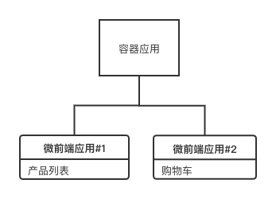
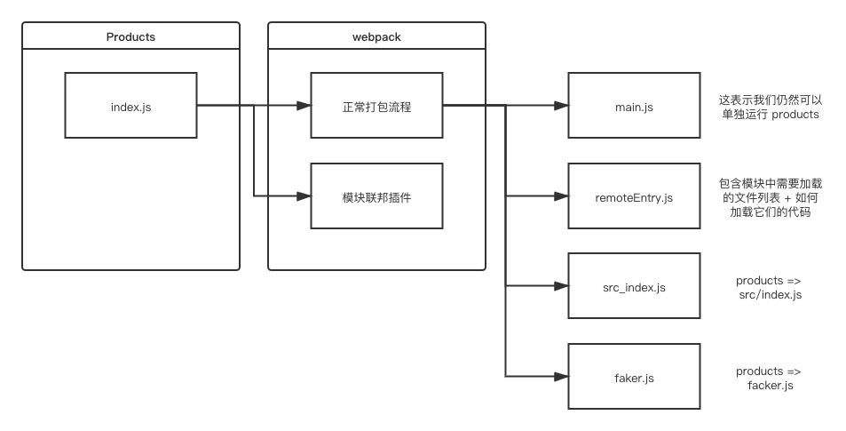
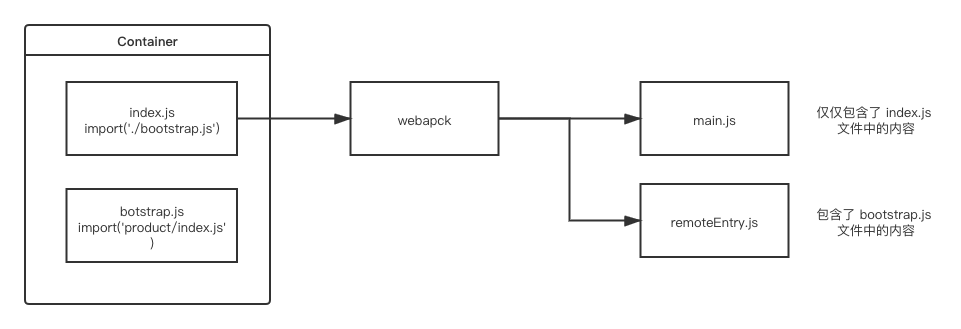
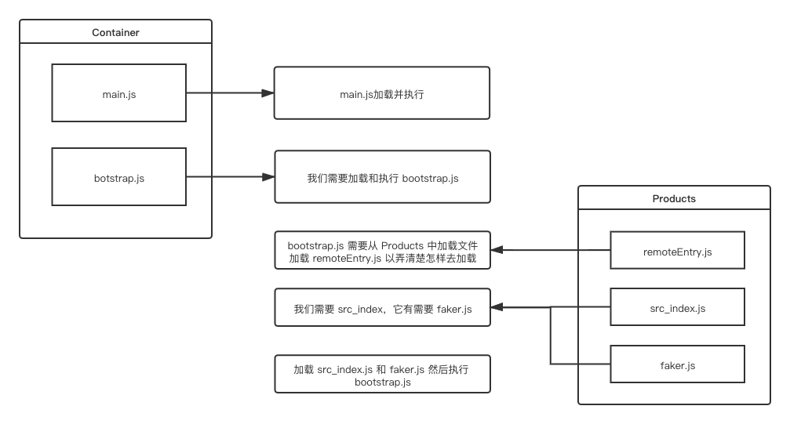

# 微前端

## 是什么

微前端是一种软件架构，可以将前端应用拆解成一些更小的能够独立开发部署的微型应用，然后再将这些微应用进行组合使其成为整体应用的架构模式。

微前端架构类似于组件架构，但不同的是，组件不能独立构建和发布，但是微前端中的应用是可以的。

微前端架构与框架无关，每个微应用都可以使用不同的框架。

## 价值

1. 增量迁移

   迁移是一项非常耗时且艰难的任务，比如有一个管理系统使用 AngularJS 开发维护已经有三年时 间，但是随时间的推移和团队成员的变更，无论从开发成本还是用人需求上，AngularJS 已经不能 满足要求，于是团队想要更新技术栈，想在其他框架中实现新的需求，但是现有项目怎么办?直接 迁移是不可能的，在新的框架中完全重写也不太现实。
   
   使用微前端架构就可以解决问题，在保留原有项目的同时，可以完全使用新的框架开发新的需求，然后再使用微前端架构将旧的项目和新的项目进行整合。这样既可以使产品得到更好的用户体验，也可以使团队成员在技术上得到进步，产品开发成本也降到的最低。
   
2. 独立发布 在目前的单页应用架构中，使用组件构建用户界面，应用中的每个组件或功能开发完成或者bug修复完成后，每次都需要对整个产品重新进行构建和发布，任务耗时操作上也比较繁琐。

   在使用了微前端架构后，可以将不能的功能模块拆分成独立的应用，此时功能模块就可以单独构建
   单独发布了，构建时间也会变得非常快，应用发布后不需要更改其他内容应用就会自动更新，这意
   味着你可以进行频繁的构建发布操作了。

3. 允许单个团队做出技术决策

   因为微前端构架与框架无关，当一个应用由多个团队进行开发时，每个团队都可以使用自己擅长的技术栈进行开发，也就是它允许适当的让团队决策使用哪种技术，从而使团队协作变得不再僵硬。

**微前端的使用场景:**

1. 拆分巨型应用，使应用变得更加可维护
2. 兼容历史应用，实现增量开发

## 微前端的问题

1. 多个微应用如何进行组合 ?

     在微前端架构中，除了存在多个微应用以外，还存在一个容器应用，每个微应用都需要被注册到容器应用中。

   微前端中的每个应用在浏览器中都是一个独立的 JavaScript 模块，通过模块化的方式被容器应用启 动和运行。使用模块化的方式运行应用可以防止不同的微应用在同时运行时发生冲突。


2. 在微应用中如何实现路由 ?
  在微前端架构中，当路由发生变化时，容器应用首先会拦截路由的变化，根据路由匹配微前端应用，当匹配到微应用以后，再启动微应用路由，匹配具体的页面组件。


3. 微应用与微应用之间如何实现状态共享 ? 在微应用中可以通过发布订阅模式实现状态共享，比如使用 RxJS。

4. 微应用与微应用之间如何实现框架和库的共享?
   通过 import-map 和 webpack 中的 externals 属性。

## Systemjs

在微前端架构中，微应用被打包为模块，但浏览器不支持模块化，需要使用 systemjs 实现浏览器中的模 块化。

systemjs 是一个用于实现模块化的 JavaScript 库，有属于自己的模块化规范。 在开发阶段我们可以使用 ES 模块规范，然后使用 webpack 将其转换为 systemjs 支持的模块。

不需要 npm 装开发依赖以外的依赖，在 html 里面引用了库的 cdn 地址，通过 systemjs 去加载这些依赖，然后通过 webpack 的 externals 去排除打包的依赖

## Single-spa

**概述**

single-spa 是一个实现微前端架构的框架。

在 single-spa 框架中有三种类型的微前端应用:

1. single-spa-application / parcel: 微前端架构中的微应用，可以使用 vue、react、angular 等框 架。
2. single-spa root config: 创建微前端容器应用。
3. utility modules: 公共模块应用，非渲染组件，用于跨应用共享 javascript 逻辑的微应用。

### **创建容器应用** 

1. 安装 single-spa 脚手架工具: `npm install create-single-spa@2.0.3 -g`

2. 创建微前端应用目录: `mkdir workspace && cd "$_"` 

3. 创建微前端容器应用: `create-single-spa`

   1. 应用文件夹填写 container 名字无所谓

   2. 应用选择 single-spa root config 容器应用

   3. 组织名称填写 study

      组织名称可以理解为团队名称，微前端架构允许多团队共同开发应用，组织名称可以标识应用由哪个团队开发。

      应用名称的命名规则为 @组织名称/应用名称 ，比如 @study/todos

4. 启动应用: `npm start`

5. 访问应用: `localhost:9000`

6. 默认代码解析

   1. Root-config.js

   ```js
   // workspace/container/src/study-root-config.js
   import { registerApplication, start } from "single-spa"
   /*
   注册微前端应用
   1. name: 字符串类型, 微前端应用名称 "@组织名称/应用名称"
   2. app: 函数类型, 返回 Promise, 通过 systemjs 引用打包好的微前端应用模块代码
   (umd)
   3. activeWhen: 路由匹配时激活应用
   */
   registerApplication({
     name: "@single-spa/welcome",
     app: () =>
     System.import(
       "https://unpkg.com/single-spa-welcome/dist/single-spa-welcome.js"
   ),
     activeWhen: ["/"]
   })
   ```

   ```js
   // start 方法必须在 single spa 的配置文件中调用
   // 在调用 start 之前, 应用会被加载, 但不会初始化, 挂载或卸载. 
   start({
   // 是否可以通过 history.pushState() 和 history.replaceState() 更改触发 single-spa 路由
   // true 不允许 false 允许
     urlRerouteOnly: true
   })
   ```

   2. index.ejs

   ```html
   <!-- 导入微前端容器应用 --> <script>
     System.import("@study/root-config")
   </script>
   <!--
   import-map-overrides 可以覆盖导入映射 当前项目中用于配合 single-spa Inspector 调试工具使用. 可以手动覆盖项目中的 JavaScript 模块加载地址, 用于调试.
   -->
   <import-map-overrides-full show-when-local-storage="devtools" dev-libs>
   </import-map-overrides-full>
   ```

   ```html
   <!-- 模块加载器 -->
   <script src="https://cdn.jsdelivr.net/npm/systemjs@6.8.0/dist/system.min.js"> </script>
   <!-- systemjs 用来解析 AMD 模块的插件 -->
   <script src="https://cdn.jsdelivr.net/npm/systemjs@6.8.0/dist/extras/amd.min.js" ></script>
   <!-- 用于覆盖通过 import-map 设置的 JavaScript 模块下载地址 -->
   <script src="https://cdn.jsdelivr.net/npm/import-map- overrides@2.2.0/dist/import-map-overrides.js"></script>
   <!-- 用于支持 Angular 应用 -->
   <script src="https://cdn.jsdelivr.net/npm/zone.js@0.10.3/dist/zone.min.js"> </script>
   ```

   ```html
   <!-- single-spa 预加载 --> <link
     rel="preload"
     href="https://cdn.jsdelivr.net/npm/single-spa@5.8.3/lib/system/single-
   spa.min.js"
     as="script"
   />
   ```

   ```html
   <!-- JavaScript 模块下载地址 此处可放置微前端项目中的公共模块 --> <script type="systemjs-importmap">
     {
       "imports": {
         "single-spa": "https://cdn.jsdelivr.net/npm/single-
   spa@5.8.3/lib/system/single-spa.min.js"
   } }
   </script>
   ```

### **创建不基于框架的微应用**

1. 应用初始化: `mkdir lagou && cd "$_" `

2. 配置 webpack

   ```js
   const { merge } = require("webpack-merge")
   const singleSpaDefaults = require("webpack-config-single-spa")
   module.exports = () => {
     const defaultConfig = singleSpaDefaults({
   		// 组织名称
   		orgName: "study", // 项目名称 
       projectName: "lagou"
   	})
     return merge(defaultConfig, {
       devServer: {
   			port: 9001 
       }
   	})
   }
   ```

3. 在 package.json 文件中添加应用启动命令

   ```json
   "scripts": {
     "start": "webpack serve"
   }
   ```

4. 在应用入口文件中导出微前端应用所需的生命周期函数，生命周期函数必须返回 Promise

   ```js
   let lagouContainer = null
   export const bootstrap = async function () { 
     console.log("应用正在启动")
   }
   export const mount = async function () {
   	console.log("应用正在挂载")
   	lagouContainer = document.createElement("div") 
     lagouContainer.innerHTML = "Hello Lagou" 
     lagouContainer.id = "lagouContainer" 
     document.body.appendChild(lagouContainer)
   }
   export const unmount = async function () {
   	console.log("应用正在卸载")
     document.body.removeChild(lagouContainer)
   }
   ```

5. 在为前端容器应用中注册微前端应用

   ```js
   registerApplication({
     name: "@study/lagou",
     app: () => System.import("@study/lagou"),
     activeWhen: ["/lagou"]
   })
   ```

6. 在模板文件中指定模块访问地址

   ```html
   <script type="systemjs-importmap">
   {
     "imports": {
        "@study/lagou": "//localhost:9001/study-lagou.js"
   } }
   </script>
   ```

7. 修改默认应用代码

   ```js
   // 注意: 参数的传递方式发生了变化, 原来是传递了一个对象, 对象中有三项配置, 现在是传递了三 个参数
   registerApplication(
     "@single-spa/welcome",
     () =>
       System.import(
         "https://unpkg.com/single-spa-welcome/dist/single-spa-welcome.js"
       ),
     location => location.pathname === "/"
   )
   ```

### **创建基于** **React** **的微应用**

1. 创建应用: `create-single-spa`

   1. 应用目录输入 todos
   2. 框架选择 react
   
2. 修改应用端口 && 启动应用

   ```json
   {
   	"scripts": {
   		"start": "webpack serve --port 9002",
   	}
   } 
   ```

3. 注册应用，将 React 项目的入口文件注册到基座应用中

   ```js
   registerApplication({
     name: "@study/todos",
     app: () => System.import("@study/todos"),
     activeWhen: ["/todos"]
   })
   ```

4. 指定微前端应用模块的引用地址

   ```html
   <!--
   在注册应用时 systemjs 引用了 @study/todos 模块, 所以需要配置该模块的引用地址
   -->
   <script type="systemjs-importmap">
   {
     "imports": {
        "@study/root-config": "//localhost:9000/study-root-config.js",
        "@study/todos": "//localhost:9002/study-todos.js"
   } }
   </script>
   ```

5. 指定公共库的访问地址

   默认情况下，应用中的 react 和 react-dom 没有被 webpack 打包， single-spa 认为它是公共库，不应该单独打包。
   
   ```html
   <script type="systemjs-importmap">
   {
     "imports": {
        "single-spa": "https://cdn.jsdelivr.net/npm/single-
   spa@5.8.3/lib/system/single-spa.min.js",
        "react":
   "https://cdn.jsdelivr.net/npm/react@17.0.1/umd/react.production.min.js",
        "react-dom": "https://cdn.jsdelivr.net/npm/react-dom@17.0.1/umd/react-
   dom.production.min.js",
        "react-router-dom": "https://cdn.jsdelivr.net/npm/react-router-
   dom@5.2.0/umd/react-router-dom.min.js"
     }
   }
   </script>
   ```

6. 微前端 React 应用入口文件代码解析

   ```
   // react、react-dom 的引用是 index.ejs 文件中 import-map 中指定的版本 import React from "react"
   import ReactDOM from "react-dom"
   // single-spa-react 用于创建使用 React 框架实现的微前端应用
   import singleSpaReact from "single-spa-react" // 用于渲染在页面中的根组件
   import rootComponent from "./root.component"
   // 指定根组件的渲染位置
   const domElementGetter = () => document.getElementById("todosContainer") // 错误边界函数
   const errorBoundary = () => <div>发生错误时此处内容将会被渲染</div>
   // 创建基于 React 框架的微前端应用, 返回生命周期函数对象 const lifecycles = singleSpaReact({
     React,
     ReactDOM,
     rootComponent,
     domElementGetter,
     errorBoundary
   })
   // 暴露必要的生命周期函数
   export const { bootstrap, mount, unmount } = lifecycles
   ```

7. 路由配置

   ```jsx
   import React from "react"
   import {BrowserRouter, Switch, Route, Redirect, Link} from "react-router-
   dom"
   import Home from "./pages/Home"
   import About from "./pages/About"
   export default function Root(props) {
     return (
       <BrowserRouter basename="/todos">
         <div>{props.name}</div>
         <div>
           <Link to="/home">Home</Link>
           <Link to="/about">About</Link>
         </div>
         <Switch>
           <Route path="/home">
             <Home />
           </Route>
           <Route path="/about">
             <About />
           </Route>
           <Route path="/">
             <Redirect to="/home" />
           </Route>
         </Switch>
       </BrowserRouter>
   ) }
   ```

8. 修改 webpack 配置

   ```js
   const { merge } = require("webpack-merge")
   const singleSpaDefaults = require("webpack-config-single-spa-react")
   module.exports = (webpackConfigEnv, argv) => {
     const defaultConfig = singleSpaDefaults({
       orgName: "study",
       projectName: "todos",
       webpackConfigEnv,
       argv
     })
     return merge(defaultConfig, {
       externals: ["react-router-dom"]
     })
   }
   ```

   

### **创建基于** **Vue** **的微应用** 

1. 创建应用: create-single-spa

   1. 项目文件夹填写 realworld
   1. 框架选择 Vue
   1. 生成 Vue 2 项目

2. 提取 vue && vue-router

   ```js
   // vue.config.js
   module.exports = {
     chainWebpack: config => {
       config.externals(["vue", "vue-router"])
     }
   }
   ```

   ```html
   <script type="systemjs-importmap">
   {
     "imports": {
        "vue": "https://cdn.jsdelivr.net/npm/vue@2.6.10/dist/vue.js",
        "vue-router": "https://cdn.jsdelivr.net/npm/vue-router@3.0.7/dist/vue-
   router.min.js"
     }
   }
   </script>
   ```

3. 修改启动命令 && 启动应用

   ```
   "scripts": {
     "start": "vue-cli-service serve --port 9003",
   }
   ```

4. Vue 应用配置路由

   ```js
   import Vue from "vue"
   import VueRouter from "vue-router"
   import singleSpaVue from "single-spa-vue"
   import App from "./App.vue"
   Vue.use(VueRouter)
   Vue.config.productionTip = false
   // 路由组件
   const Foo = { template: "<div>foo</div>" } const Bar = { template: "<div>bar</div>" }
   // 路由规则
   const routes = [
     { path: "/foo", component: Foo },
     { path: "/bar", component: Bar }
   ]
   // 路由实例
   const router = new VueRouter({ routes, mode: "history", base: "/realworld"
   })
   const vueLifecycles = singleSpaVue({
     Vue,
   // 应用配置 appOptions: {
   // 路由 router,
   // 渲染组件 render(h) {
   return h(App, {
   // 向组件中传递的数据 props: {
             name: this.name,
             mountParcel: this.mountParcel,
             singleSpa: this.singleSpa
   } })
   } }
   })
   // 导出生命周期函数
   export const bootstrap = vueLifecycles.bootstrap export const mount = vueLifecycles.mount
   export const unmount = vueLifecycles.unmount
   ```

   ```html
   <template>
     <div id="app">
       <h1>{{ name }}</h1>
       <p>
         <router-link to="/foo">Go to Foo</router-link>
         <router-link to="/bar">Go to Bar</router-link>
       </p>
       <router-view></router-view>
     </div>
   </template>
   <script>
   export default {
     name: "App",
     props: ["name"]
   }
   </script>
   ```

   

### **创建** **Parcel** 应用

Parcel 用来创建公共 UI，涉及到跨框架共享 UI 时需要使用 Parcel。

Parcel 的定义可以使用任何 single-spa 支持的框架，它也是单独的应用，需要单独启动，但是它不关联 路由。

Parcel 应用的模块访问地址也需要被添加到 import-map 中，其他微应用通过 System.import 方法进行 引用。

需求:创建 navbar parcel，在不同的应用中使用它。

1. 使用 React 创建 Parcel 应用 `create-single-spa`

   ```js
   import React from "react"
   import ReactDOM from "react-dom"
   import singleSpaReact from "single-spa-react"
   import Root from "./root.component"
   const lifecycles = singleSpaReact({
     React,
     ReactDOM,
     rootComponent: Root,
     errorBoundary(err, info, props) {
       // Customize the root error boundary for your microfrontend here.
   return null }
   })
   export const { bootstrap, mount, unmount } = lifecycles
   ```

   ```jsx
   export default function Root(props) {
     return (
       <BrowserRouter>
         <div>
           <Link to="/">@single-spa/welcome</Link>{" "}
           <Link to="/lagou">@study/lagou</Link>{" "}
           <Link to="/todos">@study/todos</Link>{" "}
           <Link to="/realworld">@study/realworld</Link>
         </div>
       </BrowserRouter>
   ) }
   ```

2. 在 webpack 配置文件中去除 react-router-dom

   ```js
   externals: ["react-router-dom"]
   ```

3.  指定端口，启动应用

   ```json
   "scripts": {
      "start": "webpack serve --port 9004",
   }
   ```

4. 在模板文件中指定应用模块地址

   ```json
   {
     "imports": {
       "@study/navbar": "//localhost:9004/study-navbar.js"
     }
   }
   ```

5. 在 React 应用中使用它

   ```jsx
   import Parcel from "single-spa-react/parcel"
   <Parcel config={System.import("@study/navbar")} />
   ```

6. 在 Vue 应用中使用它

   ```vue
   <Parcel :config="parcelConfig" :mountParcel="mountParcel" />
   <script>
   import Parcel from "single-spa-vue/dist/esm/parcel"
   import { mountRootParcel } from "single-spa"
   export default {
     components: {
   Parcel
   }, data() {
       return {
         parcelConfig: window.System.import("@study/navbar"),
         mountParcel: mountRootParcel
   } }
   }
   </script>
   ```

   

### **创建** **utility modules**

用于放置跨应用共享的 JavaScript 逻辑，它也是独立的应用，需要单独构建单独启动。 

1. 创建应用: create-single-spa

   1. 文件夹填写 tools
   2. 应用选择 in-browser utility module (styleguide, api cache, etc) 

2. 修改端口，启动应用

   ```json
   "scripts": {
      "start": "webpack serve --port 9005",
   }
   ```

3. 应用中导出方法

   ```js
   export function sayHello(who) {
     console.log(`%c${who} Say Hello`, "color: skyblue")
   }
   ```

4. 在模板文件中声明应用模块访问地址

   ```html
   <script type="systemjs-importmap">
   {
     "imports": {
       "@study/tools": "//localhost:9005/study-tools.js"
   } }
   </script>
   ```

5. 在 React 应用中使用该方法

   ```jsx
   import React, { useEffect, useState } from 'react'
   function useToolsModule() {
     const [toolsModule, setToolsModule] = useState()
     useEffect(() => {
       System.import("@study/tools").then(setToolsModule)
     }, [])
     return toolsModule
   }
   const Home = () => {
     const toolsModule = useToolsModule()
     if (toolsModule) toolsModule.sayHello("todos")
     return <div>Todos home works</div>
   }
   export default Home
   ```

6. 在 Vue 应用中使用该方法

   ```vue
   <h1 @click="handleClick">{{ name }}</h1>
   async handleClick() {
     let toolsModule = await window.System.import("@study/tools")
     toolsModule.sayHello("realworld")
   }
   ```

### **实现跨应用通信**

跨应用通信可以使用 RxJS，因为它无关于框架，也就是可以在任何其他框架中使用。

1. 在 index.ejs 文件中添加 rxjs 的 import-map

   ```json
   {
     "imports": {
       "rxjs": "https://cdn.jsdelivr.net/npm/rxjs@6.6.3/bundles/rxjs.umd.min.js"
   	} 
   }
   ```

2. 在 utility modules 中导出一个 ReplaySubject，它可以广播历史消息，就算应用是动态加载进来 的，也可以接收到数据

   ```js
   import { ReplaySubject } from "rxjs"
   export const sharedSubject = new ReplaySubject()
   ```

3. 在 React 应用中订阅它

   ```js
   useEffect(() => {
       let subjection = null
       if (toolsModule) {
         subjection = toolsModule.sharedSubject.subscribe(console.log)
       }
       return () => subjection.unsubscribe()
     }, [toolsModule])
   ```

4. 在 Vue 应用中订阅它

   ```js
   async mounted() {
     let toolsModule = await window.System.import("@study/tools")
     toolsModule.sharedSubject.subscribe(console.log)
   }
   ```

   

### **Layout Engine**

允许使用组件的方式声明顶层路由，并且提供了更加便捷的路由API用来注册应用。 

1. 下载布局引擎 npm install single-spa-layout@1.3.1

2. 构建路由

   ```html
   <template id="single-spa-layout">
     <single-spa-router>
       <application name="@study/navbar"></application>
       <route default>
         <application name="@single-spa/welcome"></application>
       </route>
       <route path="lagou">
         <application name="@study/lagou"></application>
       </route>
       <route path="todos">
         <application name="@study/todos"></application>
       </route>
       <route path="realworld">
         <application name="@study/realworld"></application>
       </route>
     </single-spa-router>
   </template>
   ```

   ```html
   <script type="systemjs-importmap">
   {
     "imports": {
        "@single-spa/welcome": "https://unpkg.com/single-spa-
   welcome/dist/single-spa-welcome.js"
     }
   }
   </script>
   ```

3. 获取路由信息 && 注册应用

   ```js
   import { registerApplication, start } from "single-spa"
   import { constructApplications, constructRoutes } from "single-spa-layout"
   // 获取路由配置对象
   const routes = constructRoutes(document.querySelector("#single-spa-layout")) // 获取路由信息数组
   const applications = constructApplications({
     routes,
     loadApp({ name }) {
       return System.import(name)
     }
   })
   // 遍历路由信息注册应用 applications.forEach(registerApplication)
   start({
     urlRerouteOnly: true
   })
   ```

   

## **Module Federation**

### **模块联邦概述**

Module Federation 即为模块联邦，是 Webpack 5 中新增的一项功能，可以实现跨应用共享模块。

解决的就是在应用 A 中要调用应用 B 的方法，在应用 B 中调用应用 A 的方法的需求

**快速上手**

通过模块联邦在容器应用中加载微应用。



**应用结构**

```
products
    ├── package-lock.json
    ├── package.json
    ├── public
    │   └── index.html
    ├── src
    │   └── index.js
    └── webpack.config.js
```

**应用初始化**

在入口 JavaScript 文件中加入产品列表

```js
import faker from "faker"
let products = ""
for (let i = 1; i <= 5; i++) {
  products += `<div>${faker.commerce.productName()}</div>`
}
document.querySelector("#dev-products").innerHTML = products
```

在入口 html 文件中加入盒子

```
<div id="dev-products"></div>
```

webpack 配置

```js
const HtmlWebpackPlugin = require("html-webpack-plugin")
module.exports = {
  mode: "development",
  devServer: {
		port: 8081 
  },
  plugins: [
    new HtmlWebpackPlugin({
      template: "./public/index.html"
    })
] }
```

添加应用启动命令

```json
"scripts": {
  "start": "webpack serve"
}
```

通过 copy 的方式创建 container 和 cart

### 配置

通过配置模块联邦实现在容器应用中加载产品列表微应用。

1. 在产品列表微应用中将自身作为模块进行导出

```js
// webpack.config.js
// 导入模块联邦插件
const ModuleFederationPlugin = require("webpack/lib/container/ModuleFederationPlugin")
// 将 products 自身当做模块暴露出去 
new ModuleFederationPlugin({
// 模块文件名称, 其他应用引入当前模块时需要加载的文件的名字 
  filename: "remoteEntry.js",
// 模块名称, 具有唯一性, 相当于 single-spa 中的组织名称 
  name: "products",
// 当前模块具体导出的内容 
  exposes: {
    "./index": "./src/index"
  }
})
// 在容器应用中要如何引入产品列表应用模块?
// 1. 在容器应用中加载产品列表应用的模块文件
// 2. 在容器应用中通过 import 关键字从模块文件中导入产品列表应用模块
```

2. 在容器应用的中导入产品列表微应用

```js
// webpack.config.js
// 导入模块联邦插件
const ModuleFederationPlugin = require("webpack/lib/container/ModuleFederationPlugin")
new ModuleFederationPlugin({ 
  name: "container",
// 配置导入模块映射
	remotes: {
// 字符串 "products" 和被导入模块的 name 属性值对应
// 属性 products 是映射别名, 是在当前应用中导入该模块时使用的名字 
  	products: "products@http://localhost:8081/remoteEntry.js"
	} 
})
```

```js
// src/index.js
// 因为是从另一个应用中加载模块, 要发送请求所以使用异步加载方式 
import("products/index").then(products => console.log(products))
```

通过上面这种方式加载在写法上多了一层回调函数, 不爽, 所以一般都会在 src 文件夹中建立 bootstrap.js，在形式上将写法变为同步

```js
// src/index.js
import('./bootstrap.js')
```

```js
// src/bootstrap.js
import "products/index"
```

### **文件打包加载分析**

1. Products 应用打包分析



叫 main.js 是因为没有去指定打包出来的名字

联邦插件的入口会单独打包成一个 js，导出的模块列表都会单独生成文件，它们的依赖也会再单独生成文件

2. Container 应用打包分析


3. 文件加载顺序分析



### **加载** **Cart** **微应用**

```js
// cart/webpack.config.js
const ModuleFederationPlugin =
require("webpack/lib/container/ModuleFederationPlugin")
new ModuleFederationPlugin({
  name: "cart",
  filename: "remoteEntry.js",
  exposes: {
    "./index": "./src/index"
  }
})
```

```json
// container/webpack.config.js
remotes: {
   cart: "cart@http://localhost:8082/remoteEntry.js"
}
```

```js
// container/bootstrap.js
import "cart/index"
```

```html
<!-- container/index.html -->
<div id="dev-cart"></div>
```

注意:cart/index.html 和 products/index.html 仅仅是在开发阶段中各自团队使用的文件，而 container/index.html 是在开发阶段和生产阶段都要使用的文件。

### **共享模块**

**实现模块共享**

在 Products 和 Cart 中都需要 Faker，当 Container 加载了这两个模块后，Faker 被加载了两次。


```js
// 分别在 Products 和 Cart 的 webpack 配置文件中的模块联邦插件中添加以下代码 
{
  shared: ["faker"]
}
// 重新启动 Container、Products、Cart
```

注意:共享模块需要异步加载，在 Products 和 Cart 中需要添加 bootstrap.js

**共享模块版本冲突解决**

Cart 中如果使用 4.1.0 版本的 faker，Products 中使用 5.2.0 版本的 faker，通过查看网络控制面板可以

发现 faker 又会被加载了两次，模块共享失败。

解决办法是分别在 Products 和 Cart 中的 webpack 配置中加入如下代码

```js
shared: {
  faker: {
    singleton: true
  }
}
```

但同时会在原本使用低版本的共享模块应用的控制台中给予警告提示。

### **开放子应用挂载接口**

在容器应用导入微应用后，应该有权限决定微应用的挂载位置，而不是微应用在代码运行时直接进行挂
载。所以每个微应用都应该导出一个挂载方法供容器应用调用。

```js
// Products/bootstrap.js
import faker from "faker"
function mount(el) {
  let products = ""
  for (let i = 1; i <= 5; i++) {
    products += `<div>${faker.commerce.productName()}</div>`
  }
  el.innerHTML = products
}
// 此处代码是 products 应用在本地开发环境下执行的 
if (process.env.NODE_ENV === "development") {
  const el = document.querySelector("#dev-products")
// 当容器应用在本地开发环境下执行时也可以进入到以上这个判断, 容器应用在执行当前代码时肯定是获取不到 dev-products 元素的, container 里的挂载节点应该是别的 id，所以此处还需要对 el 进行判断.
  if (el) mount(el)
}
export { mount }
```

```js
// Products/webpack.config.js
exposes: {
// ./src/index => ./src/bootstrap 为什么 ?
// mount 方法是在 bootstrap.js 文件中导出的, 所以此处要导出 bootstrap
// 此处的导出是给容器应用使用的, 和当前应用的执行没有关系, 当前应用在执行时依然先执行 index 
  "./index": "./src/bootstrap"
}
```

```js
// Container/bootstrap.js
import { mount as mountProducts } from "products/index"
mountProducts(document.querySelector("#my-products"))
```

## **基于模块联邦的微前端实现方案**

当前案例中包含三个微应用，分别为 Marketing、Authentication 和 Dashboard

1. Marketing:营销微应用，包含首页组件和价格组件 
2. Authentication:身份验证微应用，包含登录组件 
3. Dashboard:仪表盘微应用，包含仪表盘组件

容器应用、营销应用、身份验证应用使用 React 框架，仪表盘应用使用 Vue 框架。

### **Marketing 应用初始化**

1. 创建应用结构

```
├── public
│   └── index.html
├── src
│   ├── bootstrap.js
│   └── index.js
├── package-lock.json
├── package.json
└── webpack.config.js
```

```html
<!-- index.html -->
<title>Marketing</title>
<div id="dev-marketing"></div>
```

```js
// index.js
import("./bootstrap")
```

```js
// bootstrap.js
console.log('Hello')
```

2. 配置 webpack

```js
const HtmlWebpackPlugin = require('html-webpack-plugin')
module.exports = {
  mode: 'development',
  devServer: {
    port: 8081,
    // 当使用 HTML5 History API 时, 所有的 404 请求都会响应 index.html 文件 
    historyApiFallback: true
  },
  module: {
    rules: [
      {
        test: /\.js$/,
        exclude: /node_modules/,
        use: {
          loader: 'babel-loader',
          options: {
            presets: ['@babel/preset-react', '@babel/preset-env'], 
            // 1. 避免 babel 转义语法后 helper 函数重复
            // 2. 避免 babel polyfill 将 API 添加到全局
            plugins: ['@babel/plugin-transform-runtime'],
          },
        },
      },
    ],
  },
  plugins: [
    new HtmlWebpackPlugin({
      template: './public/index.html',
    }),
  ],
}

```

3. 添加启动命令

```json
"scripts": {
  "start": "webpack serve"
}
```

### **Marketing 创建挂载方法**

```jsx
// bootstrap.js
import React from 'react'
import ReactDOM from 'react-dom'
function mount(el) {
  ReactDOM.render(<div>Marketing works</div>, el)
}
if (process.env.NODE_ENV === 'development') {
  const el = document.querySelector('#dev-marketing')
  if (el) mount(el)
}
export { mount }

```

### **Marketing 创建路由**

1. 在 src 文件夹中创建 components 文件夹用于放置页面组件
2. 在 src 文件夹中创建 App 组件，用于编写路由

```jsx
// App.js
import React from 'react'
import { BrowserRouter, Route, Switch } from 'react-router-dom'
import Landing from './components/Landing'
import Pricing from './components/Pricing'
export default function App() {
  return (
    <BrowserRouter>
      <Switch>
        <Route path='/pricing' component={Pricing} />
        <Route path='/' component={Landing} />
      </Switch>
    </BrowserRouter>
  )
}
```

```jsx
// bootstrap.js
import App from "./App"
function mount(el) {
  ReactDOM.render(<App />, el)
}
```

### **Container -** **应用初始化**

1. 创建应用结构  (基于 Marketing 应用进行拷贝修改)

```
├── public
│   └── index.html
├── src
│   ├── bootstrap.js
│   └── index.js
├── package-lock.json
├── package.json
└── webpack.config.js
```

2. 修改 index.html

```html
<title>Container</title>
<div id="root"></div>
```

3. 修改 App.js

```jsx
import React from "react"
export default function App() {
  return <div>Container works</div>
}
```

4. 修改 bootstrap.js

```js
if (process.env.NODE_ENV === "development") {
  const el = document.querySelector("#root")
  if (el) mount(el)
}
```

5. 修改 webpack.config.js

```js
module.exports = {
  devServer: {
    port: 8080,
  },
}
```

### **Container** **应用加载** **Marketing**

1. Marketing 应用配置 ModuleFederation

```js
const ModuleFederationPlugin = require('webpack/lib/container/ModuleFederationPlugin')
new ModuleFederationPlugin({
  name: 'marketing',
  filename: 'remoteEntry.js',
  exposes: {
    './MarketingApp': './src/bootstrap',
  },
})
```

2. Container 应用配置 ModuleFederation

```js
const ModuleFederationPlugin =
require("webpack/lib/container/ModuleFederationPlugin")
new ModuleFederationPlugin({
  name: "container",
  remotes: {
    marketing: "marketing@http://localhost:8081/remoteEntry.js"
  }
})
```

3. 在 Container 应用中新建 MarketingApp 组件，用于挂载 Marketing 应用

```jsx
// Container/components/MarketingApp.js
import React, { useRef, useEffect } from "react"
import { mount } from "marketing/MarketingApp"
export default function MarketingApp() {
  const ref = useRef()
  useEffect(() => {
    mount(ref.current)
  }, [])
  return <div ref={ref}></div>
}
```

4. 在 Container 应用中的 App 组件中渲染 Marketing 应用的

```jsx
// Container/App.js
import React from 'react'
import MarketingApp from './components/MarketingApp'
export default function App() {
  return <MarketingApp />
}
```

### **共享库设置**

在 Container 应用和 Marketing 应用中都使用了大量的相同的代码库，如果不做共享处理，则应用中相同的共享库会被加载两次。

```json
"dependencies": {
  "@material-ui/core": "^4.11.0",
  "@material-ui/icons": "^4.9.1",
  "react": "^17.0.1",
  "react-dom": "^17.0.1",
  "react-router-dom": "^5.2.0"
}
```

在 Container 应用和 Marketing 应用的 webpack 配置文件中加入以下代码

```js
const packageJson = require("./package.json")
new ModuleFederationPlugin({
  shared: packageJson.dependencies
})
```

### **路由配置**

容器应用路由用于匹配微应用，微应用路由用于匹配组件。

容器应用使用 BrowserHistory 路由，微应用使用 MemoryHistory 路由。

1. 为防止容器应用和微应用同时操作 url 而产生冲突，在微前端架构中，只允许容器应用更新 url， 微应用不允许更新 url，MemoryHistory 是基于内存的路由，不会改变浏览器地址栏中的 url。
2. 如果不同的应用程序需要传达有关路由的相关信息，应该尽可能的使用通用的方式， memoryHistory 在 React 和 Vue 中都有提供。

**更新现有路由配置**

1. 容器应用的路由配置

```jsx
// Container/App.js
import { Router, Route, Switch } from 'react-router-dom'
import { createBrowserHistory } from 'history'
const history = createBrowserHistory()
export default function App() {
  return (
    <Router history={history}>
      <Switch>
        <Route path='/'>
          <MarketingApp />
        </Route>
      </Switch>
    </Router>
  )
}
```

2. Marketing 应用的路由配置

```jsx
// Marketing/bootstrap.js
import { createMemoryHistory } from "history"
function mount(el) {
  const history = createMemoryHistory()
  ReactDOM.render(<App history={history} />, el)
}
```

```jsx
// Marketing/app.js
import { Router, Route, Switch } from "react-router-dom"
export default function App({ history }) {
  return (
    <Router history={history}>
      <Switch>
        <Route path="/pricing" component={Pricing} />
        <Route path="/" component={Landing} />
      </Switch>
</Router>
) 
}
```

3. 添加头部组件

```jsx
import Header from "./components/Header"
export default function App() {
  return <Header />
}
```

**微应用和容器应用路由沟通**

1. 微应用路由变化时 url 地址没有被同步到浏览器的地址栏中，路由变化也没有被同步到浏览器的历

   史记录中。
   当微应用路由发生变化时通知容器应用更新路由信息 (容器应用向微应用传递方法)。

```js
// Container/components/MarketingApp.js
import { useHistory } from "react-router-dom"
const history = useHistory()
mount(ref.current, {
  onNavigate({ pathname: nextPathname }) {
    const { pathname } = history.location
    if (pathname !== nextPathname) {
      history.push(nextPathname)
    }
} })
```

```js
// Marketing/bootstrap.js
function mount(el, { onNavigate }) {
  if (onNavigate) history.listen(onNavigate)
}
```

2. 容器应用路由发生变化时只能匹配到微应用，微应用路由并不会响应容器应用路由的变化。 当容器应用路由发生变化时需要通知微应用路由进行响应 (微应用向容器应用传递方法)

```js
// Marketing/bootstrap.js
function mount(el, { onNavigate }) {
  return {
    onParentNavigate({ pathname: nextPathname }) {
      const { pathname } = history.location
      if (pathname !== nextPathname) {
        history.push(nextPathname)
      }
} }
}
```

```js
// Container/components/MarketingApp.js
const { onParentNavigate } = mount()
if (onParentNavigate) {
  history.listen(onParentNavigate)
}
```

**Marketing** **应用本地路由设置**

目前 Marketing 应用本地开发环境是报错的，原因是本地开发环境在调用 mount 方法时没有传递第二 个参数，默认值就是 undefined, mount 方法内部试图从 undefined 中解构 onNavigate，所以就报错 了。

解决办法是在本地开发环境调用mount 方法时传递一个空对象。

```js
if (process.env.NODE_ENV === "development") {
  if (el) mount(el, {})
}
```

如果当前为本地开发环境，路由依然使用 BrowserHistory，所以在调用 mount 方法时传递 defaultHistory 以做区分。

```js
// Marketing/bootstrap.js
if (process.env.NODE_ENV === "development") {
  if (el) mount(el, { defaultHistory: createBrowserHistory() })
}
```

在 mount 方法内部判断 defaultHistory 是否存在，如果存在就用 defaultHistory，否则就用 MemoryHistory。

```js
// Marketing/bootstrap.js
function mount(el, { onNavigate, defaultHistory }) {
  const history = defaultHistory || createMemoryHistory()
}
```

### **Authentication** **应用初始化**

1. 下载应用依赖 cd auth && npm install
2. 拷贝 src 文件夹并做如下修改

```js
// bootstrap.js
if (process.env.NODE_ENV === "development") {
  const el = document.querySelector("#dev-auth")
}
```

```js
// App.js
import React from "react"
import { Router, Route, Switch } from "react-router-dom"
export default function App({ history }) {
  return (
    <Router history={history}>
      <Switch>
        <Route path="/auth/signin" component={Signin}></Route>
      </Switch>
</Router>
) }
```

3.  拷贝 public 文件夹，并修改 index.html

```html
<div id="dev-auth"></div>
```

4. 拷贝 webpack.config.js 文件并进行修改

```js
module.exports = {
  devServer: {
    port: 8082,
  },
  plugins: [
    new ModuleFederationPlugin({
      name: 'auth',
      exposes: {
        './AuthApp': './src/bootstrap',
      },
    }),
  ],
}
```

5. 添加应用启动命令

```json
// package.json
"scripts": {
  "start": "webpack serve"
}
```

6. 修改 publicPath 更正文件的访问路径

```js
// webpack.config.js
module.exports = {
  output: {
    publicPath: "http://localhost:8082/"
  }
}
```

7. 更正其他微应用的 publicPath

```js
// Container/webpack.config.js
output: {
  publicPath: "http://localhost:8080/"
}
```

```js
// Marketing/webpack.config.js
output: {
  publicPath: 'http://localhost:8081/'
}
```

### **Container** **应用加载** **AuthApp**

1. 在 Container 应用的 webpack 中配置添加 AuthApp 的远端地址

```js
// Container/webpack.config.js
remotes: {
  auth: "auth@http://localhost:8082/remoteEntry.js"
}
```

2. 在 Container 应用的 components 文件夹中新建 AuthApp.js，并拷贝 MarketingApp.js 中的内容 进行修改

```js
import { mount } from "auth/AuthApp"
export default function AuthApp() {}
```

3. 在 Container 应用的 App.js 文件中配置路由

```jsx
<BrowserRouter>
  <Switch>
    <Route path="/auth/signin">
      <AuthApp />
    </Route>
    <Route path="/">
      <MarketingApp />
    </Route>
  </Switch>
</BrowserRouter>
```

4. 解决登录页面点击两次才显示的 Bug

   当点击登录按钮时，容器应用的路由地址是 /auth/signin，加载 AuthApp，但是 AuthApp 在首次 加载时默认访问的是 /，因为在使用 createMemoryHistory 创建路由时没有传递初始参数，当再次点击登录按钮时，容器应用通知微应用路由发生了变化，微应用同步路由变化，所以最终看到了登 录页面。

   解决问题的核心点在于微应用在初始创建路由对象时应该接收一个默认参数，默认参数就来自于容器应用。

```js
// auth/bootstrap.js
function mount(el, { onNavigate, defaultHistory, initialPath }) {
  createMemoryHistory({
    initialEntries: [initialPath]
  })
}
```

```js
// container/src/components/AuthApp.js
mount(ref.current, {
  initialPath: history.location.pathname
})
```

5. 按照上述方法修正 MarketingApp

### **懒加载微应用**

目前所有的微应用都会在用户初始访问时被加载，这样会导致加载时间过长，解决办法就是懒加载微应
用。

```jsx
// Container/app.js
import React, { lazy, Suspense } from 'react'
import Progress from './components/Progress'
const MarketingApp = lazy(() => import('./components/MarketingApp'))
const AuthApp = lazy(() => import('./components/AuthApp'))
function App() {
  return (
    <Suspense fallback={<Progress />}>
      <Switch>
        <Route path='/auth/signin'>
          <AuthApp />
        </Route>
        <Route path='/'>
          <MarketingApp />
        </Route>
      </Switch>
    </Suspense>
  )
}
```

```jsx
import React from 'react'
import { makeStyles } from '@material-ui/core/styles'
import LinearProgress from '@material-ui/core/LinearProgress'
const useStyles = makeStyles((theme) => ({
  root: {
    width: '100%',
    '& > * + *': {
      marginTop: theme.spacing(2),
    },
  },
}))
export default function Progress() {
  const classes = useStyles()
  return (
    <div className={classes.root}>
      <LinearProgress />
    </div>
  )
}
```

[进度条](https://material-ui.com/zh/components/progress/)

### **设置登录状态**

由于每个微应用都有可能用到登录状态以及设置登录状态的方法，所以登录状态和设置登录状态的方法
需要放置在容器应用中。

```jsx
// Container/App.js
export default function App() {
  // 存储登录状态
  const [status, setStatus] = useState(false)
  return <AuthApp setStatus={setStatus} />
}
```

```js
// Container/AuthApp.js
export default function AuthApp({ setStatus }) {
  useEffect(() => {
    mount(ref.current, { setStatus })
  }, [])
}
```

```jsx
// Auth/bootstrap.js
function mount(el, { setStatus }) {
  ReactDOM.render(<App setStatus={setStatus} />, el)
}
```

```jsx
// Auth/App.js
export default function App({ setStatus }) {
  return <Signin setStatus={setStatus} />
}
```

```jsx
// Auth/Signin.js
export default function SignIn({ setStatus }) {
	return <Button onClick={() => setStatus(true)}>登录</Button>
}
```

### **登录状态应用**

根据登录状态更改头部组件右侧的按钮文字，如果是**未登录状态**，**显示登录**，如果是**登录状态**，**显示退出**。

点击退出按钮取消登录状态。 

如果登录状态为真，跳转到 Dashboard 应用。

```jsx
// Container/App.js
export default function App() {
  const [status, setStatus] = useState(false) // 如果登录状态为真，跳转到 Dashboard 应用
  useEffect(() => {
    if (status) history.push('/dashboard')
  }, [status])
  return (
    <Router history={history}>
      {/* 将登录状态和设置登录状态的方法传递到头部组件 */}{' '}
      <Header status={status} setStatus={setStatus} />
    </Router>
  )
}
```

```jsx
// Container/Header.js
export default function Header({ status, setStatus }) {
  // 当点击按钮时取消登录状态
  const onClick = () => {
    if (status && setStatus) setStatus(false)
  }
  return (
    <Button to={status ? '/' : '/auth/signin'} onClick={onClick}>
      {' '}
      {status ? '退出' : '登录'}
    </Button>
  )
}
```

### **Dashboard** **初始化**

1. 下载依赖 npm install

2. 新建 public 文件夹并拷贝 index.html 文件

```html
<div id="dev-dashboard"></div>
```

3. 新建 src 文件夹并拷贝 index.js 和 bootstrap.js

```jsx
// bootstrap.js
import { createApp } from "vue"
import Dashboard from "./components/Dashboard.vue"
function mount(el) {
  const app = createApp(Dashboard)
  app.mount(el)
}
if (process.env.NODE_ENV === "development") {
  const el = document.querySelector("#dev-dashboard")
  if (el) mount(el)
}
export { mount }
```

4. 拷贝 webpack.config.js 文件并做如下修改

```js
const HtmlWebpackPlugin = require('html-webpack-plugin')
const { VueLoaderPlugin } = require('vue-loader')
const ModuleFederationPlugin = require('webpack/lib/container/ModuleFederationPlugin')
const packageJson = require('./package.json')
module.exports = {
  mode: 'development',
  entry: './src/index.js',
  output: {
    publicPath: 'http://localhost:8083/',
    filename: '[name].[contentHash].js',
  },
  resolve: {
    extensions: ['.js', '.vue'],
  },
  devServer: {
    port: 8083,
    historyApiFallback: true,
    headers: {
      'Access-Control-Allow-Origin': '*',
    },
  },
  module: {
    rules: [
      {
        test: /\.(png|jpe?g|gif|woff|svg|eot|ttf)$/i,
        use: [
          {
            loader: 'file-loader',
          },
        ],
      },
      {
        test: /\.vue$/,
        use: 'vue-loader',
      },
      {
        test: /\.scss|\.css$/,
        use: ['vue-style-loader', 'style-loader', 'css-loader', 'sass-loader'],
      },
      {
        test: /\.js$/,
        exclude: /node_modules/,
        use: {
          loader: 'babel-loader',
          options: {
            presets: ['@babel/preset-env'],
            plugins: ['@babel/plugin-transform-runtime'],
          },
        },
      },
    ],
  },
  plugins: [
    new ModuleFederationPlugin({
      name: 'dashboard',
      filename: 'remoteEntry.js',
      exposes: {
        './DashboardApp': './src/bootstrap',
      },
      shared: packageJson.dependencies,
    }),
    new HtmlWebpackPlugin({
      template: './public/index.html',
    }),
    new VueLoaderPlugin(),
  ],
}
```

5. 修改启动命令

```json
"scripts": {
  "start": "webpack serve"
}
```

### **Container** **应用加载** **Dashboard**

1. Container 配置 ModuleFedaration

```js
// container/webpack.config.js
remotes: {
  dashboard: "dashboard@http://localhost:8083/remoteEntry.js"
}
```

2. 新建 DashboardApp 组件

```jsx
import React, { useRef, useEffect } from "react"
import { mount } from "dashboard/DashboardApp"
export default function DashboardApp() {
  const ref = useRef()
  useEffect(() => {
    mount(ref.current)
  }, [])
  return <div ref={ref}></div>
}
```

3. Container 应用添加路由

```jsx
const DashboardApp = lazy(() => import('./components/DashboardApp'))
function App() {
  return (
    <Route path='/dashboard'>
      <DashboardApp />
    </Route>
  )
}
```

4. 重启 Container 应用查看效果

### **Dashboard** **路由保护**

```jsx
// container/src/App.js
function App() {
  const [status, setStatus] = useState(false)
  useEffect(() => {
    if (status) history.push('/dashboard')
  }, [status])
  return (
    <Router history={history}>
      <Route path='/dashboard'>
        {!status && <Redirect to='/' />}
        <DashboardApp />
      </Route>
    </Router>
  )
}
```

```jsx
// Marketing/Landing.js
<Link to="/dashboard">
  <Button variant="contained" color="primary">
			Dashboard
  </Button>
</Link>
```

